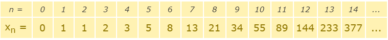
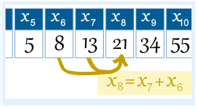
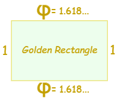
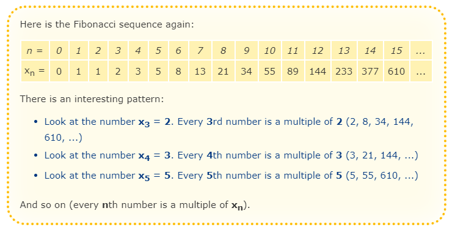
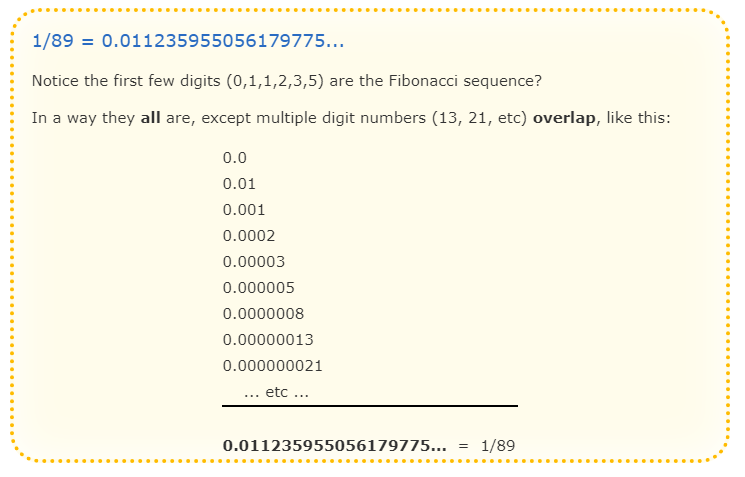
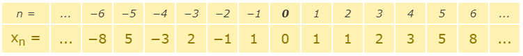
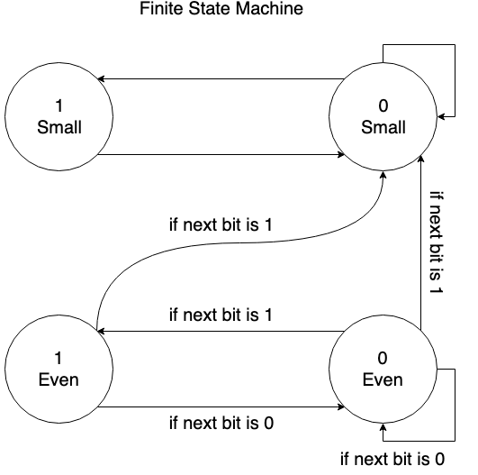

## Leetcode - Problem 600 - Non-negative Integers without Consecutive Ones

#### Problem Description:

Given a positive integer `n`, find the number of non-negative integers 
less than or equal to `n`, whose binary representations do NOT contain 
consecutive ones.

**Example 1:**

```
Input: 5
Output: 5
Explanation: 
Here are the non-negative integers <= 5 with their corresponding binary representations:
0 : 0
1 : 1
2 : 10
3 : 11
4 : 100
5 : 101
Among them, only integer 3 disobeys the rule (two consecutive ones) and the other 5 satisfy the rule. 
```

**Note:** `1 <= n <= 109`

#### Fibonacci Sequence

The Fibonacci Sequence is the series of numbers:

`0, 1, 1, 2, 3, 5, 8, 13, 21, 34, ...`

The next number is found by adding up the two numbers before it:

* the 2 is found by adding the two numbers before it (1+1),
* the 3 is found by adding the two numbers before it (1+2),
* the 5 is (2+3),
* and so on!

> Example: the next number in the sequence above is 21+34 = 55
>

It is that simple!

Here is a longer list:

```
0, 1, 1, 2, 3, 5, 8, 13, 21, 34, 55, 89, 144, 233, 377, 610, 987, 1597, 2584, 
4181, 6765, 10946, 17711, 28657, 46368, 75025, 121393, 196418, 317811, ...
```

##### Fibonacci Sequence - The Rule

The Fibonacci Sequence can be written as a "Rule" 

First, the terms are numbered from 0 onwards like this:



So term number 6 is called ___x<sub>6</sub>___ (which equals 8).

> Example: the 8th term is
>
> the 7th term plus the 6th term:
>
> ___x<sub>8</sub> = x<sub>7</sub> + x<sub>6</sub>___
>
> 
>

So we can write the rule:

* The Rule is **x<sub>n</sub> = x<sub>n-1</sub> + x<sub>n-2</sub>**

where:
* **x<sub>n</sub>** is term number "n"
* **x<sub>n-1</sub>** is the previous term (n-1)
* **x<sub>n-2</sub>** is the term before that (n-2)

> `Example: term 9 is calculated like this:`
>
> x<sub>9</sub> = x<sub>9-1</sub> + x<sub>9-2</sub>
>               = x<sub>8</sub> + x<sub>7</sub>
>               = 21 + 13
>               = 34
>
 
##### Fibonacci Sequence - Golden Ratio


And here is a surprise. When we take any two successive (one after the other) Fibonacci Numbers, 
their ratio is very close to the [Golden Ratio](https://www.mathsisfun.com/numbers/golden-ratio.html)

 which is approximately **1.618034...**

In fact, the bigger the pair of Fibonacci Numbers, the closer the approximation. 
Let us try a few:

| **A** | **B** | **B/A** |
| ----- | ----- | ------- |
| 2 | 3 | 1.5 |
| 3 | 5 | 1.666666666... |
| 5 | 8 | 1.6 |
| 8 | 13 | 1.625 |
| ... | ... | ... |
| 144 | 233 | 1.618055556... |
| 233 | 377 | 1.618025751... |
| ... | ... | ... |

##### Fibonacci Sequence - Using The Golden Ratio to Calculate Fibonacci Numbers

And even more surprising is that we can **calculate any Fibonacci Number** using the Golden Ratio:

%5E%7Bn%7D)%20/%20%5Csqrt%5B%5D%7B5%7D)

The answer comes out **as a whole number**, exactly equal to the addition of the previous two terms.

> **Example: x<sub>6</sub>**
> 
> %5E%7B6%7D%20-%20(1-1.618034...)%5E%7B6%7D)%20/%20%5Csqrt%7B5%7D)
> 
> When I used a calculator on this (only entering the Golden Ratio to 6 decimal places) 
>
> I got the answer **8.00000033**, a more accurate calculation would be closer to 8.
>
> Try n=12 and see what you get.
>

You can also calculate a Fibonacci Number by multiplying the previous Fibonacci Number by 
the Golden Ratio and then rounding (works for numbers above 1):

> **Example:**
>
> 
>

##### Fibonacci Sequence - Some Interesting Things





##### Fibonacci Sequence - Terms Below Zero

The sequence works below zero also, like this:

___(Prove to yourself that each number is found by adding up the two numbers before it!)___

In fact the sequence below zero has the same numbers as the sequence above zero, except they follow a +-+- ... pattern. It can be written like this:

%5E%7Bn&plus;1%7Dx_%7Bn%7D)

Which says that term **"−n"** is equal to **___(-1)<sup>n+1</sup>___** times term **"n"**, 
and the value **___(-1)<sup>n+1</sup>___** neatly makes the correct `+1, −1, +1, −1, ...` pattern.

#### Solution 1 - Based on Fibonacci Sequence

The solution is based on 2 facts:

1. The number of length `k` string without consecutive 1 is Fibonacci sequence `f(k)`;
For example, if `k = 5`, the range is `00000-11111`. We can consider it as two ranges, 
which are `00000-01111` and `10000-10111`. Any number >= 11000 is not allowed due to 
consecutive 1. The first case is actually `f(4)`, and the second case is `f(3)`, 
so `f(5)= f(4)+f(3)`.
1. Scan the number from most significant digit, i.e. left to right, in binary format. If we find a '1' with k digits to the right, count increases by f(k) because we can put a '0' at this digit and any valid length k string behind; After that, we continue the loop to consider the remaining cases, i.e., we put a '1' at this digit. If consecutive 1s are found, we exit the loop and return the answer. By the end of the loop, we return count+1 to include the number n itself.
For example, if n is 10010110,
we find first '1' at 7 digits to the right, we add range 00000000-01111111, which is f(7);
second '1' at 4 digits to the right, add range 10000000-10001111, f(4);
third '1' at 2 digits to the right, add range 10010000-10010011, f(2);
fourth '1' at 1 digits to the right, add range 10010100-10010101, f(1);
Those ranges are continuous from 00000000 to 10010101. And any greater number <= n will have consecutive 1.

Or, in other words:

* `x, y` are used to calculate Fibonacci numbers.

* `num & 1` and `num & 2` will check if `num` ends with 11 in binary.

Why can I use fibonacci numbers?

* `a(n) = the number of valid integers less than 2^n`
* `a(5) = the number of valid integers less than 0b100000`
* It equals to the number of valid integers in `[0b0, 0b10000[` and in `[0b10000, 0b11000[`.
* The number of valid integers `[0b0, 0b10000[`, which is like `'0b0XXXX'`, equals to `a(4)`.
* The number of valid integers `[0b10000, 0b11000[`, which is like `'0b101XX'`, equals to `a(3)`.
* So a(5) = a(4) + a(3).
* This rule is the same for other values of n, 
and it is the same as Fibonacci numbers recurrence relation definition.

```python
class Solution(object):
    def findIntegers(self, num: int) -> int:
        """
        :type num: int
        :rtype: int
        """
        x, y = 1, 2
        res = 0
        num += 1
        while num:
            if num & 1 and num & 2:
                res = 0
            res += x * (num & 1)
            num >>= 1
            x, y = y, x + y
        return res

```

Shorter version:

```python
class Solution(object):

    def findIntegers(self, num: int) -> int:
        """
        :type num: int
        :rtype: int
        """
        res, x, y, num = 0, 1, 2, num + 1
        while num:  res, x, y, num = res if not num & 1 else x if num & 2 else res + x, y, x + y, num >> 1
        return res

```

#### Solution 2 - Dynamic Programming, Finite State Machine, O(1) time O(1) space

Dynamic Programming with the idea of finite state machine:

We try build the number from left (most significant bit) to right (least siginificant bit).

* There are two conditions:
    1. The number must be smaller or equal to `num`
    1. No consecutive ones in binary representation

* There are only 4 valid states at each step
    1. oneEven: the last bit used is `1`, and all bits used so far are the same as the corresponding bits in `num`
    1. zeroEven: the last bit used is `0`, and all bits used so far are the same as the corresponding bits in `num`
    1. oneSmall: the last bit used is `1`, and some of the previous bits used made our number smaller than `num` (i.e. used `0` but `num` has `1` at that place)
    1. zeroSmall: the last bit used is `0`, and some of the previous bits used made our number smaller than `num` (i.e. used `0` but `num` has `1` at that place)

* These states move between each other following some rules, shown in the graph below.
    1. If the current state used `1`, the next state must use `0`
    1. If the current state used `0`, the next state use both `1` and `0`
    1. If the number of current state is already smaller than `num`, we can't move back to a state that has a number not smaller than `num`
    1. The next bit in `num` decides whether we could reach some state. (shown in graph)

* Dynamic Programming:
    * Use four variables (`oneSmall`, `zeroSmall`, `oneEven`, `zeroEven`) to store the optimal result for each state at the current step
    * At each step, update those variables using values from last step, following the rules.
    * The new optimal value for each state is `sum(values from last step for all states that could lead to the current state)`
        * For example, oneSmall can only be reached from zeroSmall, so the new value for oneSmall at each step is zeroSmall
            * i.e. oneSmall = zeroSmall
    * Thus we could come up with the following solution
        * The initial state is oneSmall, zeroSmall, oneEven, zeroEven = 0, 0, 0, 1
        * Before doing any steps, we haven't used any bits (same as used zero as the last bit), and our number is still same as num (only consider bits we already processed so far)
        * So, for zeroEven, we have one possibility. And for all other states, we have zero as the initial value.
        * Process every bit from left to right, and update those values
            * I used a trick to update the four variables in one single statement, so that I don't have to store the old values.



```python
class Solution(object):
    def findIntegers(self, num: int) -> int:
        """
        :type num: int
        :rtype: int
        """
        num = list(map(int, bin(num)[2:]))
        oneSmall, zeroSmall, oneEven, zeroEven = 0, 0, 0, 1
        for x in num:
            isOne = x == 1
            (
                oneSmall,
                zeroSmall,
                oneEven,
                zeroEven
            ) = (
                zeroSmall,
                zeroSmall + oneSmall + (oneEven if isOne else 0) + (zeroEven if isOne else 0),
                zeroEven if isOne else 0,
                (zeroEven if not isOne else 0) + (oneEven if not isOne else 0)
            )
        return oneSmall + zeroSmall + oneEven + zeroEven
```