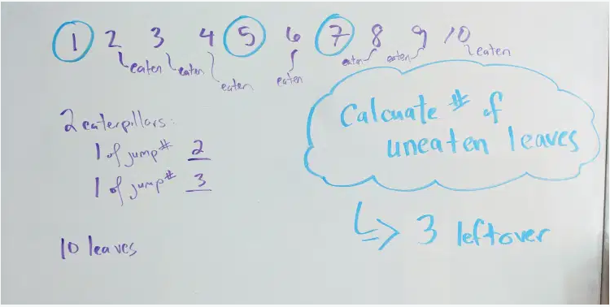
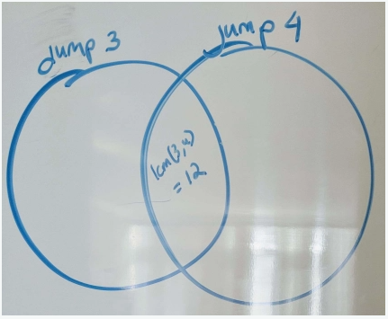
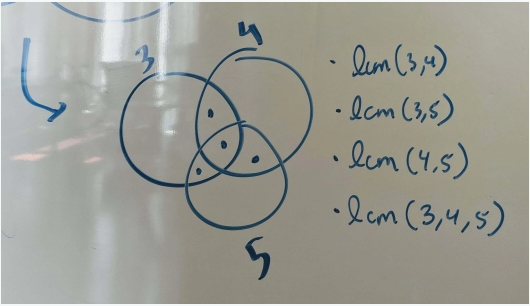
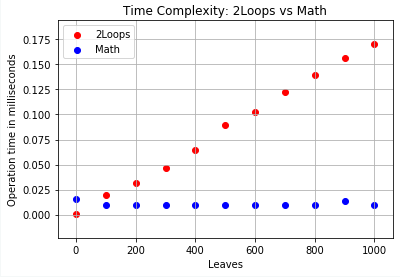
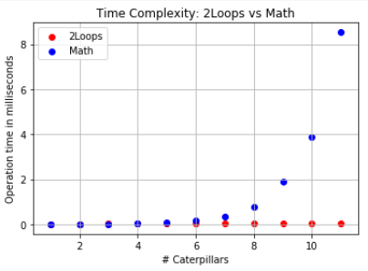
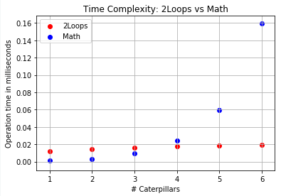

## Geeks For Geeks : Jumping Caterpillars

Given **N** leaves numbered from **1 to N**. 
A caterpillar at leaf `1`, jumps from leaf to leaf in multiples of ___A<sub>j</sub> (A<sub>j</sub>, 2A<sub>j</sub>, 3A<sub>j</sub>)___.
`j` is specific to the caterpillar. 
Whenever a caterpillar reaches a leaf, it eats it a little bit.. 
You have to find out how many leaves, from **1 to N**, are left uneaten 
after all **K** caterpillars have reached the end. 
Each caterpillar has its own jump factor denoted by ___A<sub>j</sub>___, 
and each caterpillar starts at leaf number `1`.


#### **Problem Statement**

All caterpillars traverse n leaves.
A caterpillar with jump number j eats leaves at positions that are multiples of j until it reaches the end and stops and build its cocoon.
Given n leaves and a set k elements of caterpillars, we need to determine the number of uneaten leaves.

(k<-15, n<=10^9)

Typically, I like to solve a simple example by hand just 
to get a general idea of the problem.



Thinking through this problem, I came up with two concepts for solutions. I’ll describe the logic first, 
then delve into the implementation, and end off with a performance comparison.

##### **I. Walking Through Leaves with each Caterpillar via Nested Loops**

* Set 2 loops, the first running from `1->n` and the second running from `0->len(k)`.
* Calculate modulo to see if current leaf is a multiple of `k` jump value
* Count it as eaten if it is.
* Subtract eaten count from total number of leaves to obtain leftover count

We can optimize this quite easily by breaking out inner k loop when an eaten boolean is set to true, 
so if one caterpillar is eating it, we don’t care if other caterpillars want to eat it too. It’s gone.

As you can see in the implementation below,

1. I’ve initialized an eat_count integer variable as 0 and an eaten boolean as False.
1. Then I walk through each leaf, and within that loop, check on each caterpillar’s jump sequence to determine whether anyone is going to eat that leaf.
1. I set eaten as True and break out of the inner loop the moment we have a taker, and count that leaf as eaten.
1. Finally, I subtract the eaten count from the total number of leaves and we have our leftover count.

```python
class Solution:
    def leftover_leaves_1_nested_loops(self, num_leaves, caterpillar_jumps):
        eat_count = 0
        eaten = False
        for num_leaf in range(1, num_leaves + 1):
            for num_jump in caterpillar_jumps:
                if num_leaf % num_jump == 0:
                    eaten = True
                    break
            if eaten is True:
                eat_count += 1
            eaten = False
        leftover = num_leaves - eat_count
        return leftover
```

##### **II. Thinking about the Number Patterns**

First, I’m thinking to divide total number of leaves by each k value and take 
total sum of element. If we have a jump number of 2, it makes sense to say 
that 50 leaves have been eaten.

* 100 leaves / jump number of 2 = 50 eaten leaves

```python
def leftover_leaves_math(num_leaves, jumps):
    ...
    eaten = 0
    for num_jump in jumps:
        eaten += num_leaves//num_jump
    
    leftover = num_leaves - eaten
    return leftover
```

Now there is the complication of **___double counting leaves___**. 
For example, jump sequences of `[2, 4]` can lead to the following calculation:

* 100 leaves / jump number of 2 = 50 eaten leaves.
* 100 leaves / jump number of 4 = 25 eaten leaves.
* Total number of eaten leaves = 75; leftover = 25??
* No... The 25 leaves in 4’s calculation was already eaten by the caterpillar with jump sequence of 2.

We know that we need to ___subtract out___ the double counted variables.
**How do we mathematically compute how many values have been double counted?**
Let’s examine a couple of examples.

* If we have jump numbers 2 and 4, we want to compute a number of 100/4 = 25, 
  because we know that all leaves that are multiples of 4 have already been considered in 2.
* If a caterpillar eats every 3 leaves and another eats every 4 leaves, 
  then we’ll want to add back the double counted values which would happen every 12th leaf. 
  In n=100, this will be 100//12 = 8 leaves. (We also want to make sure we use floor division, 
  since the leaves are either there or not for the caterpillars to eat.)
  
If you couldn’t tell already, our brains are instinctively conducting a 
mathematical operation known as **computing the least common multiple**.

Now let’s implement this. We first write a find lcm method. Then we use 
that method in our function to compute what we need to subtract back out.

```python
def leftover_leaves_math(num_leaves, jumps):
    ...
    eaten = 0
    for num_jump in jumps:
        eaten += num_leaves//num_jump
    
    lcm = find_lcm(jumps[0], jumps[1])
    eaten -= num_leaves//lcm

    leftover = num_leaves - eaten
    return leftover

def find_lcm(num1, num2):
    if(num1 > num2):
        num = num1
        den = num2
    else:
        num = num2
        den = num1
    rem = num % den
    while(rem != 0):
        num = den
        den = rem
        rem = num % den
    gcd = den
    lcm = int(int(num1 * num2)/int(gcd))
    return lcm
```

Cool. Now what if we have **three** caterpillars instead of **two**? 
Let’s look at a venn diagram of two features.



Previously, we computed the lcm of each of our pair to account 
for the center shared space and add that back in. 
What happens when we have a venn diagram of three features?



Now there are double counted spots and **triple counted** spots! 
To complicate things further, the double counted spots when we subtract 
them back out will subtract too much, since they share our triple counted space 
with each other! Thus **we would need to add our triple counted values back in**.

Is this starting to seem insane? Not to worry. Just spot the pattern and codify it!

We can imagine that as we increase the number of caterpillars, we will loop through 
this cycle of adding double counted values in and subtracting triple counted values 
back out in response to adding those double counted values in.

If we draw a venn diagram of 4 overlapping circles, we’ll find that when a 
fourth caterpillar falls into the equation, we will need to add its 
triple counted values in but subtract its quadruple counted values back out. 
**So in accordance with the pattern, if we just subtract every evenly counted values out 
and add every oddly counted values in, this should work!**

Not so fast! There’s also the complication that once we have more than 2 k values, 
we will need to compute all combinations of subsets to feed into our lcm method. 
Annoyingly enough, this is at best an O(2^k) operation since there are 2^k combinations. 
I’ve used recursion to compute subset in my implementation. You can feel free to use your algorithm of choice. 
Do note I’ve constrained mine to avoid empty subsets.

We will leverage this subset method to compute the values we want to add in or subtract out. 
Then, as mentioned, we can grab all even-length subsets and subtract them 
and grab all odd-length subsets and add them.

```python
class Solution:
    def leftover_leaves_2_math(self, num_leaves, jumps):
        subsets = []
        n = len(jumps) - 1
        self.sub_pairs(jumps, 0, n, [], subsets)

        eaten = 0
        for num_jump in jumps:
            eaten += num_leaves // num_jump

        for subset in subsets:
            composite_lcm = self.find_lcm(subset[0], subset[1])
            for i in range(2, len(subset)):
                composite_lcm = self.find_lcm(composite_lcm, subset[i])
            if len(subset) % 2 == 0:
                eaten -= num_leaves // composite_lcm
            else:
                eaten += num_leaves // composite_lcm

        leftover = num_leaves - eaten
        return leftover

    def sub_pairs(self, arr, s, e, sub_arr, subsets):
        if s == e + 1:
            if len(sub_arr) > 1 and len(sub_arr) <= len(arr):
                subsets.append(sub_arr)
            return subsets
        self.sub_pairs(arr, s + 1, e, sub_arr, subsets)
        self.sub_pairs(arr, s + 1, e, sub_arr + [arr[s]], subsets)

    def find_lcm(self, num1, num2):
        if num1 > num2:
            num = num1
            den = num2
        else:
            num = num2
            den = num1
        rem = num % den
        while rem != 0:
            num = den
            den = rem
            rem = num % den
        gcd = den
        lcm = int(int(num1 * num2) / int(gcd))
        return lcm
```

That’s all for the implementation! Now let’s check performance.

#### Performance: O(2^k) vs. O(n*k)

We have two inputs, **n** number of leaves and **k** number of caterpillars 
(and their corresponding jump numbers).

##### Scaling <ins>n</ins> number of leaves, keeping len(k)=2

If we raise n number of leaves, it’s trivial to say that our nested loops method (**“2Loops“**) will slow 
down. **2Loops** walks through each step, so even if we keep `k` constant, 
the time complexity for **2loops** is **O(n)**.

On the other hand our lcm-driven method (**“Math“**) will stay flat in comparison. 
At `k=2`, we’re conducting the same 3-4 math operations, so time complexity w.r.t. `n` is just **O(1)**.



##### Scaling <ins>k</ins> number of caterpillars

Now what happens if k increases?

In our **“Math”** method, we have to compute exponentially more pairwise subsets, 
triplets, quadruplets, etc. as we increase k number of caterpillars. 
If we keep n constant, our time complexity for **“Math”** is **O(2^k)**. 
We are also storing them, so there is a space complexity of **O(2^k)**.



You can see from this plot how quickly **“Math”** degrades in time complexity 
as we scale `k` number of caterpillars up. In the zoomed in plot below, 
you can see that here specifically it was at `k=4` number of caterpillars 
where **“Math”** started losing to **2Loops**.



Our nest for loop only runs through each number once, and each `k` up to once `(O(n*k))`. 
While it was slower when `k < 4`, we now find that **2Loops** method has the advantage 
when we scale number of caterpillars up.

All in all, if you find yourself with a growing number of leaves, opt for the **“Math”** method. 
But if your caterpillars are reproducing at a rapid rate, maybe stick to **2Loops**! 
Or better yet, find a better algorithm.