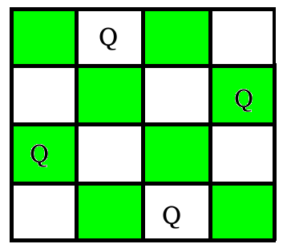

# GeeksForGeeks - N-Queen Problem

## Problem Description:

The ___**n-queens puzzle**___ is the problem of placing n queens on an n×n chessboard such that no two queens attack each other. Given an integer n, print all distinct solutions to the n-queens puzzle. Each solution contains distinct board configurations of the n-queens’ placement, where the solutions are a permutation of [1,2,3..n] in increasing order, here the number in the ith place denotes that the ith-column queen is placed in the row with that number. For eg below figure represents a chessboard `[3 1 4 2]`.

Given an integer array `cuts` where `cuts[i]` denotes a position you should perform a cut at.

You should perform the cuts in order, you can change the order of the cuts as you wish.

## Input:
The first line of input contains an integer **T** denoting the no of test cases. Then T test cases follow. Each test case contains an integer n denoting the size of the chessboard.

## Output:
For each test case, output your solutions on one line where each solution is enclosed in square brackets '[', ']' separated by a space . The solutions are permutations of {1, 2, 3 …, n} in increasing order where the number in the ith place denotes the ith-column queen is placed in the row with that number, if no solution exists print -1.

## Constraints:
1 <= T <= 10
1 <= n <= 10

## Example:
#### Input
`2`

`1`

`4`

#### Output:
`[1 ]`

`[2 4 1 3 ] [3 1 4 2 ]`