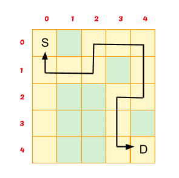
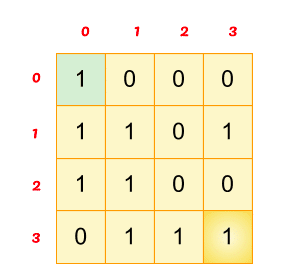
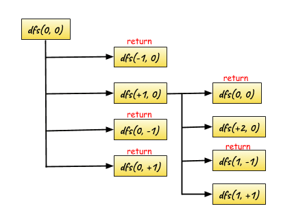
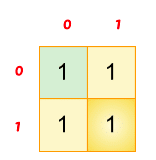
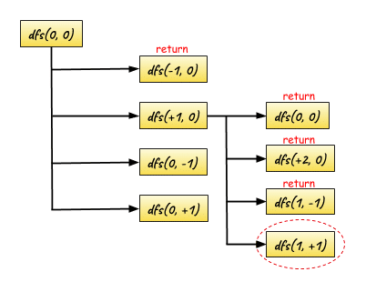
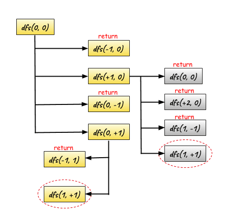

## Geeks For Geeks : Rat in a Maze Problem - I

#### **[Problem Statement](https://practice.geeksforgeeks.org/problems/rat-in-a-maze-problem/1) of rat in a maze problem.**

> The problem is a rat in a maze problem. Consider a rat placed at (0, 0) in a square matrix of order N*N. It has to reach the destination at (n-1, n-1). Find all possible paths that the rat can take to reach from source to destination. The directions in which the rat can move are ‘U'(up), ‘D'(down), ‘L’ (left), ‘R’ (right).
>
> **Input:**
>
> The first line of input contains an integer T denoting the no of test cases. Then T test cases follow. Each test case contains two lines. The first line contains an integer N denoting the size of the square matrix. The next line contains N*N space-separated values of the matrix m where 0’s represents blocked paths and 1 represents valid paths.
>
> **Output:**
>
> For each test, case output will be space-separated sorted strings denoting all directions, which the rat could take to reach the destination. Print -1 if no such path exists.
>
> **User Task:**
>
> Your task is to complete the function printPath() which returns a sorted array of strings denoting all the possible paths which the rat can take to reach the destination at (n-1, n-1). If no such path exists the function should return an empty array.
>
> **Constraints:**
> * 1 <= T <= 100
> * 2 <= N <= 5
> * 0 <= matrix[i][j] <= 1
>

```
Example
Input:
3
4
1 0 0 0 1 1 0 1 0 1 0 0 0 1 1 1
4
1 0 0 0 1 1 0 1 1 1 0 0 0 1 1 1
2
1 0 1 0 

Output:
DRDDRR
DDRDRR DRDDRR
-1
```

```
Explanation:
Testcase 2: The given input is in the form
1 0 0 0
1 1 0 1
1 1 0 0
0 1 1 1
For the above matrix the rat can reach the destination at (3, 3) from (0, 0) by two paths ie DRDDRR and DDRDRR when printed in sorted order we get DDRDRR DRDDRR.
```

#### Analysis of Problem Statement

> You are given **2-D matrix** of size **N*N** and you have to find all paths so that 
> rat can reach the **maze**. In N*N matrix **‘1’** signifies that you can **move to that 
> block** and **‘0’** signifies that you **cannot** move to that block.
>
> Rat is initially at **(0,0)** cell and maze is present at **(N-1,N-1)** cell. In Short you 
> have to find all paths if present for the rat to reach its maze.
>



___rat in a maze problem___

> In the above example, there is **one path** present. Your task is to **print** the 
> direction in which rat should move to reach it’s destination. The directions in 
> which the rat can move are **‘U'(up), ‘D'(down), ‘L’ (left), ‘R’ (right)**.
> 
> **Output :** DRRURRDDLDDR
> 
> If **multiple paths** are present you should print all the paths separated by a space.
> 
> Hope **Problem Statement** is clear.
>

#### Approach to the Rat in a maze problem

> This is clearly a [backtracking Problem](https://geekstocode.com/backtracking-complete-overview-of-backtracking/), where we have to find the path from
> **source** to **destination**.
>
> To solve this puzzle, we first start from the **source** and move in a direction 
> where the path is **not blocked**. If taken path makes us reach to the 
> **destination** then the puzzle is solved else, we come back and **change** our 
> **direction of the path** taken.
>
> Here we will write a **recursive** Algorithm which will search it’s path by it’s 
> own, we just need to specify some of the conditions and rest work will be 
> done by recursion itself.
>
> Let’s move step by step so that we can understand the algorithm clearly.
>

#### Recursive Function

> It’s clear that we will solve this problem by using [recursion](https://geekstocode.com/recursion-art-of-repetition/). So, let’s discuss 
> the approach to write the recursive function.
>

##### Base Condition for the Recursion

> The **base condition** will be simple, we cannot go out of the **square matrix**, 
> and also we cannot move to the block with integer **‘0’** because ‘0’ means path 
> is **blocked**.
>
> Also, we will keep track of a **visited array**, to insure that we are not visiting 
> the same block which we crossed earlier. So if the block is already **visited**, we 
> will simply **return** it.
>
> So, these are the **base condition** required for our algorithm.
>

> Let see the code for base condition,
>

```python
    def isSafe(self, n, x, y):
        if x < 0 or x >= n or y < 0 or y >= n:
            # For not going out of the square matrix
            return False
        return True
```

> Hope above base condition is clear to you, these are very simple conditions. 
> So, let’s move ahead.
>

##### Main body of the [Recursion](https://geekstocode.com/recursion-art-of-repetition/)

> For the sake of simplicity, let’s first find the **path** for the rat to reach the 
> maze or let us first check whether there is any path present or not for the rat 
> to reach the maze.
>
> Later, we will modify the recursion to also find the direction of the path.
>
> The body of the recursion will be simple, the rat can move only in four 
> directions. So if the current position of the rat is **M[x][y]**, then it can move to 
> **M[x-1][y], M[x+1][y], M[x][y-1], M[x][y+1]**. Isn’t it?
>
> It is as simple as that and this is the information we need to **specify** in the 
> body of the recursion and rest work will be tackled by our **base condition**.
>
> So, let’s see the code and we will then understand it by an example.
>

##### Code

```python
    def isSafe(self, n, x, y):
        if x < 0 or x >= n or y < 0 or y >= n:
            return False
        return True

    def dfs(self, arr, n, x, y, visited, path):
        visited[str(x) + " " + str(y)] = True
        if x == n - 1 and y == n - 1:
            ans.append(''.join(path))
        rx = [1, 0, 0, -1]
        ry = [0, 1, -1, 0]

        for i in range(4):
            nx = x + rx[i]
            ny = y + ry[i]
            if self.isSafe(n, nx, ny) and arr[nx][ny] == 1:
                if not visited[str(nx) + " " + str(ny)]:
                    if ny > y:
                        self.dfs_solution_1(arr, n, nx, ny, visited, path + ['R'])
                    elif nx > x:
                        self.dfs_solution_1(arr, n, nx, ny, visited, path + ['D'])
                    elif nx < x:
                        self.dfs_solution_1(arr, n, nx, ny, visited, path + ['U'])
                    elif ny < y:
                        self.dfs_solution_1(arr, n, nx, ny, visited, path + ['L'])
        visited[str(x) + " " + str(y)] = False
```

> If we reach the coordinate **M[n-1][n-1]** then **count** will get updated from that 
> we will know if there is any path present or not.
>
> Let us understand the code step by step and also with an help of a example.
>
> The **parameters** of the recursive function are simple, the matrix **M[][]**, the 
> coordinates **[i][j]**, the size of the array **N** and the **visited array** for keeping 
> the track of the path.
>



> This is the 2-D Matrix given to us and we are currently at the source **M[0][0]** 
> and we have to reach the maze present at **M[3][3]**.
>
> Now let us analyse the **recursion** by the help of below diagram.
>



> Hope, the above diagram is clear. The recursion tree is **incomplete** but the 
> process will go on like this.
> 
> **Note** the recursive call which are **returning** is actually going to our **base condition**.
> 
> **dfs(-1, 0)** is actually going out of the square matrix.
> **dfs(0, 0)** is actually visited before, so it is returned.
> 
> By going this way, this Algorithm will find it’s own path. Hope the **recursion body** 
> is clear to you. If not clear then try to draw a recursion diagram by taking a small example and try to follow the steps which I have mentioned above.
>

##### What if a path is found ??

> Now suppose the above algorithm finds a **path** by the above recursion but this 
> is not the end of our solution.
>
> We need to find all the path from source to destination. So for this we will '
> again return back and we will **unvisit** the visited block, so that it can find 
> more ways to reach the destination.
>
> We will try to understand this part by taking an small example,
>



> In the above example, there are **two paths** to reach destination. We will see 
> it’s recursion tree to understand how we will find both the **paths**.
>



> The **first path** is found, now our task is to find the second path, for this we 
> will **unvisit** the remaining nodes and we will try to find the other path.
>



> This is how, **recursion** will find the second path, first it will unvisit the visited 
> node (**marked by grey**) and then recursion will **continue**. This way it will 
> find the second path.
>
> Hope **recursion** is clear and now I hope you can **visualize** the bigger picture 
> that how rat is finding it’s own way to reach the maze.
>

##### Solution to the Rat in a maze Problem

> We have discussed the main logic of the problem and now we need to wrap up 
> all the above discussion to solve the **actual problem**.
>
> In the actual Problem, we have to find the way as well as we have to **specify** 
> the direction in which rat has to travel to reach the maze.
>
> We will use **string** to store the **directions** and when we reach the destination, 
> we will store that string to the vector and at last we will return that vector.
>
> Let’s see the code for it,
>

##### Complete Code for Python

```python
#
# Time  :
# Space :
#
# @tag : Divide And Conquer
# @by  : Shaikat Majumdar
# @date: Aug 27, 2020
# **************************************************************************
# GeeksForGeeks: Rat in a Maze Problem - I
#
# Description:
#
# Consider a rat placed at (0, 0) in a square matrix of order N*N. It has to reach the destination at (N-1, N-1). Find all possible paths that the rat can take to reach from source to destination. The directions in which the rat can move are 'U'(up), 'D'(down), 'L' (left), 'R' (right). Value 0 at a cell in the matrix represents that it is blocked and cannot be crossed while value 1 at a cell in the matrix represents that it can be traveled through.
#
# Example 1:
#
# Input: N = 4, m[][] = {{1, 0, 0, 0},
#                        {1, 1, 0, 1},
#                        {1, 1, 0, 0},
#                        {0, 1, 1, 1}}
# Output: DDRDRR DRDDRR
# Explanation: The rat can reach the
# destination at (3, 3) from (0, 0) by two
# paths ie DRDDRR and DDRDRR when printed
# in sorted order we get DDRDRR DRDDRR.
# Example 2:
# Input: N = 2, m[][] = {{1, 0},
#                        {1, 0}}
# Output: -1
# Explanation: No path exits
#
# Your Task:
# You don't need to read input or print anything. Complete the function printPath() which takes N and 2d array m[][] as input parameters and returns a sorted list of paths.
#
# Note:  In case of no path, return an empty list. The driver will output -1 automatically.
#
# Expected Time Complexity: O((N2)4).
# Expected Auxiliary Space: O(L*X), L = length of the path, X = number of paths.
#
# Constraints:
# 2 ≤ N ≤ 5
# 0 ≤ m[i][j] ≤ 1
#
# **************************************************************************
# Source: https://practice.geeksforgeeks.org/problems/rat-in-a-maze-problem/1 (GeeksForGeeks - Rat in a Maze Problem - I)
# **************************************************************************
#
from typing import List

import unittest


class Solution(object):

    def isSafe(self, n, x, y):
        if x < 0 or x >= n or y < 0 or y >= n:
            return False
        return True

    def dfs(self, arr, n, x, y, visited, path):
        visited[str(x) + " " + str(y)] = True
        if x == n - 1 and y == n - 1:
            ans.append(''.join(path))
        rx = [1, 0, 0, -1]
        ry = [0, 1, -1, 0]

        for i in range(4):
            nx = x + rx[i]
            ny = y + ry[i]
            if self.isSafe(n, nx, ny) and arr[nx][ny] == 1:
                if not visited[str(nx) + " " + str(ny)]:
                    if ny > y:
                        self.dfs(arr, n, nx, ny, visited, path + ['R'])
                    elif nx > x:
                        self.dfs(arr, n, nx, ny, visited, path + ['D'])
                    elif nx < x:
                        self.dfs(arr, n, nx, ny, visited, path + ['U'])
                    elif ny < y:
                        self.dfs(arr, n, nx, ny, visited, path + ['L'])
        visited[str(x) + " " + str(y)] = False

    # Solution 1:
    #
    # Your task is to complete this function
    # Function should return a sorted string
    # String should contains required paths
    # string should contain space separated paths
    def findPath(self, arr: List[int], n: int) -> str:
        global ans
        ans = []
        """
        :type arr: List[int]
        :type n: int
        :rtype: str
        """
        visited = {}
        for i in range(n):
            for j in range(n):
                visited[str(i) + " " + str(j)] = False
        self.dfs(arr, n, 0, 0, visited, [])
        ans.sort()
        return ' '.join(ans)

class Test(unittest.TestCase):
    def setUp(self) -> None:
        pass

    def tearDown(self) -> None:
        pass

    def test_findPath(self) -> None:
        sol = Solution()
        for arr, n, solution in (
            [[[1, 0, 0, 0], [1, 1, 0, 1], [1, 1, 0, 0], [0, 1, 1, 1]],
              4,
              'DDRDRR DRDDRR'
            ],
            [[[1, 0], [1, 0]],
              2,
              ''
            ]
        ):
            self.assertEqual(solution, sol.findPath(arr, n))


# main
if __name__ == "__main__":
    unittest.main()
```

> **Note** if no such path exists the function should return **an empty vector**. 
> **Don’t print (-1) for that case as it is clearly mentioned in the Problem Statement. 
> The (-1) case will be handled by GFG**.
>
> **I hope this explanation of rat in maze problem and working of Recursion 
> are** clear to you all.
>
> That’s all folks..!!!
>
> Similar Problem : [Find whether path exist](https://practice.geeksforgeeks.org/problems/find-whether-path-exist/0)
>
