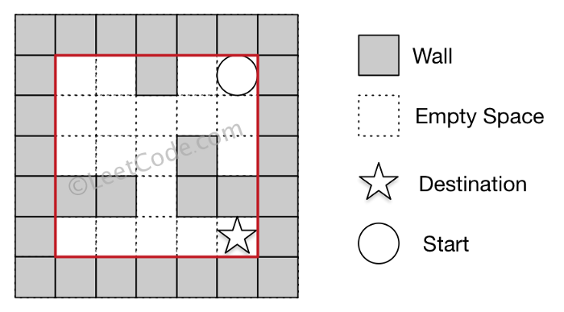

# LeetCode - Problem 490 - The Maze

## Problem Description:

There is a **ball** in a maze with empty spaces and walls. The ball can go 
through empty spaces by rolling **up, down, left** or **right**, but it won’t stop 
rolling until hitting a wall. When the ball stops, it could choose the next 
direction.

Given the ball’s **start position**, the **destination** and the **maze**, determine 
whether the ball could stop at the destination.

The maze is represented by a binary 2D array. 1 means the wall and 0 
means the empty space. You may assume that the borders of the maze are 
all walls. The start and destination coordinates are represented by row and 
column indexes.

#### **Example 1:**

> **Input 1:** `a maze represented by a 2D array`
> ```
> 0 0 1 0 0
> 0 0 0 0 0
> 0 0 0 1 0
> 1 1 0 1 1
> 0 0 0 0 0
> ```
>
> **Input 2:** `start coordinate (rowStart, colStart) = (0, 4)`
>
> **Input 3:** `destination coordinate (rowDest, colDest) = (4, 4)`
>
> **Output:** `true`
> 
> **Explanation:** `One possible way is : left -> down -> left -> down -> right -> down -> right.`
>


#### **Solution**

This is a typical tree like problem which DFS/BFS can solve.

From a specific point (in the beginning it’s the **Start**), I have at most 4 
directions to roll a ball; in each direction, the ball will stop when it hits a 
wall and that stop will become a start point to roll. If the stop matches the 
**Destination**, then that means I can reach the **Destination** from **Start**.

Additional favor the problem adds is rolling. The rolling, in Python3 
implementation, means keep changing either X or Y coordinate consistently 
in the same manner.

A very common technique is to use a **dirs** variable (which contains the shift 
in each coordinate for each direction) and the corresponding rolling/stop 
mechanism is illustrated as below.

```python
dirs = [(-1,0), (1,0), (0,-1), (0,1)]
pos = (startX, startY)
for d in dirs:                
  newX = pos[0]
  newY = pos[1]
  while(True): #rolling 
    possibleNewX = newX + d[0]
    possibleNewY = newY + d[1]
    if (possibleNewX >= 0 and possibleNewX < len(maze) ) and (possibleNewY >= 0 and possibleNewY < len(maze[0])) and (maze[possibleNewX][possibleNewY] != 1):
      #rolling to newX and newY and may continue rolling
      newX = possibleNewX
      newY = possibleNewY
      continue
    else: #either hit wall or surrounding frames       
      break
  newStop = (newX, newY)
```

Complete solution is available in below (please refer to following section [Python 3 knowledge points](#Python 3 knowledge points) where I introduce the framework of DFS 
Python3 implementation that can help to understand codes in following 
block).

```python
#
# Time  :
# Space :
#
# @tag : Backtracking
# @by  : Shaikat Majumdar
# @date: Aug 27, 2020
# **************************************************************************
# LeetCode - Problem 490: The Maze
#
# Description:
#
# Refer to LeetCode_Problem_Description.md
#
# **************************************************************************
# Source: https://leetcode.com/problems/the-maze/ (LeetCode - Problem 490 - The Maze)
# **************************************************************************
#
# **************************************************************************
# Solution Explanation
# **************************************************************************
# Refer to Solution_Explanation.md
#
from typing import List

import unittest

class Solution(object):

    def hasPath(self, maze: List[List[int]], start: List[int], destination: List[int]) -> bool:
        '''
        Detailed explanation is available at
        https://medium.com/@edward.zhou/leet-code-53-maximum-subarray-detailed-explained-python3-solution-d91c7affc02a
        '''
        visited = []
        dirs = [(-1, 0), (1, 0), (0, -1), (0, 1)]
        dest = (destination[0], destination[1])

        def rollFrom(pos):
            # check all possible stop positions that current pos can roll to
            # and exclude those that are already in visited
            # and then keep rolling from the rest
            # print("rolling from {}".format(pos))
            newStops = []
            for d in dirs:
                newX = pos[0]
                newY = pos[1]
                while (True):  # rolling
                    possibleNewX = newX + d[0]
                    possibleNewY = newY + d[1]
                    if (possibleNewX >= 0 and possibleNewX < len(maze)) and (
                            possibleNewY >= 0 and possibleNewY < len(maze[0])) and (
                            maze[possibleNewX][possibleNewY] != 1):
                        newX = possibleNewX
                        newY = possibleNewY
                        continue
                    else:
                        break
                newStop = (newX, newY)
                if newStop == dest:
                    return True
                newStops.append(newStop)

            visited.append(pos)

            for newStop in newStops:
                if newStop not in visited:
                    if rollFrom(newStop):
                        return True
            return False

        startPos = (start[0], start[1])
        return rollFrom(startPos)


class Test(unittest.TestCase):
    def setUp(self) -> None:
        pass

    def tearDown(self) -> None:
        pass

    def test_hasPath(self) -> None:
        sol = Solution()
        grid = [[0, 0, 1, 0, 0], [0, 0, 0, 0, 0], [0, 0, 0, 1, 0], [1, 1, 0, 1, 1], [0, 0, 0, 0, 0]]
        start = [0, 4]
        destination = [4, 4]
        self.assertEqual(True, sol.hasPath(grid, start, destination))


# main
if __name__ == '__main__':
    # sol = Solution()
    # grid = [[0,0,1,0,0],[0,0,0,0,0],[0,0,0,1,0],[1,1,0,1,1],[0,0,0,0,0]]
    # start = [0,4]
    # destination = [4,4]
    # print(sol.hasPath(grid, start, destination))
    unittest.main()
```

#### **Time & Space Complexity**

Assuming the maze is M*N, actually I need to touch nearly every cell 
(except walls), the time spent is directly related to the scale of M*N. 
Therefore, the time complexity is O(M*N).

I use a visited list to store all stop positions the algorithm will run into. Also, 
since I use recursive calls of rollFrom(), each time execution stack will used when a call is invoked. Actually both are related since normally a stop will lead to 4 rollFrom() so space complexity is directly related to the number of stops. In a M*N maze, the stop number is also directly scaling along with the size, so space complexity is also O(M*N).

#### **Python 3 knowledge points**

This is a typical problem which can be solved by either DFS and BFS (in 
same time complexity). I have [an evolving post](https://medium.com/@edward.zhou/algorithm-cheatsheet-continuously-updated-a95ef9b530b) which contains templates 
for common algorithms include DFS and BFS. Below contents are extracted 
from that post.

**1) Typical DFS Python3 template**

```python
#params are normally those will change in each round of dfs
#for example, a position that something inside dfs will start with
#I'd suggest a more meaningful name to use than "dfs"
#like rollFrom(postion)
visited = []
def dfs(current_node):
  #processing current_node to generate more leads(nodes)
  nodes = processing of current_node
  visited.append(current_node)
  for node in nodes:
    if node not in visited:
      dfs(params_turning_from_branch_info)
dfs(start_node) #kick start dfs
```

Above template will check each path one by one, but sometimes I will need 
to abort the checking if an answer is found in some path. In that case, the 
template can be slightly modified to be:

```python
#params are normally those will change in each round of dfs
#for example, a position that something inside dfs will start with
#I'd suggest a more meaningful name to use than "dfs"
#like rollFrom(postion)
visited = []
def dfs(current_node):
  #processing current_node to generate more leads(nodes)
  nodes = processing of current_node
  visited.append(current_node)
  #during above processing, some required criteria are met
  if(criteria are met):
    return True
  for node in nodes:
    if node not in visited:
      if dfs(node): 
        return True
  return False
return dfs(start_node) #kick start dfs
```

**2) Typical BFS Python3 template**

Similarly to DFS, I may use BFS to find ALL possible answers (which means 
I need to navigate all nodes). Also, I may just stop by the first answer, which 
below template applies to.

Also, below template is not using recursive calls.

```python
visited = []
toVisit = [start_node]
while(len(toVisit) > 0):
  toVisitInNextLayer = []
  for current_node in toVisit:  
    #processing node to generate more leads(nodes)
    nodes = processing of current_node
    visited.append(current_node)
  
    #during above processing, some required criteria are met
    if(criteria are met):
      return True
    for node in nodes:
      if node not in visited:
        toVisitInNextLayer.append(node)
   
  toVisit = toVisitInNextLayer
return False
```

