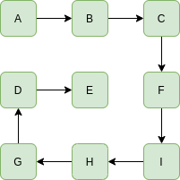

## Geeks For Geeks : Rat in a Maze Problem - I

#### **[Problem Statement](https://practice.geeksforgeeks.org/problems/word-boggle/0) of Word Boggle problem.**

> Given a dictionary, a method to do lookup in dictionary and a `M x N` board where every cell has one character.
> Find all possible words that can be formed by a sequence of adjacent characters.
> Note that we can move to any of 8 adjacent characters,
> but a word should not have multiple instances of same cell.
>
> **Example 1:**
>
> ```
> Input: dictionary[] = {"GEEKS", "FOR", "QUIZ", "GO"};
>        boggle[][]   = {{'G','I','Z'},
>                        {'U','E','K'},
>                        {'Q','S','E'}};
> 
> Output:  Following words of dictionary are present
>          GEEKS, QUIZ
> ```
> **Input:**
>
> The first line of input contains an integer `T` denoting the no of test cases. 
> Then `T` test cases follow. Each test case contains an integer `x` denoting the no of words in the dictionary. 
> Then in the next line are `x` space separated strings denoting the contents of the dictionary. 
> In the next line are two integers `N` and `M` denoting the size of the boggle. 
> The last line of each test case contains `NxM` space separated values of the boggle.
>
> **Output:**
>
> For each test case in a new line print the space separated sorted distinct words of the dictionary 
> which could be formed from the boggle. 
> If no word can be formed print -1.
>
> **User Task:**
>
> Your task is to complete the function printPath() which returns a sorted array of strings denoting all the possible paths which the rat can take to reach the destination at (n-1, n-1). If no such path exists the function should return an empty array.
>
> **Constraints:**
> * 1 <= T <= 100
> * 1 <= N <= 10
> * 1 <= n , m <= 7
>
> **Example:**
> ```
> Input:
> 1
> 4
> GEEKS FOR QUIZ GO
> 3 3
> G I Z U E K Q S E
>
> Output:
> GEEKS QUIZ
> ```
>

#### Introduction

Given a dictionary, a method to do a lookup in the dictionary and a `M x N` board where every cell has one character. Find all possible words that can be formed by a sequence of adjacent characters. 
Note that we can move to any of 8 adjacent characters, 
but a word should not have multiple instances of the same cell.

#### **Example:**

> **Input:**  
> ```
> dictionary[] = {"GEEKS", "FOR", "QUIZ", "GO"};
>
> boggle[][]   = {{'G', 'I', 'Z'},
>                 {'U', 'E', 'K'},
>                 {'Q', 'S', 'E'}};
> ```
> **Output:** 
> ```
> Following words of the dictionary are present
> GEEKS
> QUIZ
> ```
> **Explanation:**
>
> 
>
> **Input:**
> ```
> dictionary[] = {"GEEKS", "ABCFIHGDE"};
> boggle[][]   = {{'A', 'B', 'C'},
>                 {'D', 'E', 'F'},
>                 {'G', 'H', 'I'}};
> ```
> **Output:** 
> ```
> Following words of the dictionary are present
> ABCFIHGDE
> ```
> **Explanation:**
>
> 
>

We have discussed a Graph DFS based solution in below post :
[Boggle (Find all possible words in a board of characters) | Set 1](https://www.geeksforgeeks.org/boggle-find-possible-words-board-characters/)

Here we discuss a [Trie](https://www.geeksforgeeks.org/trie-insert-and-search/) based solution which is better then DFS based solution.
Given Dictionary: 

```dictionary[] = {"GEEKS", "FOR", "QUIZ", "GO"}```

1] Create an Empty `trie` and insert all words of given dictionary into `trie`


2] After that we have pick only those character in `boggle[][]` which are child of root of Trie
Let for above we pick `'G'` `boggle[0][0]`, `'Q'` `boggle[2][0]` 
(they both are present in `boggle` matrix).

3] search a word in a `trie` which start with character that we pick in step 2


Below is the implementation of above idea in Python :

```python
#
# Time  :
# Space :
#
# @tag : Backtracking
# @by  : Shaikat Majumdar
# @date: Aug 27, 2020
# **************************************************************************
# GeeksForGeeks: Word Boggle
#
# Description:
#
# Given a dictionary, a method to do lookup in dictionary and a M x N board where every cell has one character.
# Find all possible words that can be formed by a sequence of adjacent characters.
# Note that we can move to any of 8 adjacent characters,
# but a word should not have multiple instances of same cell.
#
# Example 1:
#
# Input: dictionary[] = {"GEEKS", "FOR", "QUIZ", "GO"};
#        boggle[][]   = {{'G','I','Z'},
#                        {'U','E','K'},
#                        {'Q','S','E'}};
#
# Output:  Following words of dictionary are present
#          GEEKS, QUIZ
#
# Input:
# The first line of input contains an integer T denoting the no of test cases . Then T test cases follow. Each test case contains an integer x denoting the no of words in the dictionary. Then in the next line are x space separated strings denoting the contents of the dictinory. In the next line are two integers N and M denoting the size of the boggle. The last line of each test case contains NxM space separated values of the boggle.
#
# Output:
# For each test case in a new line print the space separated sorted distinct words of the dictionary which could be formed from the boggle. If no word can be formed print -1.
#
# Constraints:
#   * 1<=T<=10
#   * 1<=x<=10
#   * 1<=n,m<=7
#
# Example:
# Input:
# 1
# 4
# GEEKS FOR QUIZ GO
# 3 3
# G I Z U E K Q S E
#
# Output:
# GEEKS QUIZ
#
# **************************************************************************
# Source: https://practice.geeksforgeeks.org/problems/word-boggle/0 (GeeksForGeeks - Word Boggle)
# **************************************************************************
#
# **************************************************************************
# Solution Explanation
# **************************************************************************
# Refer to Solution_Explanation.md
#
# Reference:
# **************************************************************************
# https://jimmy-shen.medium.com/how-to-solve-the-boggle-problem-7234e9891705 (Medium: How to solve the Boggle problem?)
#

from typing import List
from collections import defaultdict

import unittest

class TrieNode:
    def __init__(self):
        #self.children = {}
        self.children = defaultdict(TrieNode)
        self.end_node = 0

class Trie:
    def __init__(self):
        self.root = TrieNode()

    def insert(self, word):
        root = self.root
        # for symbol in word:
        #     root = root.children.setdefault(symbol, TrieNode())
        for symbol in word:
            root = root.children[symbol]
        root.end_node = 1

class BoggleTrieDfs(object):
    def __init__(self):
        # key is word value is [board coordinates]
        self.hash = {}
        self.trie = Trie()

    def find_words(self, words: List[str], boggle: List[List[str]]) -> List[str]:
        """
        input: words is the dictionary contains all possible words
               boggle is the boggle
        output: a list contains word_in_boggle for all possible words
        """
        self.num_words = len(words)
        res, trie = [], Trie()
        for word in words:
            trie.insert(word)

        R, C = len(boggle), len(boggle[0])
        def dfs(i, j, node, path):
            if self.num_words == 0: return

            if node.end_node:
                res.append(path)
                node.end_node = False
                self.num_words -= 1

            if i < 0 or i >= R or j < 0 or j >= C: return
            tmp = boggle[i][j]
            if tmp not in node.children: return

            boggle[i][j] = "#"
            for x, y in [[0, 1], [1, 0], [-1, 0], [0, -1], [-1, -1], [1, -1], [-1, 1], [1, 1]]:
                dfs(i + x, j + y, node.children[tmp], path + tmp)
            boggle[i][j] = tmp

        for i in range(len(boggle)):
            for j in range(len(boggle[0])):
                dfs(i, j, trie.root, "")
        res.sort()
        return res


class Test(unittest.TestCase):
    def setUp(self) -> None:
        pass

    def tearDown(self) -> None:
        pass

    def test_find_words(self) -> None:
        boggle = [
            ["G","I","Z"],
            ["U","E","K"],
            ["Q","S","E"]
        ]
        words = ["GEEKS", "FOR", "QUIZ", "GO"]
        b = BoggleTrieDfs()
        # b.find_words(words, boggle)
        self.assertEqual(["GEEKS", "QUIZ"], b.find_words(words, boggle))

# main
if __name__ == '__main__':
    unittest.main()
```

**Output:**
```
GEE, GEEKS, QUIZ
```

**Complexity Analysis:**

 * **Time complexity:** O(4^(N^2)).
   
   Even after applying trie the time complexity remains same. 
   For every cell there are 4 directions and there are `N^2` cells. 
   So the time complexity is `O(4^(N^2))`.
   
 * **Auxiliary Space:** O(N^2).

   The maximum length of recursion can be `N^2`, where `N` is the side of the matrix. 
   So the space Complexity is `O(N^2)`.