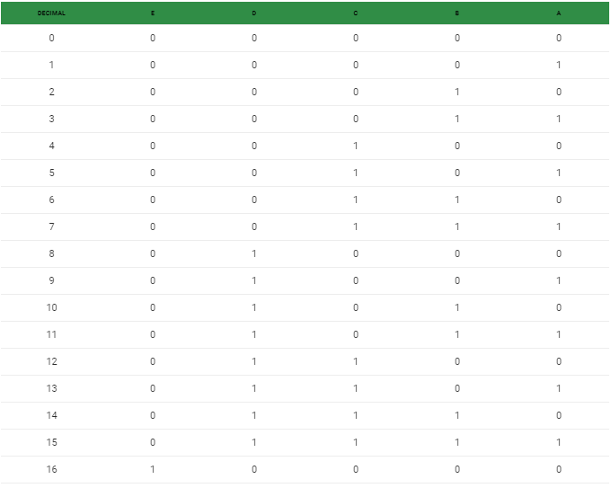

_solution_3## Geeks For Geeks : Rightmost different bit

#### **[Problem Statement](https://practice.geeksforgeeks.org/problems/count-total-set-bits-1587115620/1) of Count total set bits problem.**

Given a positive integer n, count the total number of set bits in binary representation of all numbers from 1 to n.

##### **Examples:**

```
Input: n = 3
Output:  4

Input: n = 6
Output: 9

Input: n = 7
Output: 12

Input: n = 8
Output: 13
```

#### **Method 1 (Simple)**

A simple solution is to run a loop from 1 to n and sum the count of set bits in all numbers from 1 to n.

```python
class Solution(object):

    # A utility function to count set bits
    # in a number x
    def countSetBitsUtil(self, x):

        if (x <= 0):
            return 0
        return (0 if int(x % 2) == 0 else 1) + self.countSetBitsUtil(int(x / 2))

    # Returns count of set bits present in
    # all numbers from 1 to n
    def countTotalSetBits(self, n: int) -> int:
        # initialize the result
        bitCount = 0

        for i in range(1, n + 1):
            bitCount += self.countSetBitsUtil(i)

        return bitCount

# Driver code 
if __name__ == "__main__" : 
    n = 4
    sol = Solution()
    print(f"Total set bit count is {sol.countSetBits(n)}")
```
**Output:**
```
Total set bit count is 5
```
**Time Complexity:** O(nLogn)

#### **Method 2 (Simple and efficient than Method 1)**

If we observe bits from rightmost side at distance `i` than bits get inverted 
after `2^i` position in vertical sequence.
for example `n = 5`:
```
0 = 0000
1 = 0001
2 = 0010
3 = 0011
4 = 0100
5 = 0101
```
Observe the right most bit `(i = 0)` the bits get flipped after `(2^0 = 1)`
Observe the 3rd rightmost bit `(i = 2)` the bits get flipped after `(2^2 = 4)`

So, We can count bits in vertical fashion such that at ___**i<sup>th</sup>**___ 
**right most position bits** will be get flipped after `2^i` iteration;
```python
class Solution(object):

    # Function which counts set bits from 0 to n
    def countTotalSetBits(self, n: int) -> int:
        i = 0

        # ans store sum of set bits from 0 to n
        ans = 0

        # while n greater than equal to 2^i
        while ((1 << i) <= n):

            # This k will get flipped after
            # 2^i iterations
            k = 0

            # change is iterator from 2^i to 1
            change = 1 << i

            # This will loop from 0 to n for
            # every bit position
            for j in range(0, n + 1):
                ans += k

                if change == 1:

                    #  When change = 1 flip the bit
                    k = not k

                    # again set change to 2^i
                    change = 1 << i

                else:
                    change -= 1

            # increment the position
            i += 1

        return ans

# Driver code 
if __name__ == "__main__" : 
    n = 17
    sol = Solution()
    print(sol.countSetBits(n))
```
**Output:**
```
35
```
**Time Complexity:** O(k*n)

where 
* `k` = number of bits to represent number `n`
* `k <= 64`

#### **Method 3 (Tricky)**

If the input number is of the form 2^b -1 e.g., 1, 3, 7, 15.. etc, 
the number of set bits is b * 2^(b-1). 
This is because for all the numbers 0 to (2^b)-1, 
if you complement and flip the list you end up with the same list 
(half the bits are on, half off).

If the number does not have all set bits, then some position m 
is the position of leftmost set bit. The number of set bits 
in that position is n – (1 << m) + 1. The remaining set bits are in two parts:

1) The bits in the (m-1) positions down to the point where the leftmost bit becomes 0, and
2) The 2^(m-1) numbers below that point, which is the closed form above.

An easy way to look at it is to consider the number 6:

```
0|0 0
0|0 1
0|1 0
0|1 1
-|--
1|0 0
1|0 1
1|1 0
```

The leftmost set bit is in position 2 (positions are considered starting from 0). 
If we mask that off what remains is 2 (the “1 0” in the right part of the last row.) 
So the  number of bits in the 2nd position (the lower left box) is 3 (that is, 2 + 1). 
The set bits from 0-3 (the upper right box above) is 2*2^(2-1) = 4. 
The box in the lower right is the remaining bits we haven’t yet counted, 
and is the number of set bits for all the numbers up to 2 
(the value of the last entry in the lower right box) which can be 
figured recursively.

```python
class Solution(object):

    # A O(Logn) complexity program to count
    # set bits in all numbers from 1 to n

    """ 
    /* Returns position of leftmost set bit. 
    The rightmost position is considered 
    as 0 */ 
    """
    def getLeftmostBit(self, n):

        m = 0
        while (n > 1):
            n = n >> 1
            m += 1

        return m

    """ 
    /* Given the position of previous leftmost 
    set bit in n (or an upper bound on 
    leftmost position) returns the new 
    position of leftmost set bit in n */ 
    """
    def getNextLeftmostBit(self, n, m):

        temp = 1 << m
        while (n < temp):
            temp = temp >> 1
            m -= 1

        return m

    def _countSetBits(self, n, m):

        # Base Case: if n is 0, then set bit
        # count is 0
        if (n == 0):
            return 0

        # /* get position of next leftmost set bit */
        m = self.getNextLeftmostBit(n, m)

        # If n is of the form 2^x-1, i.e., if n
        # is like 1, 3, 7, 15, 31, .. etc,
        # then we are done.
        # Since positions are considered starting
        # from 0, 1 is added to m
        if (n == (1 << (m + 1)) - 1):
            return ((m + 1) * (1 << m))

        # update n for next recursive call
        n = n - (1 << m)
        return (n + 1) + self.countTotalSetBits(n) + m * (1 << (m - 1))

    # The main recursive function used by countSetBits()
    # def _countSetBits(n, m)

    # Returns count of set bits present in
    # all numbers from 1 to n
    def countTotalSetBits(self, n):

        # Get the position of leftmost set
        # bit in n. This will be used as an
        # upper bound for next set bit function
        m = self.getLeftmostBit(n)

        # Use the position
        return self._countSetBits(n, m)

# Driver code 
if __name__ == "__main__" : 
    n = 17
    sol = Solution()
    print("Total set bit count is", sol.countSetBits(n)) 
```
**Output:**
```
Total set bit count is 35
```

Time Complexity: **O(LogN)**. 

From the first look at the implementation, time complexity looks more. 
But if we take a closer look, statements inside while loop of **getNextLeftmostBit()** 
are executed for all **0** bits in **n**. And the number of times recursion is executed 
is less than or equal to set bits in **n**. In other words, if the control goes inside 
while loop of getNextLeftmostBit(), then it skips those many bits in recursion.

#### **Method 4 (Power of 2 approach)**

Check the pattern of Binary representation of the numbers from 1 to N in the following table:



Notice that,

1. Every alternate bits in A are set.
1. Every 2 alternate bits in B are set.
1. Every 4 alternate bits in C are set.
1. Every 8 alternate bits in D are set.
1. ...
1. This will keep on repeating for every power of 2.

So, we will iterate till the number of bits in the number. And we don’t have to iterate every single number in the range from 1 to n.

We will perform the following operations to get the desired result.

* First of all, we will add 1 to the number in order to compensate 0. As the binary number system starts from 0. 
So now n = n + 1.
* We will keep the track of the number of set bits encountered till now. And we will initialise it with n/2.
* We will keep one variable which is a power of 2, in order to keep track of bit we are computing.
* We will iterate till the power of 2 becomes greater than n.
* We can get the number of pairs of 0s and 1s in the current bit for all the numbers by dividing n by current power of 2.
* Now we have to add the bits in the set bits count. We can do this by dividing the number of pairs of 0s and 1s by 2 which will give us the number of pairs of 1s only and after that, we will multiply that with the current power of 2 to get the count of ones in the groups.
* Now there may be a chance that we get a number as number of pairs, which is somewhere in the middle of the group i.e. the number of 1s are less than the current power of 2 in that particular group. So, we will find modulus and add that to the count of set bits which will be clear with the help of an example.

**Example:**
Consider N = 14

From the table above, there will be 28 set bits in total from 1 to 14.

We will be considering 20 as A, 21 as B, 22 as C and 23 as D

First of all we will add 1 to number N, So now our N = 14 + 1 = 15.

* Calculation for A (20 = 1)

    15/2 = 7

    Number of set bits in A = 7 ————> (i)

* Calculation for B (2^1 = 2)

    15/2 = 7 => there are 7 groups of 0s and 1s
    
    Now, to compute number of groups of set bits only, we have to divide that by 2.

    So, 7/2 = 3. There are 3 set bit groups.

    And these groups will contain set bits equal to power of 2 this time, which is 2. So we will multiply number of set bit groups with power of 2
    
    => 3*2 = 6 —>(2i)

    Plus

    There may be some extra 1s in this because 4th group is not considered, as this division will give us only integer value. So we have to add that as well. Note: – This will happen only when number of groups of 0s and 1s is odd.

    15%2 = 1 —>(2ii)

    2i + 2ii => 6 + 1 = 7 ————>(ii)

* Calculation for C (2^2 = 4)

    15/4 = 3 => there are 3 groups of 0s and 1s

    Number of set bit groups = 3/2 = 1

    Number of set bits in those groups = 1*4 = 4 —> (3i)

    As 3 is odd, we have to add bits in the group which is not considered

    So, 15%4 = 3 —> (3ii)

    3i + 3ii = 4 + 3 = 7 ————>(iii)

* Calculation for D (2^3 = 8)

    15/8 = 1 => there is 1 group of 0s and 1s. Now in this case there is only one group and that too of only 0.

    Number of set bit groups = 1/2 = 0

    Number of set bits in those groups = 0 * 8 = 0 —> (4i)

    As number of groups are odd,

    So, 15%8 = 7 —> (4ii)

    4i + 4ii = 0 + 7 = 7 ————>(iv)

At this point, our power of 2 variable becomes greater than the number, which is 15 in our case. (power of 2 = 16 and 16 > 15). So the loop gets terminated here.
Final output = i + ii + iii + iv = 7 + 7 + 7 + 7 = 28
Number of set bits from 1 to 14 are 28.

Below is the implementation of the above approach:

```python
class Solution(object):

    # Function to return the sum of the count  
    # of set bits in the integers from 1 to n
    def countTotalSetBits_solution_4(self, n):

        # Ignore 0 as all the bits are unset
        n += 1

        # To store the powers of 2
        powerOf2 = 2

        # To store the result, it is initialized
        # with n/2 because the count of set
        # least significant bits in the integers
        # from 1 to n is n/2
        cnt = n // 2

        # Loop for every bit required to represent n
        while (powerOf2 <= n):

            # Total count of pairs of 0s and 1s
            totalPairs = n // powerOf2

            # totalPairs/2 gives the complete
            # count of the pairs of 1s
            # Multiplying it with the current power
            # of 2 will give the count of
            # 1s in the current bit
            cnt += (totalPairs // 2) * powerOf2

            # If the count of pairs was odd then
            # add the remaining 1s which could
            # not be groupped together
            if (totalPairs & 1):
                cnt += (n % powerOf2)
            else:
                cnt += 0

            # Next power of 2
            powerOf2 <<= 1

        # Return the result
        return cnt

# Driver code  
if __name__ == "__main__" :  
    n = 14
    sol = Solution()
    print(sol.countSetBits(n))  
```
**Output:**
```
28
```

#### **Method 5 Dynamic Programming Approach**

Here, a dynamic programming based approach is discussed.

* **Base case:** Number of set bits in 0 and 1 are 0 and 1 respectively.
* Now for every element i from the range **[2, N]**, if **i is even** 
  then it will have the same number of set bits as **i / 2** 
  because to get the number i we just shift the number **i / 2** by one. 
  While shifting, the number of set bits does not change.
* Similarly, if **i is odd** then it will have **1** additional set bit 
  at **0th** position than **i – 1** which was even.

Below is the implementation of the above approach:

```python
class Solution(object):

    # Function to return the count of 
    # set bits in all the integers 
    # from the range [1, n]
    def countTotalSetBits(self, n):
        # To store the required count
        # of the set bits
        cnt = 0

        # To store the count of set
        # bits in every integer
        setBits = [0 for x in range(n + 1)]

        # 0 has no set bit
        setBits[0] = 0

        # 1 has a single set bit
        setBits[1] = 1

        # For the rest of the elements
        for i in range(2, n + 1):

            # If current element i is even then
            # it has set bits equal to the count
            # of the set bits in i / 2
            if (i % 2 == 0):
                setBits[i] = setBits[i // 2]

                # Else it has set bits equal to one
            # more than the previous element
            else:
                setBits[i] = setBits[i - 1] + 1

        # Sum all the set bits
        for i in range(0, n + 1):
            cnt = cnt + setBits[i]

        return cnt
# Driver code  
if __name__ == "__main__" :  
    n = 6
    sol = Solution()
    print(sol.countSetBits(n))  
```
**Output:**
```
9
```
