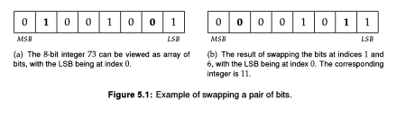

# EPI - Swap Bits

## Problem Description:

There are a number of ways in which bit manipulations can be accelerated. For
example, the expression `x & (x - 1)` clears the lowest set bit in `x`, 
and `x & ~(x -1)` extracts the lowest set bit of x. Here are a few examples:
```
16&(16-1) = 0
11&(11-1) = 10
20&(20-l) = 16
16&~(16-1) = 16
11&~(11-1) = 1
20&~(20 -1) = 4
```



A 64-bit integer can be viewed as an array of 64 bits, with the bit at index 0 
corresponding to the least significant bit (LSB), and the bit at index 63 corresponding to
the most significant bit (MSB). Implement code that takes as input a 64-bit integer
and swaps the bits at indices i and y. Figure 5.1 illustrates bit swapping for an 8-bit
integer.

**___Hint: When is the swap necessary?___**
