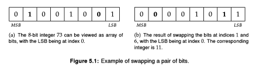

## EPI - Swap Bits



#### **Solution:**

A brute-force approach would be to use bitmasks to extract the ___i<sup>th</sup>___ and
___j<sup>th</sup>___ bits, saving them to local variables. Consequently, write the 
saved ___j<sup>th</sup>___ bit to index `i` and the saved ___i<sup>th</sup>___ bit to index `j`, 
using a combination of bitmasks and bitwise operations.

The brute-force approach works generally, e.g., if we were swapping objects stored in an array. 
However, since a bit can only take two values, we can do a little better.
Specifically, we first test if the bits to be swapped differ. If they do not, the swap
does not change the integer. If the bits are different, swapping them is the same as
flipping their individual values. For example in Figure 5.1, since the bits at Index 1
and Index 6 differ, flipping each bit has the effect of a swap.

In the code below we use standard bit-fiddling idioms for testing and flipping bits.
Overall, the resulting code is slightly more succinct and efficient than the 
brute force approach.

```python
import unittest

class Solution(object):

    def swap_bits(self, x: int, i: int, j: int) -> int:
        # Extract the i-th and j-th bits, and see if they differ.
        if (x >> i) & 1 != (x >> j) & 1:
            # i-th and j-th bits differ. We will swap them by flipping their values.
            # Select the bits to flip with bit_mask. Since x^1 = 0 when x = 1 and 1
            # when x = 0, we can perform the flip XOR.
            bit_mask = (1 << i) | (1 << j)
            x ^= bit_mask
        return x


class Test(unittest.TestCase):
    def setUp(self) -> None:
        pass

    def tearDown(self) -> None:
        pass

    def test_parity(self) -> None:
        sol = Solution()
        for x, i, j, solution in ([73, 1, 6, 11],
                                  [19574056046756, 15, 14, 19574056063140],
                                  [106, 3, 7, 226],
                                  [4, 0, 0, 4],
                                  [18875686394025, 0, 40, 18875686394025],
                                  [1585902379909443641, 26, 41, 1585902379909443641],
                                  [1972974, 12, 4, 1968894]):
            self.assertEqual(solution, sol.swap_bits(x, i, j))


# main
if __name__ == "__main__":
    unittest.main()
```

##### **Time Complexity:** O(1)

The time complexity is `O(1)`, **independent** of the **word size**.