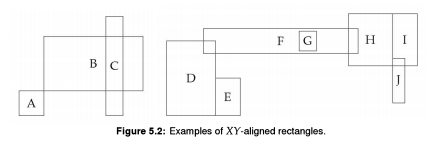

# EPI - Rectangle Intersection

## Problem Description:

This problem is concerned with rectangles whose sides are parallel to the X-axis and
Y-axis. See Figure 5.2 for examples.

Write a program which tests if two rectangles have a nonempty intersection. 
If the intersection is nonempty, return the rectangle formed by their intersection.

**___Hint: Think of the X and Y dimensions independently.___**
