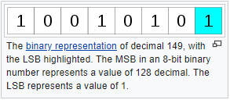
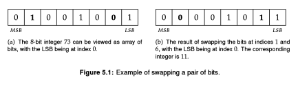

# Bit Manipulation - Tricks - Part 1

## <ins>**L**</ins>east <ins>**S**</ins>ignificant <ins>**B**</ins>it (LSB)

In [computing](https://en.wikipedia.org/wiki/Computing), the <ins>**L**</ins>east <ins>**S**</ins>ignificant <ins>**B**</ins>it (LSB) is the [bit](https://en.wikipedia.org/wiki/Bit) position 
in a [binary](https://en.wikipedia.org/wiki/Binary_numeral_system) [integer](https://en.wikipedia.org/wiki/Integer_(computer_science)) giving the units value, 
that is, determining whether the number is even or odd. 
The **LSB** is sometimes referred to as the **low-order bit** or **right-most bit**, 
due to the convention in [positional notation](https://en.wikipedia.org/wiki/Positional_notation) of writing **less significant digits** further to the right. 
It is analogous to the least significant digit of a decimal integer, 
which is the digit in the ones (right-most) position.



#### Clearing the LSB

The expression `x & (x - 1)` clears the LSB.

##### **Example:**

```
16&(16-1) = 0
11&(11-1) = 10
20&(20-l) = 16
```

#### Extracting the LSB

The expression x & ~(x -1) extracts the LSB.

##### **Example:**

```
16&~(16-1) = 16
11&~(11-1) = 1
20&~(20 -1) = 4
```


