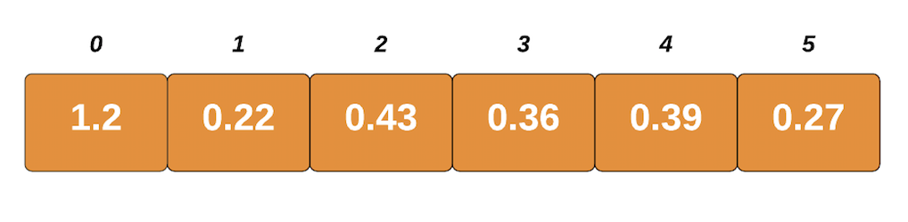
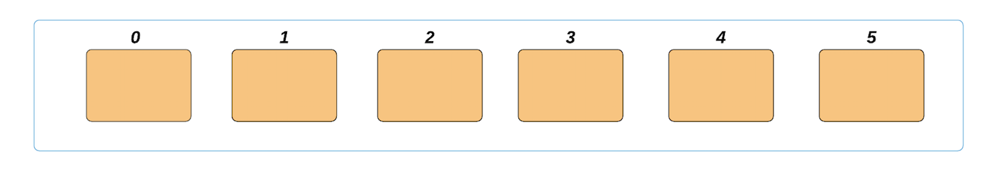
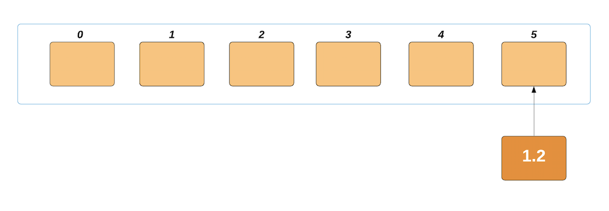
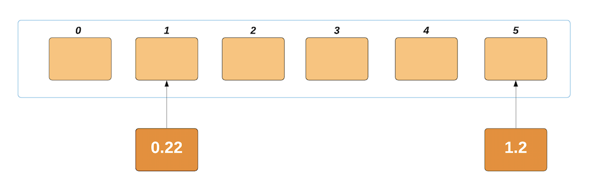
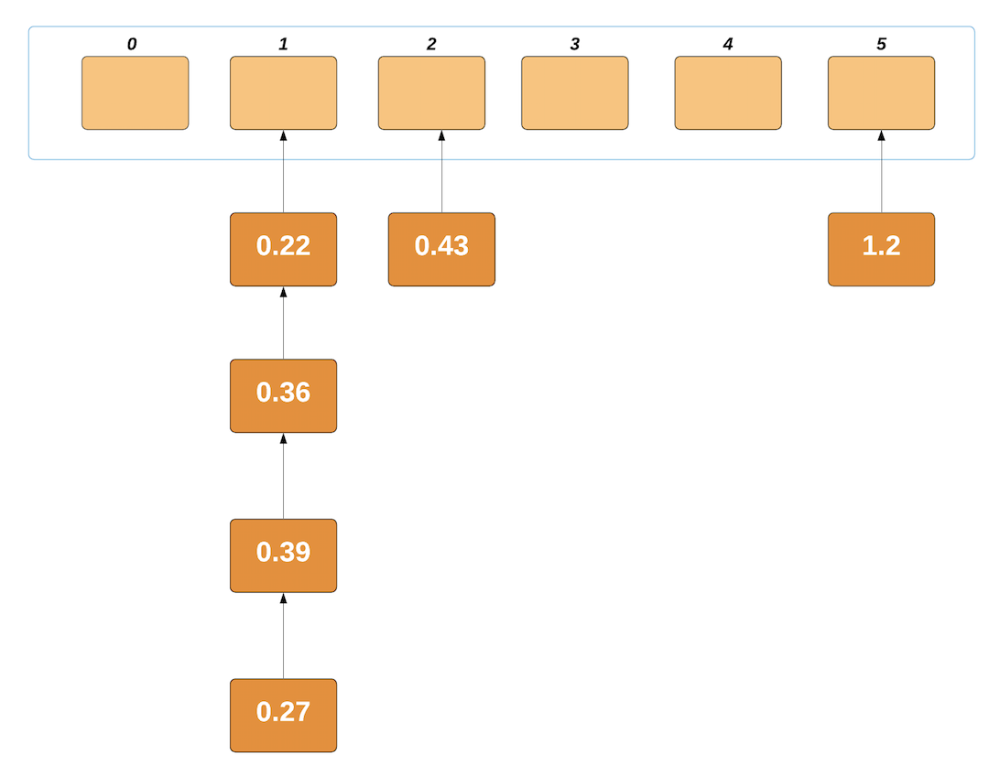
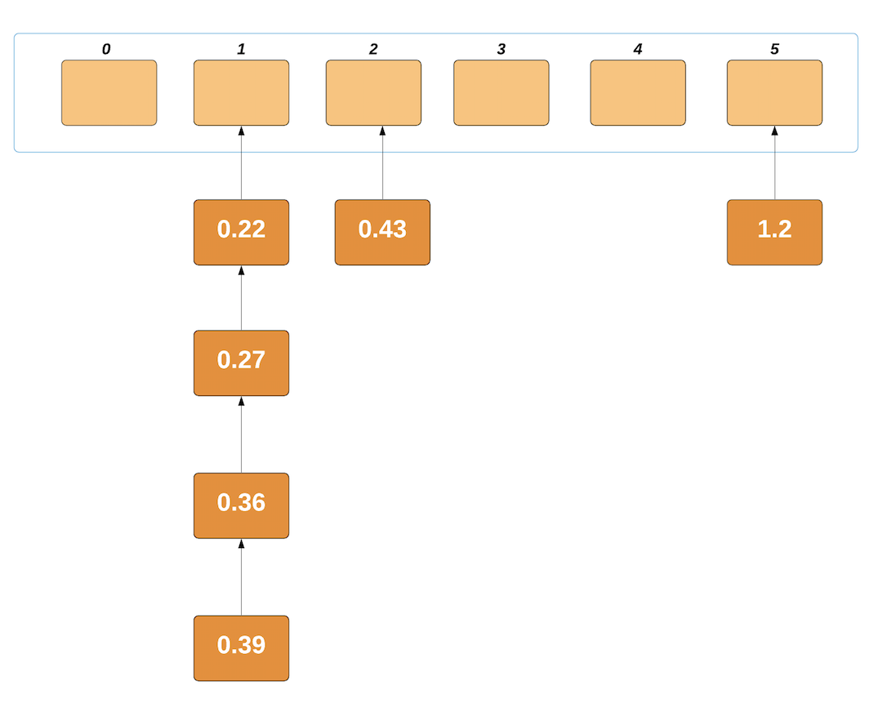
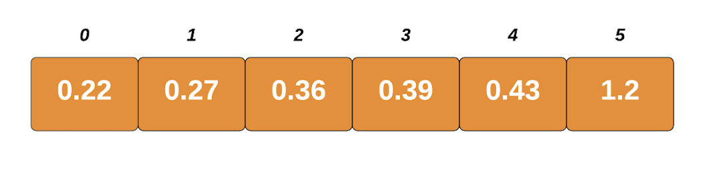

# Sorting Algorithms in Python

## LeetCode - Problem 912 - Sort an Array

Given an array of integers nums, sort the array in ascending order.

**Example 1:**

```
Input: nums = [5,2,3,1]
Output: [1,2,3,5]
```

**Example 2:**

```
Input: nums = [5,1,1,2,0,0]
Output: [0,0,1,1,2,5]
```

**Constraints:**

* 1 <= nums.length <= 50000
* -50000 <= nums[i] <= 50000

### Introduction

Sometimes, data we store or retrieve in an application can have little or no order. We may have to rearrange the data to correctly process it or efficiently use it. Over the years, computer scientists have created many sorting algorithms to organize data.

In this article we'll have a look at popular sorting algorithms, understand how they work and code them in Python. We'll also compare how quickly they sort items in a list.

For simplicity, algorithm implementations would be sorting lists of numbers in ascending order. Of course, you're free to adapt them to your needs

If you'd like to learn about a specific algorithm, you can jump to it here:

* [Bubble Sort](#bubble-sort)
* [Selection Sort](#selection-sort)
* [Insertion Sort](#insertion-sort)
* [Merge Sort](#merge-sort)
* [Quick Sort](#quick-sort)
* [Bucket Sort](#bucket-sort)
* [Python Built-in Sort Functions](#python-built-in-sort-functions)
 
#### Bubble Sort

This simple sorting algorithm iterates over a list, comparing elements in pairs and swapping them until the larger elements "bubble up" to the end of the list, and the smaller elements stay at the "bottom".

##### Explanation

We begin by comparing the first two elements of the list. If the first element is larger than the second element, we swap them. If they are already in order we leave them as is. We then move to the next pair of elements, compare their values and swap as necessary. This process continues to the last pair of items in the list.

Upon reaching the end of the list, it repeats this process for every item. Though, this is highly inefficient. What if only a single swap needs to be made in the array? Why would we still iterate though it n^2 times, even though it's already sorted?

Obviously, to optimize the algorithm, we need to stop it when it's finished sorting, otherwise it'll reevaluate an already sorted array many times.

How would we know that we're finished sorting? If the items were in order then we would not have to swap any. So, whenever we swap values we set a flag to `True` to repeat sorting process. If no swaps occurred, the flag would remain `False` and the algorithm will stop.

##### Implementation

With the optimization, we can implement Bubble Sort in Python as follows:

```python
def bubble_sort(nums):
    # We set swapped to True so the loop looks runs at least once
    swapped = True
    while swapped:
        swapped = False
        for i in range(len(nums) - 1):
            if nums[i] > nums[i + 1]:
                # Swap the elements
                nums[i], nums[i + 1] = nums[i + 1], nums[i]
                # Set the flag to True so we'll loop again
                swapped = True


# Verify it works
random_list_of_nums = [5, 2, 1, 8, 4]
bubble_sort(random_list_of_nums)
print(random_list_of_nums)
```

The algorithm runs in a `while` loop, only breaking when no items are swapped. We set `swapped` to `True` in the beginning to ensure that the algorithm runs at least once.

##### Time Complexity
In the worst case scenario (when the list is in reverse order), this algorithm would have to swap every single item of the array. Our `swapped` flag would be set to `True` on every iteration.

Therefore, if we have n elements in our list, we would have `n` iterations per item - thus Bubble Sort's time complexity is **O(n^2)**.

#### Selection Sort

This algorithm segments the list into two parts: sorted and unsorted. We continuously remove the smallest element of the unsorted segment of the list and append it to the sorted segment.

##### Explanation

In practice, we don't need to create a new list for the sorted elements, what we do is treat the leftmost part of the list as the sorted segment. We then search the entire list for the smallest element, and swap it with the first element.

Now we know that the first element of the list is sorted, we get the smallest element of the remaining items and swap it with the second element. This reiterates until the last item of the list is the remaining element to be examined.

##### Implementation

```python
def selection_sort(nums):
    # This value of i corresponds to how many values were sorted
    for i in range(len(nums)):
        # We assume that the first item of the unsorted segment is the smallest
        lowest_value_index = i
        # This loop iterates over the unsorted items
        for j in range(i + 1, len(nums)):
            if nums[j] < nums[lowest_value_index]:
                lowest_value_index = j
        # Swap values of the lowest unsorted element with the first unsorted
        # element
        nums[i], nums[lowest_value_index] = nums[lowest_value_index], nums[i]


# Verify it works
random_list_of_nums = [12, 8, 3, 20, 11]
selection_sort(random_list_of_nums)
print(random_list_of_nums)
```

We see that as `i` increases, we need to need to check less items.

##### Time Complexity

We can easily get the time complexity by examining the `for` loops in the Selection Sort algorithm. For a list with `n` elements, the outer loop iterates `n` times.

The inner loop iterate `n-1` when `i` is equal to `1`, and then `n-2` as `i` is equal to `2` and so forth.

The amount of comparisons are `(n - 1) + (n - 2) + ... + 1`, which gives Selection Sort a time complexity of **O(n^2)**.

#### Insertion Sort

Like Selection Sort, this algorithm segments the list into sorted and unsorted parts. It iterates over the unsorted segment, and inserts the element being viewed into the correct position of the sorted list.

##### Explanation

We assume that the first element of the list is sorted. We then go to the next element, let's call it x. If x is larger than the first element we leave as is. If x is smaller, we copy the value of the first element to the second position and then set the first element to x.

As we go to the other elements of the unsorted segment, we continuously move larger elements in the sorted segment up the list until we encounter an element smaller than x or reach the end of the sorted segment, and then place x in it's correct position.

If you'd like to read a detailed, dedicated article for [Insertion Sort](https://stackabuse.com/insertion-sort-in-python/), we've got you covered!

##### Implementation

```python
def insertion_sort(nums):
    # Start on the second element as we assume the first element is sorted
    for i in range(1, len(nums)):
        item_to_insert = nums[i]
        # And keep a reference of the index of the previous element
        j = i - 1
        # Move all items of the sorted segment forward if they are larger than
        # the item to insert
        while j >= 0 and nums[j] > item_to_insert:
            nums[j + 1] = nums[j]
            j -= 1
        # Insert the item
        nums[j + 1] = item_to_insert


# Verify it works
random_list_of_nums = [9, 1, 15, 28, 6]
insertion_sort(random_list_of_nums)
print(random_list_of_nums)
```

##### Time Complexity

In the worst case scenario, an array would be sorted in reverse order. The outer `for loop` in Insertion Sort function always iterates `n-1` times.

In the worst case scenario, the inner `for loop` would swap once, then swap two and so forth. The amount of swaps would then be `1 + 2 + ... + (n - 3) + (n - 2) + (n - 1)` which gives Insertion Sort a time complexity of **O(n^2)**.

#### Heap Sort

This popular sorting algorithm, like the Insertion and Selection sorts, segments the list into sorted and unsorted parts. It converts the unsorted segment of the list to a Heap data structure, so that we can efficiently determine the largest element.

##### Explanation

We begin by transforming the list into a **Max Heap** - a Binary Tree where the biggest element is the root node. We then place that item to the end of the list. We then rebuild our ___Max Heap___ which now has one less value, placing the new largest value before the last item of the list.

We iterate this process of building the heap until all nodes are removed.

If you'd like to read a detailed, dedicated article for [Heap Sort](https://stackabuse.com/heap-sort-in-python/), we've got you covered!

##### Implementation

We'll create an helper function `heapify` to implement this algorithm:

```python
def heapify(nums, heap_size, root_index):
    # Assume the index of the largest element is the root index
    largest = root_index
    left_child = (2 * root_index) + 1
    right_child = (2 * root_index) + 2

    # If the left child of the root is a valid index, and the element is greater
    # than the current largest element, then update the largest element
    if left_child < heap_size and nums[left_child] > nums[largest]:
        largest = left_child

    # Do the same for the right child of the root
    if right_child < heap_size and nums[right_child] > nums[largest]:
        largest = right_child

    # If the largest element is no longer the root element, swap them
    if largest != root_index:
        nums[root_index], nums[largest] = nums[largest], nums[root_index]
        # Heapify the new root element to ensure it's the largest
        heapify(nums, heap_size, largest)


def heap_sort(nums):
    n = len(nums)

    # Create a Max Heap from the list
    # The 2nd argument of range means we stop at the element before -1 i.e.
    # the first element of the list.
    # The 3rd argument of range means we iterate backwards, reducing the count
    # of i by 1
    for i in range(n, -1, -1):
        heapify(nums, n, i)

    # Move the root of the max heap to the end of
    for i in range(n - 1, 0, -1):
        nums[i], nums[0] = nums[0], nums[i]
        heapify(nums, i, 0)


# Verify it works
random_list_of_nums = [35, 12, 43, 8, 51]
heap_sort(random_list_of_nums)
print(random_list_of_nums)
```

##### Time Complexity

Let's first look at the time complexity of the `heapify` function. In the worst case the largest element is never the root element, this causes a recursive call to `heapify`. While recursive calls might seem dauntingly expensive, remember that we're working with a binary tree.

Visualize a binary tree with 3 elements, it has a height of 2. Now visualize a binary tree with 7 elements, it has a height of 3. The tree grows logarithmically to `n`. The `heapify` function traverses that tree in **O(log(n))** time.

The `heap_sort` function iterates over the array `n` times. Therefore the overall time complexity of the Heap Sort algorithm is **O(nlog(n))**.

#### Merge Sort

This divide and conquer algorithm splits a list in half, and keeps splitting the list by 2 until it only has singular elements.

Adjacent elements become sorted pairs, then sorted pairs are merged and sorted with other pairs as well. This process continues until we get a sorted list with all the elements of the unsorted input list.

##### Explanation

We recursively split the list in half until we have lists with size one. We then merge each half that was split, sorting them in the process.

Sorting is done by comparing the smallest elements of each half. The first element of each list are the first to be compared. If the first half begins with a smaller value, then we add that to the sorted list. We then compare the second smallest value of the first half with the first smallest value of the second half.

Every time we select the smaller value at the beginning of a half, we move the index of which item needs to be compared by one.

If you'd like to read a detailed, dedicated article for [Merge Sort](https://stackabuse.com/merge-sort-in-python/), we've got you covered!

##### Implementation

```python
def merge(left_list, right_list):
    sorted_list = []
    left_list_index = right_list_index = 0

    # We use the list lengths often, so its handy to make variables
    left_list_length, right_list_length = len(left_list), len(right_list)

    for _ in range(left_list_length + right_list_length):
        if left_list_index < left_list_length and right_list_index < right_list_length:
            # We check which value from the start of each list is smaller
            # If the item at the beginning of the left list is smaller, add it
            # to the sorted list
            if left_list[left_list_index] <= right_list[right_list_index]:
                sorted_list.append(left_list[left_list_index])
                left_list_index += 1
            # If the item at the beginning of the right list is smaller, add it
            # to the sorted list
            else:
                sorted_list.append(right_list[right_list_index])
                right_list_index += 1

        # If we've reached the end of the of the left list, add the elements
        # from the right list
        elif left_list_index == left_list_length:
            sorted_list.append(right_list[right_list_index])
            right_list_index += 1
        # If we've reached the end of the of the right list, add the elements
        # from the left list
        elif right_list_index == right_list_length:
            sorted_list.append(left_list[left_list_index])
            left_list_index += 1

    return sorted_list


def merge_sort(nums):
    # If the list is a single element, return it
    if len(nums) <= 1:
        return nums

    # Use floor division to get midpoint, indices must be integers
    mid = len(nums) // 2

    # Sort and merge each half
    left_list = merge_sort(nums[:mid])
    right_list = merge_sort(nums[mid:])

    # Merge the sorted lists into a new one
    return merge(left_list, right_list)


# Verify it works
random_list_of_nums = [120, 45, 68, 250, 176]
random_list_of_nums = merge_sort(random_list_of_nums)
print(random_list_of_nums)
```

Note that the `merge_sort()` function, unlike the previous sorting algorithms, returns a new list that is sorted, rather than sorting the existing list.

Therefore, Merge Sort requires space to create a new list of the same size as the input list.

##### Time Complexity

Let's first look at the merge function. It takes two lists, and iterates `n` times, where `n` is the size of their combined input.

The `merge_sort` function splits its given array in 2, and recursively sorts the sub-arrays. As the input being recursed is half of what was given, like binary trees this makes the time it takes to process grow logarithmically to `n`.

Therefore the overall time complexity of the Merge Sort algorithm is `O(nlog(n))`.

#### Quick Sort

This divide and conquer algorithm is the most often used sorting algorithm covered in this article. When configured correctly, it's extremely efficient and does not require the extra space Merge Sort uses. We partition the list around a pivot element, sorting values around the pivot.

##### Explanation

Quick Sort begins by partitioning the list - picking one value of the list that will be in its sorted place. This value is called a pivot. All elements smaller than the pivot are moved to its left. All larger elements are moved to its right.

Knowing that the pivot is in it's rightful place, we recursively sort the values around the pivot until the entire list is sorted.

If you'd like to read a detailed, dedicated article for [Quick Sort](https://stackabuse.com/quicksort-sort-in-python/), we've got you covered!

##### Implementation
```python
# There are different ways to do a Quick Sort partition, this implements the
# Hoare partition scheme. Tony Hoare also created the Quick Sort algorithm.
def partition(nums, low, high):
    # We select the middle element to be the pivot. Some implementations select
    # the first element or the last element. Sometimes the median value becomes
    # the pivot, or a random one. There are many more strategies that can be
    # chosen or created.
    pivot = nums[(low + high) // 2]
    i = low - 1
    j = high + 1
    while True:
        i += 1
        while nums[i] < pivot:
            i += 1

        j -= 1
        while nums[j] > pivot:
            j -= 1

        if i >= j:
            return j

        # If an element at i (on the left of the pivot) is larger than the
        # element at j (on right right of the pivot), then swap them
        nums[i], nums[j] = nums[j], nums[i]


def quick_sort(nums):
    # Create a helper function that will be called recursively
    def _quick_sort(items, low, high):
        if low < high:
            # This is the index after the pivot, where our lists are split
            split_index = partition(items, low, high)
            _quick_sort(items, low, split_index)
            _quick_sort(items, split_index + 1, high)

    _quick_sort(nums, 0, len(nums) - 1)


# Verify it works
random_list_of_nums = [22, 5, 1, 18, 99]
quick_sort(random_list_of_nums)
print(random_list_of_nums)
```

##### Time Complexity
The worst case scenario is when the smallest or largest element is always selected as the pivot. This would create partitions of size `n-1`, causing recursive calls `n-1` times. This leads us to a worst case time complexity of **O(n^2)**.

While this is a terrible worst case, Quick Sort is heavily used because it's average time complexity is much quicker. While the `partition` function utilizes nested `while` loops, it does comparisons on all elements of the array to make its swaps. As such, it has a time complexity of **O(n)**.

With a good pivot, the Quick Sort function would partition the array into halves which grows logarithmically with `n`. Therefore the average time complexity of the Quick Sort algorithm is **O(nlog(n))**.

#### Bucket Sort

Bucket Sort is a comparison-type algorithm which assigns elements of a list we want to sort in Buckets, or Bins. The contents of these buckets are then sorted, typically with another algorithm. After sorting, the contents of the buckets are appended, forming a sorted collection.

Bucket Sort can be thought of as a scatter-order-gather approach towards sorting a list, due to the fact that the elements are first scattered in buckets, ordered within them, and finally gathered into a new, sorted list.

We'll implement Bucket Sort in Python and analyze it's time complexity.

##### How does Bucket Sort Work?

Before jumping into its exact implementation, let's walk through the algorithm's steps:

1. Set up a list of empty buckets. A bucket is initialized for each element in the array.
1. Iterate through the bucket list and insert elements from the array. Where each element is inserted depends on the input list and the largest element of it. We can end up with 0..n elements in each bucket. This will be elaborated on in the visual presentation of the algorithm.
1. Sort each non-empty bucket. You can do this with any sorting algorithm. Since we're working with a small dataset, each bucket won't have many elements so Insertion Sort works wonders for us here.
1. Visit the buckets in order. Once the contents of each bucket are sorted, when concatenated, they will yield a list in which the elements are arranged based on your criteria.

Let's take a look at the visual presentation of how the algorithm works. For example, let's assume that this is the input list:



The largest element is **1.2**, and the length of the list is **6**. Using these two, we'll figure out the optimal size of each bucket. We'll get this number by dividing the largest element with the length of the list. In our case, it's **1.2/6** which is **0.2**.

By dividing the element's value with this size, we'll get an index for each element's respective bucket.

Now, we'll create empty buckets. We'll have the same amount of buckets as the elements in our list:



We'll insert the elements in their respective buckets. Taking the first element into consideration - **1.2/0.2 = 6**, the index of its respective bucket is **6**. If this result is higher or equal to the length of the list, we'll just subtract **1** and it'll fit into the list nicely. This only happens with the largest number, since we got the **size** by dividing the largest element by the length.

We'll place this element in the bucket with the index of **5**:



Likewise, the next element will be indexed to **0.22/0.2 = 1.1**. Since this is a decimal number, we'll floor it. This is rounded to **1**, and our element is placed in the second bucket:



This process is repeated until we've placed the last element in its respective bucket. Our buckets now look something along the lines of:



Now, we'll sort the contents of each non-empty bucket. We'll be using Insertion Sort since it's unbeaten with small lists like this. After Insertion Sort, the buckets look like this:



Now, it's just a matter of traversing the non-empty buckets and concatenating the elements in a list. They're sorted and ready to go:



##### Bucket Sort Implementation in Python

With that out of the way, let's go ahead and implement the algorithm in Python. Let's start off with the `bucket_sort()` function itself:

```python
def bucket_sort(input_list):
    # Find maximum value in the list and use length of the list to determine which value in the list goes into which bucket 
    max_value = max(input_list)
    size = max_value/len(input_list)

    # Create n empty buckets where n is equal to the length of the input list
    buckets_list= []
    for x in range(len(input_list)):
        buckets_list.append([]) 

    # Put list elements into different buckets based on the size
    for i in range(len(input_list)):
        j = int (input_list[i] / size)
        if j != len (input_list):
            buckets_list[j].append(input_list[i])
        else:
            buckets_list[len(input_list) - 1].append(input_list[i])

    # Sort elements within the buckets using Insertion Sort
    for z in range(len(input_list)):
        insertion_sort(buckets_list[z])
            
    # Concatenate buckets with sorted elements into a single list
    final_output = []
    for x in range(len (input_list)):
        final_output = final_output + buckets_list[x]
    return final_output
```

The implementation is fairly straightforward. We've calculated the `size` parameter. Then, we instantiated a list of empty buckets and inserted elements based on their value and the `size` of each bucket.

Once inserted, we call `insertion_sort()` on each of the buckets:

```python
def insertion_sort(bucket):
    for i in range (1, len (bucket)):
        var = bucket[i]
        j = i - 1
        while (j >= 0 and var < bucket[j]):
            bucket[j + 1] = bucket[j]
            j = j - 1
        bucket[j + 1] = var
```

And with that in place, let's populate a list and perform a Bucket Sort on it:

```python
def main():
    input_list = [1.20, 0.22, 0.43, 0.36,0.39,0.27]
    print('ORIGINAL LIST:')
    print(input_list)
    sorted_list = bucket_sort(input_list)
    print('SORTED LIST:')
    print(sorted_list)
```

Running this code will return:

```
Original list: [1.2, 0.22, 0.43, 0.36, 0.39, 0.27]
Sorted list: [0.22, 0.27, 0.36, 0.39, 0.43, 1.2]
```

##### Bucket Sort Time Complexity

###### Worst-Case Complexity

If the collection we're working with has a short range (like the one we've had in our example) - it's common to have many elements in a single bucket, where a lot of buckets are empty.

If all elements fall into the same bucket, the complexity depends exclusively on the algorithm we use to sort the contents of the bucket itself.

Since we're using Insertion Sort - its worst-case complexity shines when the list is in reverse order. Thus, the worst-case complexity for Bucket Sort is also **O(n2)**.

###### Best-Case Complexity
 
The best-case would be having all of the elements already sorted. Additionally, the elements are uniformly distributed. This means that each bucket would have the same number of elements.

That being said, creating the buckets would take **O(n)** and Insertion sort would take **O(k)**, giving us an **O(n+k)** complexity.

###### Average-Case Complexity

The average-case occurs in the vast majority of real-life collections. When the collection we want to sort is random. In that case, Bucket Sort takes **O(n)** to finish, making it very efficient.

#### Python Built-in Sort Functions

While it's beneficial to understand these sorting algorithms, in most Python projects you would probably use the sort functions already provided in the language.

We can change our list to have it's contents sorted with the `sort()` method:

```python
apples_eaten_a_day = [2, 1, 1, 3, 1, 2, 2]
apples_eaten_a_day.sort()
print(apples_eaten_a_day) # [1, 1, 1, 2, 2, 2, 3]
```

Or we can use the `sorted()` function to create a new sorted list:

```python
apples_eaten_a_day_2 = [2, 1, 1, 3, 1, 2, 2]
sorted_apples = sorted(apples_eaten_a_day_2)
print(sorted_apples) # [1, 1, 1, 2, 2, 2, 3]
```

They both sort in ascending order, but you can easily sort in descending order by setting the `reverse` flag to `True`:

```python
# Reverse sort the list in-place
apples_eaten_a_day.sort(reverse=True)
print(apples_eaten_a_day) # [3, 2, 2, 2, 1, 1, 1]

# Reverse sort to get a new list
sorted_apples_desc = sorted(apples_eaten_a_day_2, reverse=True)
print(sorted_apples_desc) # [3, 2, 2, 2, 1, 1, 1]
```

Unlike the sorting algorithm functions we created, both these functions can sort lists of tuples and classes. The `sorted()` function can sort any iterable object and that includes - lists, strings, tuples, dictionaries, sets, and custom [iterators](https://stackabuse.com/introduction-to-python-iterators/) you can create.

These sort functions implement the [Tim Sort](https://en.wikipedia.org/wiki/Timsort) algorithm, an algorithm inspired by Merge Sort and Insertion Sort.

#### Speed Comparisons

To get an idea of how quickly they perform, we generate a list of 5000 numbers between 0 and 1000. We then time how long it takes for each algorithm to complete. This is repeated 10 times so that we can more reliably establish a pattern of performance.

These were the results, the time is in seconds:

| Run |	Bubble | Selection | Insertion | Heap | Merge | Quick |
| --- | --- | --- | --- | --- | --- | --- |
| 1 | 5.53188 | 1.23152 | 1.60355 | 0.04006 | 0.02619 | 0.01639 |
| 2 | 4.92176 | 1.24728 | 1.59103 | 0.03999 | 0.02584 | 0.01661 |
| 3 | 4.91642 | 1.22440 | 1.59362 | 0.04407 | 0.02862 | 0.01646 |
| 4 | 5.15470 | 1.25053 | 1.63463 | 0.04128 | 0.02882 | 0.01860 |
| 5 | 4.95522 | 1.28987 | 1.61759 | 0.04515 | 0.03314 | 0.01885 |
| 6 | 5.04907 | 1.25466 | 1.62515 | 0.04257 | 0.02595 | 0.01628 |
| 7 | 5.05591 | 1.24911 | 1.61981 | 0.04028 | 0.02733 | 0.01760 |
| 8 | 5.08799 | 1.25808 | 1.62603 | 0.04264 | 0.02633 | 0.01705 |
| 9 | 5.03289 | 1.24915 | 1.61446 | 0.04302 | 0.03293 | 0.01762 |
| 10 | 5.14292 | 1.22021 | 1.57273 | 0.03966 | 0.02572 | 0.01606 |
| Avg | 5.08488 | 1.24748 | 1.60986 | 0.04187 | 0.02809 | 0.01715 |

You would get different values if you set up the test yourself, but the patterns observed should be the same or similar. Bubble Sort is the slowest the worst performer of all the algorithms. While it useful as an introduction to sorting and algorithms, it's not fit for practical use.

We also notice that Quick Sort is very fast, nearly twice as fast as Merge Sort and it wouldn't need as much space to run. Recall that our partition was based on the middle element of the list, different partitions could have different outcomes.

As Insertion Sort performs much less comparisons than Selection Sort, the implementations are usually quicker but in these runs Selection Sort is slightly faster.

Insertion Sorts does much more swaps than Selection Sort. If swapping values takes up considerably more time than comparing values, then this "contrary" result would be plausible.

Be mindful of the environment when choosing your sorting algorithm, as it will affect performance.

#### Conclusion

Sorting algorithms gives us many ways to order our data. We looked at 6 different algorithms - Bubble Sort, Selection Sort, Insertion Sort, Merge Sort, Heap Sort, Quick Sort - and their implementations in Python.

The amount of comparison and swaps the algorithm performs along with the environment the code runs are key determinants of performance. In real Python applications, it's recommended we stick with the built in Python sort functions for their flexibility on the input and speed.


