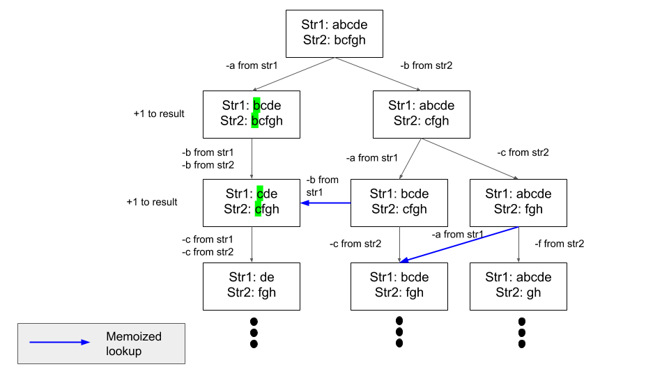

## LeetCode - Problem 1143 - Longest Common Subsequence

Given two strings text1 and text2, return the length of their longest common subsequence.

A subsequence of a string is a new string generated from the original string with some characters(can be none) deleted
without changing the relative order of the remaining characters. (eg, "ace" is a subsequence of "abcde"
while "aec" is not). A common subsequence of two strings is a subsequence that is common to both strings.

If there is no common subsequence, return 0.
___

### Examples

##### Example 1:

```
Input: text1 = "abcde", text2 = "ace" 
Output: 3  
Explanation: The longest common subsequence is "ace" and its length is 3.
```

##### Example 2:

```
Input: text1 = "abc", text2 = "abc"
Output: 3
Explanation: The longest common subsequence is "abc" and its length is 3.
```

##### Example 3:

```
Input: text1 = "abc", text2 = "def"
Output: 0
Explanation: There is no such common subsequence, so the result is 0.
```

### Solution

This is a dynamic programming problem.

First string: `str1`, Second string: `str2`.
Assume you are at position `ptr1` for `str1` and position `ptr2` for `str2`.

* ___Step 1:___ Compare `str1[ptr1]` and `str[ptr2]`. There can be two cases arising from this comparison:
    * ___Case 1:___ They are the same
        * If they are the same, it is simple, you know that there is 1 good subsequence that you can add up to your answer. Then you increment ptr1 and ptr2. Go back to `Step 1`.
    * ___Case 2:___ They are not the same.
        * If that's the case, now you have to explore two options:
            * Op 1: You increment `ptr1`, and go back to `Step 1`.
            * Op 2: You increment `ptr2`, and go back to `Step 1`.
* You do this until either of your pointers reach to the end of either of the strings.

Where does Dynamic Programming occur?

For either of the options in Case 2, there will be a lot overlapping cases. Blue lines in the image below means accessing the memoized results, this is the result of using Dynamic Programming.

In the diagram, I say stuff like '-a from str1' and '-b from str 2'. It is just saying: "remove a from str1and remove b from str2", respectively. It's similar to incrementing the pointers of respective strings.



In Python, there is an easy way to memoize a function call. For example, if you call a function `func(a,b)` with same `a` and `b` over and over again, the decorator `@lru_cache` from `functools` can memoize this function call with corresponding result so that you don't need to compute over and over again. Internally, it is just creating a hashmap with function parameters as key and returned value as value. [LRU Cache Documentation](https://docs.python.org/3/library/functools.html#functools.lru_cache).

```python
from functools import lru_cache

class Solution:
    def longestCommonSubsequence(self, text1: str, text2: str) -> int:
        
        @lru_cache(maxsize=None)
        def memo_solve(ptr1, ptr2):
            if ptr1 == len(text1) or ptr2 == len(text2):
                return 0
            
            # Case 1
            if text1[ptr1] == text2[ptr2]:
                return 1 + memo_solve(ptr1+1, ptr2+1)
        
            # Case 2
            else:     
                return max(memo_solve(ptr1+1, ptr2), memo_solve(ptr1,ptr2+1))
                       # ^    # ^ Case 2 - Option 1           ^ Case 2 - Option 2
					   # | __You want the max() result from resulting branches in the tree 
        return memo_solve(0,0) # Start the recursion stack from str1[0] and str2[0]
```