## Geeks For Geeks : 0 - 1 Knapsack Problem

You are given weights and values of N items, put these items in a knapsack of capacity W to get the maximum total value in the knapsack. Note that we have only one quantity of each item.
In other words, given two integer arrays val[0..N-1] and wt[0..N-1] which represent values and weights associated with N items respectively. Also given an integer W which represents knapsack capacity, find out the maximum value subset of val[] such that sum of the weights of this subset is smaller than or equal to W. You cannot break an item, either pick the complete item, or don’t pick it (0-1 property).

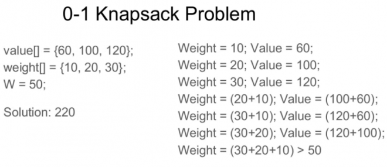

### Introduction
Given the weights and profits of ‘N’ items, we are asked to put these items in a knapsack which has a capacity ‘C’. The goal is to get the maximum profit from the items in the knapsack. Each item can only be selected once, as we don’t have multiple quantities of any item.

Let’s take the example of Merry, who wants to carry some fruits in the knapsack to get maximum profit. Here are the weights and profits of the fruits:

**Items:** { Apple, Orange, Banana, Melon }
**Weights:** { 2, 3, 1, 4 }
**Profits:** { 4, 5, 3, 7 }
**Knapsack capacity:** 5

Let’s try to put different combinations of fruits in the knapsack, such that their total weight is not more than 5:

Apple + Orange (total weight 5) => 9 profit
Apple + Banana (total weight 3) => 7 profit
Orange + Banana (total weight 4) => 8 profit
Banana + Melon (total weight 5) => 10 profit

This shows that **Banana + Melon** is the best combination, as it gives us the maximum profit and the total weight does not exceed the capacity.

### Problem Statement
Given two integer arrays to represent weights and profits of ‘N’ items, we need to find a subset of these items which will give us maximum profit such that their cumulative weight is not more than a given number ‘C’. Each item can only be selected once, which means either we put an item in the knapsack or we skip it.

### Basic Solution
A basic brute-force solution could be to try all combinations of the given items (as we did above), allowing us to choose the one with maximum profit and a weight that doesn’t exceed ‘C’. Take the example of four items (A, B, C, and D), as shown in the diagram below. To try all the combinations, our algorithm will look like:

```
for each item 'i' 
  create a new set which INCLUDES item 'i' if the total weight does not exceed the capacity, and 
     recursively process the remaining capacity and items
  create a new set WITHOUT item 'i', and recursively process the remaining items 
return the set from the above two sets with higher profit
```

Here is a visual representation of our algorithm:

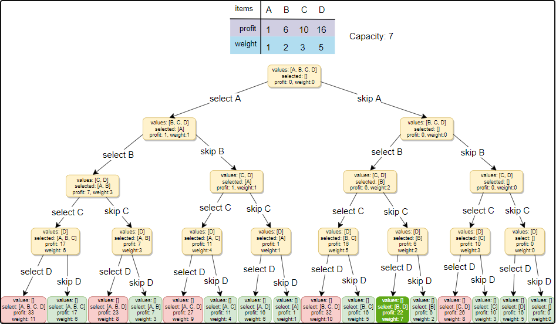

All green boxes have a total weight that is less than or equal to the capacity (7), and all the red ones have a weight that is more than 7. The best solution we have is with items [B, D] having a total profit of 22 and a total weight of 7.

##### Code

Here is the code for the brute-force solution:

```python
from typing import List

import unittest


class Solution(object):
    def knapsack(self, profits: List[int], weights: List[int], capacity: int) -> int:
        def knapsack_recursive(profits: List[int], weights: List[int], capacity: int, currentIndex: int) -> int:
            # base checks
            if capacity <= 0 or currentIndex >= len(profits):
                return 0

            # recursive call after choosing the element at the currentIndex
            # if the weight of the element at currentIndex exceeds the capacity, we  shouldn't process this
            profit1 = 0
            if weights[currentIndex] <= capacity:
                profit1 = profits[currentIndex] + knapsack_recursive(
                    profits, weights, capacity - weights[currentIndex], currentIndex + 1)

            # recursive call after excluding the element at the currentIndex
            profit2 = knapsack_recursive(profits, weights, capacity, currentIndex + 1)

            return max(profit1, profit2)

        return knapsack_recursive(profits, weights, capacity, 0)


class Test(unittest.TestCase):
    def setUp(self) -> None:
        pass

    def tearDown(self) -> None:
        pass

    def test_knapsack(self) -> None:
        sol = Solution()
        for profits, weights, capacity, solution in (
            [[1,2,3], [4,5,1], 4, 3],
            [[1,2,3], [4,5,6], 3, 0]
        ):
            self.assertEqual(solution, sol.knapsack(profits, weights, capacity))


# main
if __name__ == "__main__":
    unittest.main()
```

The time complexity of the above algorithm is exponential **___O(2<sup>n</sup>)___**, where `n` represents the total number of items. 
This can also be confirmed from the above recursion tree. As we can see that we will have a total of ‘31’ recursive calls – 
calculated through ___(2<sup>n</sup>) + (2<sup>n</sup>) - 1___, which is asymptotically 
equivalent to **___O(2<sup>n</sup>)___**.

The space complexity is **___O(n)___**. This space will be used to store the recursion stack. 
Since our recursive algorithm works in a depth-first fashion, which means, 
we can’t have more than `n` recursive calls on the call stack at any time.

Let’s visually draw the recursive calls to see if there are any overlapping sub-problems. 
As we can see, in each recursive call, profits and weights arrays remain constant, 
and only capacity and currentIndex change. For simplicity, let’s denote capacity 
with `c` and currentIndex with `i`:

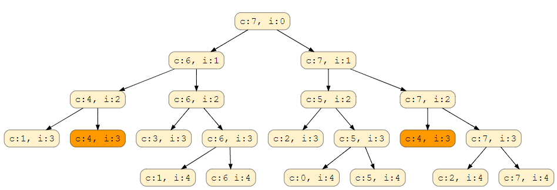

We can clearly see that **‘c:4, i=3’** has been called twice, hence we have an overlapping sub-problems 
pattern. As we discussed above, overlapping sub-problems can be solved through Memoization.

### Top-down Dynamic Programming with Memoization

We can use memoization to overcome the overlapping sub-problems. 
To reiterate, memoization is when we store the results of all the 
previously solved sub-problems and return the results from memory 
if we encounter a problem that has already been solved.

Since we have two changing values (`capacity` and `currentIndex`) in our recursive function 
`knapsackRecursive()`, we can use a two-dimensional array to store the results of all the solved sub-problems. 
As mentioned above, we need to store results for every sub-array (i.e. for every possible index ‘i’) 
and for every possible capacity ‘c’.

##### Code
Here is the code with memoization (see the changes in the highlighted lines):

```python
from typing import List

import unittest


class Solution(object):

    def knapsack(self, profits: List[int], weights: List[int], capacity: int) -> int:
        def knapsack_recursive(dp, profits, weights, capacity, currentIndex):

            # base checks
            if capacity <= 0 or currentIndex >= len(profits):
                return 0

            # if we have already solved a similar problem, return the result from memory
            if dp[currentIndex][capacity] != -1:
                return dp[currentIndex][capacity]

            # recursive call after choosing the element at the currentIndex
            # if the weight of the element at currentIndex exceeds the capacity, we
            # shouldn't process this
            profit1 = 0
            if weights[currentIndex] <= capacity:
                profit1 = profits[currentIndex] + knapsack_recursive(
                    dp, profits, weights, capacity - weights[currentIndex], currentIndex + 1)

            # recursive call after excluding the element at the currentIndex
            profit2 = knapsack_recursive(
                dp, profits, weights, capacity, currentIndex + 1)

            dp[currentIndex][capacity] = max(profit1, profit2)
            return dp[currentIndex][capacity]

        # create a two dimensional array for Memoization, each element is initialized to '-1'
        dp = [[-1 for x in range(capacity + 1)] for y in range(len(profits))]
        return knapsack_recursive(dp, profits, weights, capacity, 0)


class Test(unittest.TestCase):
    def setUp(self) -> None:
        pass

    def tearDown(self) -> None:
        pass

    def test_knapsack(self) -> None:
        sol = Solution()
        for profits, weights, capacity, solution in (
            [[1,2,3], [4,5,1], 4, 3],
            [[1,2,3], [4,5,6], 3, 0]
        ):
            self.assertEqual(solution, sol.knapsack(profits, weights, capacity))


# main
if __name__ == "__main__":
    unittest.main()
```

**What is the time and space complexity of the above solution?** 
Since our memoization array `dp[profits.length][capacity+1]` 
stores the results for all the subproblems, we can conclude that we will not have more than 
___N∗C___ subproblems (where ‘N’ is the number of items and ‘C’ is the knapsack capacity). 
This means that our time complexity will be ___O(N*C)___.

The above algorithm will be using ___O(N*C)___ space for the memoization array. 
Other than that we will use ___O(N)___ space for the recursion call-stack. 
So the total space complexity will be ___O(N*C + N)___, which is asymptotically 
equivalent to ___O(N*C)___.

### Bottom-up Dynamic Programming

Let’s try to populate our `dp[][]` array from the above solution, working in a bottom-up fashion. Essentially, we want to find the maximum profit for every sub-array and for every possible capacity. **This means,** `dp[i][c]` **will represent the maximum knapsack profit for capacity ‘c’ calculated from the first ‘i’ items**.

So, for each item at index ‘i’ (0 <= i < items.length) and capacity ‘c’ (0 <= c <= capacity), we have two options:
  1. Exclude the item at index ‘i’. In this case, we will take whatever profit we get from the sub-array excluding this item => `dp[i-1][c]`
  1. Include the item at index ‘i’ if its weight is not more than the capacity. In this case, we include its profit plus whatever profit we get from the remaining capacity and from remaining items => `profits[i] + dp[i-1][c-weights[i]]`

Finally, our optimal solution will be maximum of the above two values:

```
dp[i][c] = max (dp[i-1][c], profits[i] + dp[i-1][c-weights[i]]) 
```

Let’s visually draw this and start with our base case of zero capacity:

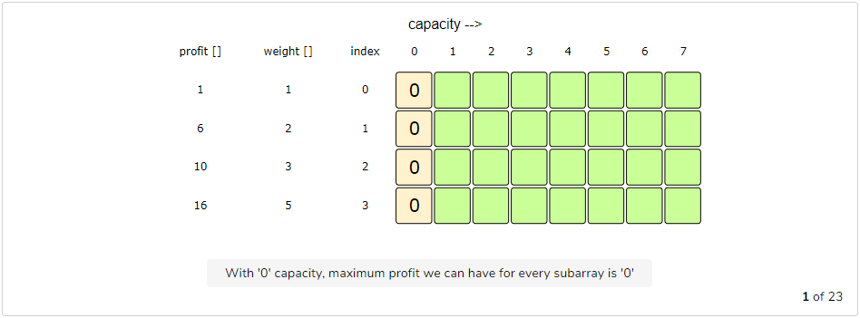
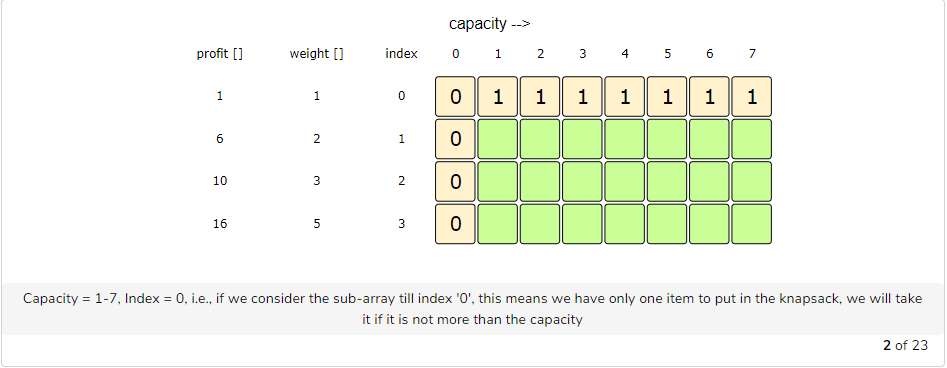
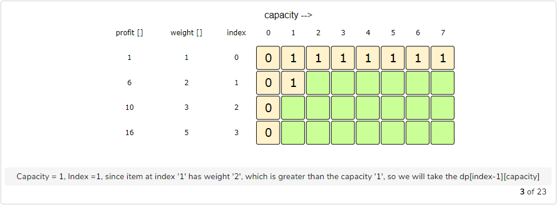
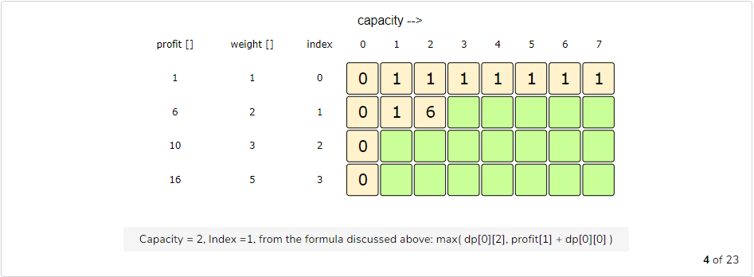
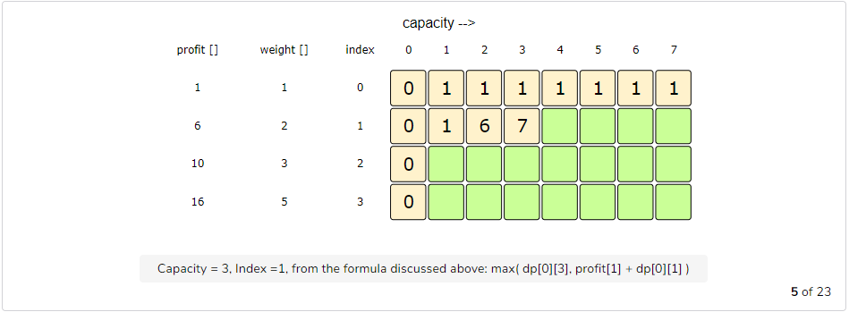
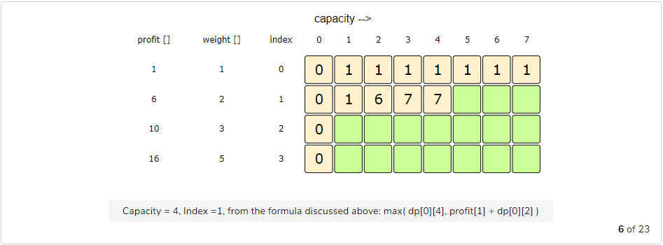
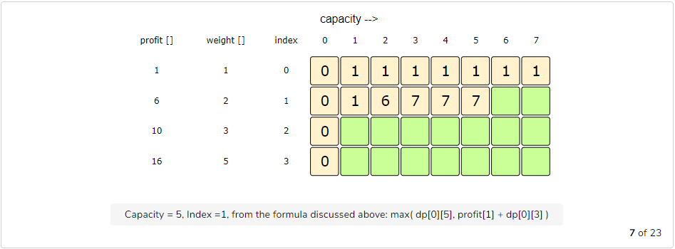
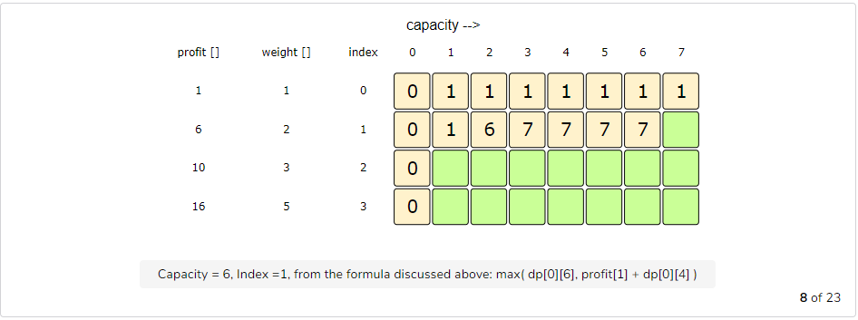
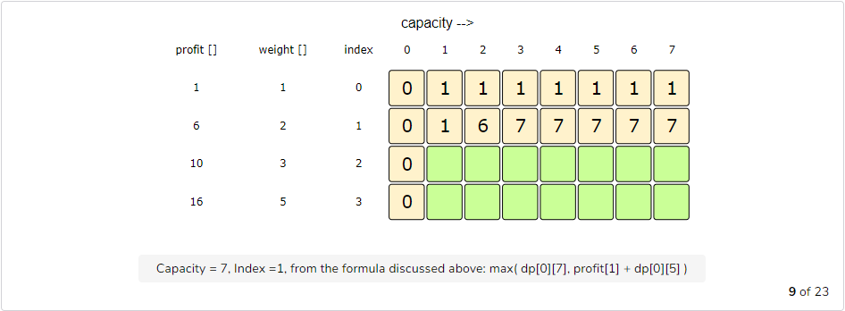
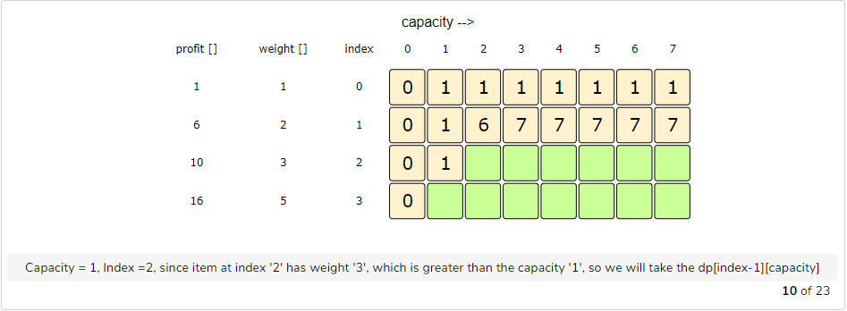
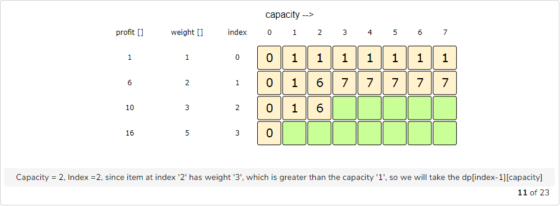

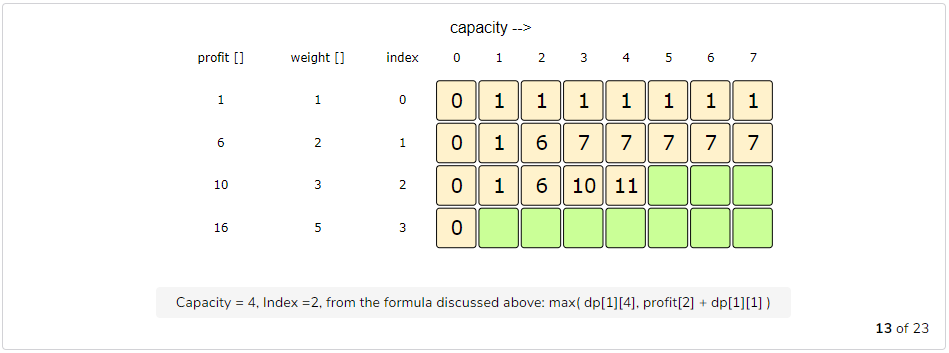
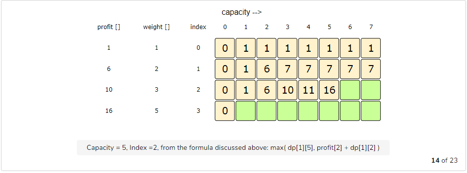
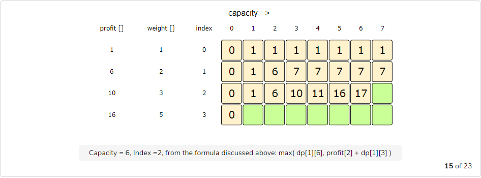
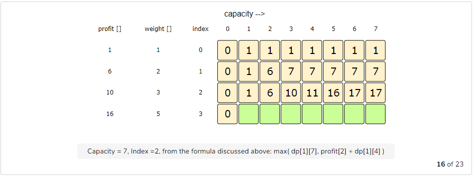
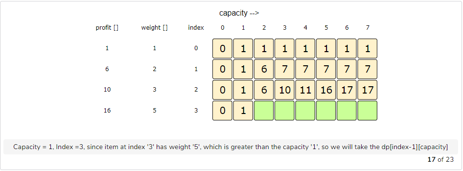

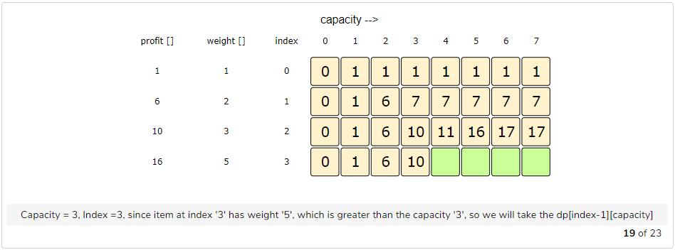
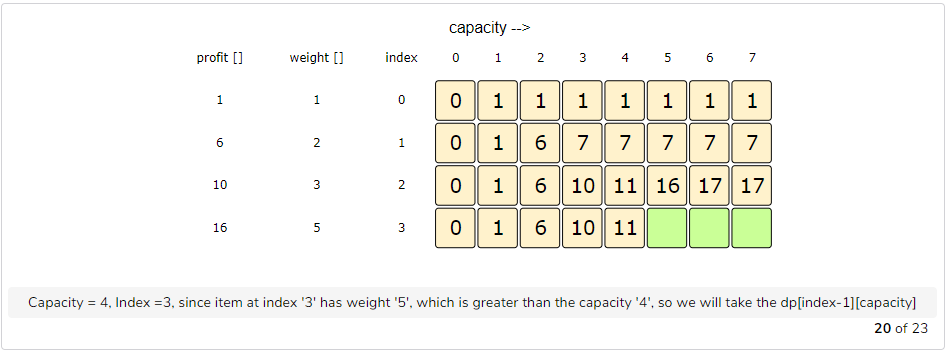

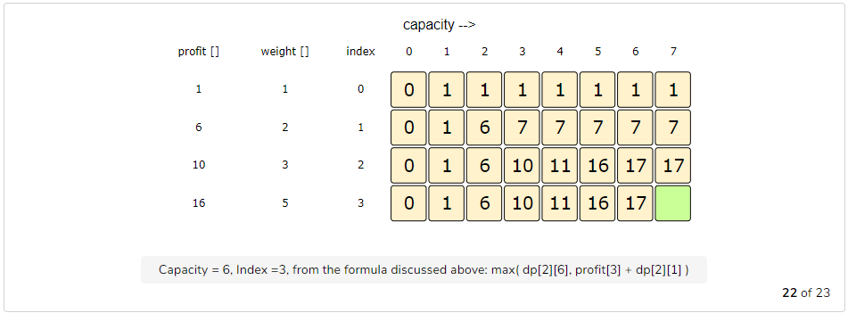
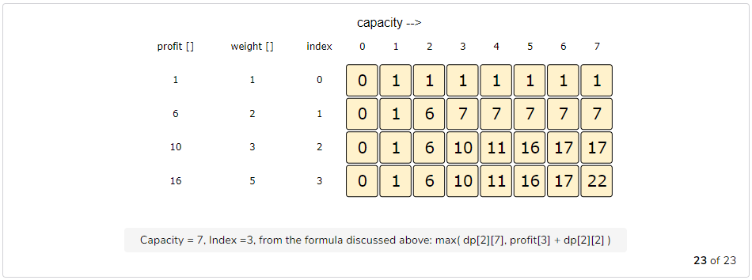


##### Code

Here is the code for our bottom-up dynamic programming approach:

```python
from typing import List

import unittest


class Solution(object):

    def knapsack(self, profits: List[int], weights: List[int], capacity: int) -> int:
        # basic checks
        n = len(profits)
        if capacity <= 0 or n == 0 or len(weights) != n:
            return 0

        dp = [[0 for x in range(capacity + 1)] for y in range(n)]

        # populate the capacity = 0 columns, with '0' capacity we have '0' profit
        for i in range(0, n):
            dp[i][0] = 0

        # if we have only one weight, we will take it if it is not more than the capacity
        for c in range(0, capacity + 1):
            if weights[0] <= c:
                dp[0][c] = profits[0]

        # process all sub-arrays for all the capacities
        for i in range(1, n):
            for c in range(1, capacity + 1):
                profit1, profit2 = 0, 0
                # include the item, if it is not more than the capacity
                if weights[i] <= c:
                    profit1 = profits[i] + dp[i - 1][c - weights[i]]
                # exclude the item
                profit2 = dp[i - 1][c]
                # take maximum
                dp[i][c] = max(profit1, profit2)

        # maximum profit will be at the bottom-right corner.
        return dp[n - 1][capacity]


class Test(unittest.TestCase):
    def setUp(self) -> None:
        pass

    def tearDown(self) -> None:
        pass

    def test_knapsack(self) -> None:
        sol = Solution()
        for profits, weights, capacity, solution in (
            [[1,2,3], [4,5,1], 4, 3],
            [[1,2,3], [4,5,6], 3, 0]
        ):
            self.assertEqual(solution, sol.knapsack(profits, weights, capacity))

# main
if __name__ == "__main__":
    unittest.main()
```

The above solution has time and space complexity of ___O(N*C)___, where ‘N’ represents total items and ‘C’ is the maximum capacity.

##### How to find the selected items?

As we know that the final profit is at the bottom-right corner; therefore we will start from there to find the items that will be going in the knapsack.

As you remember, at every step we had two options: include an item or skip it. If we skip an item, then we take the profit from the remaining items (i.e. from the cell right above it); if we include the item, then we jump to the remaining profit to find more items.

Let’s understand this from the above example:

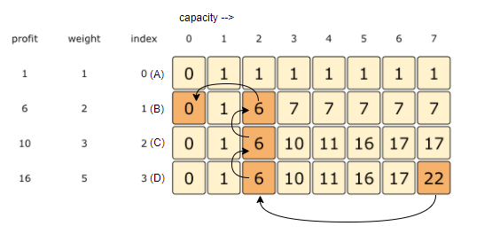

1. ‘22’ did not come from the top cell (which is 17); hence we must include the item at index ‘3’ (which is the item ‘D’).
1. Subtract the profit of item ‘D’ from ‘22’ to get the remaining profit ‘6’. We then jump to profit ‘6’ on the same row.
1. ‘6’ came from the top cell, so we jump to row ‘2’.
1. Again ‘6’ came from the top cell, so we jump to row ‘1’.
1. ‘6’ is different than the top cell, so we must include this item (which is item ‘B’).
1. Subtract the profit of ‘B’ from ‘6’ to get the profit ‘0’. We then jump to profit ‘0’ on the same row. As soon as we hit zero remaining profit, we can finish our item search.
1. So items going into the knapsack are {B, D}.

Let’s write a function to print the set of items included in the knapsack.

```python
from __future__ import print_function


def solve_knapsack(profits, weights, capacity):
  # basic checks
  n = len(profits)
  if capacity <= 0 or n == 0 or len(weights) != n:
    return 0

  dp = [[0 for x in range(capacity+1)] for y in range(n)]

  # populate the capacity = 0 columns, with '0' capacity we have '0' profit
  for i in range(0, n):
    dp[i][0] = 0

  # if we have only one weight, we will take it if it is not more than the capacity
  for c in range(0, capacity+1):
    if weights[0] <= c:
      dp[0][c] = profits[0]

  # process all sub-arrays for all the capacities
  for i in range(1, n):
    for c in range(1, capacity+1):
      profit1, profit2 = 0, 0
      # include the item, if it is not more than the capacity
      if weights[i] <= c:
        profit1 = profits[i] + dp[i - 1][c - weights[i]]
      # exclude the item
      profit2 = dp[i - 1][c]
      # take maximum
      dp[i][c] = max(profit1, profit2)

  print_selected_elements(dp, weights, profits, capacity)
  # maximum profit will be at the bottom-right corner.
  return dp[n - 1][capacity]


def print_selected_elements(dp, weights, profits, capacity):
  print("Selected weights are: ", end='')
  n = len(weights)
  totalProfit = dp[n-1][capacity]
  for i in range(n-1, 0, -1):
    if totalProfit != dp[i - 1][capacity]:
      print(str(weights[i]) + " ", end='')
      capacity -= weights[i]
      totalProfit -= profits[i]

  if totalProfit != 0:
    print(str(weights[0]) + " ", end='')
  print()


def main():
  print("Total knapsack profit: " +
        str(solve_knapsack([1, 6, 10, 16], [1, 2, 3, 5], 7)))
  print("Total knapsack profit: " +
        str(solve_knapsack([1, 6, 10, 16], [1, 2, 3, 5], 6)))


main()
```

### Bottom-up Dynamic Programming With Reduced Space

Can we further improve our bottom-up DP solution? Can you find an algorithm that has ___O(C)___ space complexity?

The above solution is similar to the previous solution, the only difference is that we use `i%2` instead of `i` and `(i-1)%2` instead of `i-1`. 
This solution has a space complexity of ___O(2*C) = O(C)___, where ‘C’ is the maximum capacity of the knapsack.

This space optimization solution can also be implemented using a single array. It is a bit tricky though, but the intuition is to use the same array for the previous and the next iteration!

If you see closely, we need two values from the previous iteration: `dp[c]` and `dp[c-weight[i]]`

Since our inner loop is iterating over `c:0-->capacity`, let’s see how this might affect our two required values:

  1. When we access `dp[c]`, it has not been overridden yet for the current iteration, so it should be fine.
  1. `dp[c-weight[i]]` might be overridden if “weight[i] > 0”. Therefore we can’t use this value for the current iteration.
  
To solve the second case, we can change our inner loop to process in the reverse direction: `c:capacity-->0`. This will ensure that whenever we change a value in `dp[]`, we will not need it anymore in the current iteration.

Can you try writing this algorithm?

```python
from typing import List

import unittest


class Solution(object):

    def knapsack(self, profits: List[int], weights: List[int], capacity: int) -> int:
        # basic checks
        n = len(profits)
        if capacity <= 0 or n == 0 or len(weights) != n:
            return 0

        dp = [0 for x in range(capacity + 1)]

        # if we have only one weight, we will take it if it is not more than the capacity
        for c in range(0, capacity + 1):
            if weights[0] <= c:
                dp[c] = profits[0]

        # process all sub-arrays for all the capacities
        for i in range(1, n):
            for c in range(capacity, -1, -1):
                profit1, profit2 = 0, 0
                # include the item, if it is not more than the capacity
                if weights[i] <= c:
                    profit1 = profits[i] + dp[c - weights[i]]
                # exclude the item
                profit2 = dp[c]
                # take maximum
                dp[c] = max(profit1, profit2)

        return dp[capacity]

class Test(unittest.TestCase):
    def setUp(self) -> None:
        pass

    def tearDown(self) -> None:
        pass

    def test_knapsack(self) -> None:
        sol = Solution()
        for profits, weights, capacity, solution in (
            [[1,2,3], [4,5,1], 4, 3],
            [[1,2,3], [4,5,6], 3, 0]
        ):
            self.assertEqual(solution, sol.knapsack(profits, weights, capacity))

# main
if __name__ == "__main__":
    unittest.main()
```

