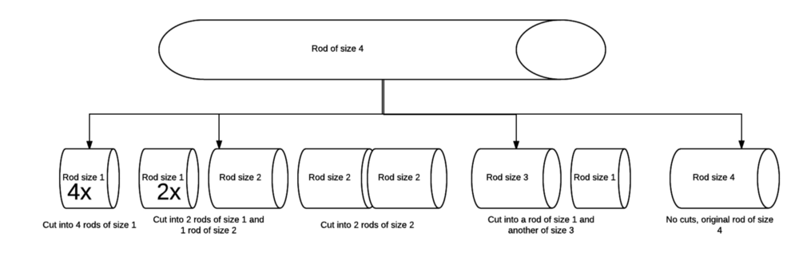
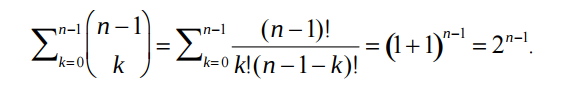

## Dynamic Programming for the confused : Rod cutting problem

I have always struggled with optimization problems. They can be hard to wrap your mind around from just the code. 
Hence, from my learning , I decided to write series of posts dealing with classic dynamic programming problems. 
Rod cutting problem is a classic optimization problem which serves as a good example of dynamic programming.

#### What is the problem ?
Rod cutting problem is very much related to any real-world problem we face. 
You have a rod of some size and you want to cut it into parts and sell in such a way 
that you get the maximum revenue out of it. 
Now, here is the catch, prices of different size of pieces are different and it is a possibility 
that a cutting into smaller pieces can fetch more revenue than selling a bigger piece, 
so a different strategy is needed.

Before that, lets state the problem more formally,

> You are given a rod of size `n > 0`, it can be cut into any number of pieces `k` `(k ≤ n)`. 
> Price for each piece of size `i` is represented as `p(i)` and maximum revenue from a rod of size `i` is `r(i)` 
> (could be split into multiple pieces). Find `r(n)` for the rod of size `n`.
>


___The size vs price table___

#### Thought process
One can see that the problem distills down to the fact : where the cuts will be ?



`
Which one provides the maximum revenue r(4)?

4 rods of size 1 (achieved by 3 cuts) = 4 x p(1) = 4 x 1 = **4**

2 rods of size 1 + 1 rod of size 2 (achieved by 2 cuts) = 2 x p(1) + 1 x p(2) = 2 x 1 + 5 = **7**

2 rods of size 2 (achieved by 1 cut)= 2 x p(2) = 2 x 5 = **10**

1 rod of size 1 + 1 rod of size 3 (achieved by 2 cuts)= 1 x p(1) + 1 x p(3) = 1 + 8 = **9**

original rod of size 4 (achieved by no cuts)= 1 x p(4) = **9**
`

Thus, maximum revenue possible is 10, can be achieved by making a cut at size=2, splitting the original rod into two rods of size 2 with no further cuts in any of them.

Generalizing it,

Max revenue r(n) on rod of size i=n, can be achieved by :

`
1. Starting with size i=1 and going up to size i=n repeat the following 2 & 3  : 
2. Deciding whether a cut at i has to be made or not (results in 2 different cases)
3. Repeating from 1 for rest of the rod (n-i)
4. Calculating r(n) in every case at the end
5. Max value among all calculated r(n) is the answer. Additional storage is required to track the cuts made.
`

Recursion is an ideal candidate for this. Find recursive code [here](http://www.geeksforgeeks.org/dynamic-programming-set-13-cutting-a-rod/).

> What is the time complexity ?
>

This can be answered by asking how many ways a cut can be made ?

In a rod of size n, 1 cut can be made in (n-1)C(1) ways

2 cuts = (n-2) C(2) ways

k cuts = (n-k)C(k) ways

Totaling it all :

ways to do 1 cut + ways to do 2 cuts + ….. ways to do k cuts ..+ ways to do n-1 cuts


___Source: [DynamicRodCutting.pdf](http://www.cs.uml.edu/~kdaniels/courses/ALG_503_F12/DynamicRodCutting.pdf)___

Thus, time complexity is exponential here. There should be a better way of doing things.

One trick is to use recursion with memoization i.e memo taking ([explained here](http://www.cs.uml.edu/~kdaniels/courses/ALG_503_F12/DynamicRodCutting.pdf)). However, still it remains an exponential operation which is infeasible for large values of n.

Enter Dynamic Programming.

#### Solving with Dynamic Programming

___The problem already shows optimal substructure and overlapping sub-problems.___

r(i) = maximum revenue achieved by applying 0, 1, …..(i-1) cuts respectively to a rod.

> r(i) = max { p(i), p(1)+r(i-1), p(2)+r(i-2)….p(i-1)+r(1) }
>

In other words, r(i) can be reached by either having no cuts, only p(i) 
or adding a cut at 1 and adding it to r(i-1) i.e. previously solved problem 
of max revenue of rod size i-1(which may have multiple more cuts). 
Similarly, cutting at 2 and solving for r(i-2). So, r(i) is dependent 
on previously computed values for smaller sizes than i. But, unlike greedy, 
it analyzes them all to take a decision. In fact, you go back and compare 
on every value of i, this is an ___overlapping sub-problem with optimal value 
of each sub-problem contributing to next one, thus, optimal substructure.___

#### Calculations

`
r(1) = p(1) = **1** (cut at size 1 i.e. no cut)

r(2) = max{ p(2), p(1)+r(1)} = max(5, 2) = **5** (cut at size 2 i.e. no cut)

r(3) = max{p(3), p(1)+r(2), p(2)+r(1)} = max(8, 1+5, 5+1) = **8** (cut at size 3 i.e. no cut)

r(4) = max{p(4), p(1)+r(3), p(2)+r(2), p(3)+r(1)} = max(9, 1+8, 5+5, 8+1) = **10** (cut at size 2)

r(5) = max{p(5), p(1)+r(4), p(2) +r(3), p(3)+r(2), p(4)+r(1)} = max(10, 1+10, 5+8, 8+5, 9+1) = **13** (cut at size 2)
`

and so on …

Completed table :


**Source:** [http://people.csail.mit.edu/bdean/6.046/dp/](http://people.csail.mit.edu/bdean/6.046/dp/). 
The link also has video for explanation of solution.

#### Example :

For example, consider below boxes where each box has dimensions `L x W x H`

```
(4 x 2 x 5)
(3 x 1 x 6)
(3 x 2 x 1)
(6 x 3 x 8)
```

The rotations of the boxes are :

```
(4 x 2 x 5)
(5 x 4 x 2)
(5 x 2 x 4)

(3 x 1 x 6)
(6 x 3 x 1)
(6 x 1 x 3)

(3 x 2 x 1)
(3 x 1 x 2)
(2 x 1 x 3)

(6 x 3 x 8)
(8 x 6 x 3)
(8 x 3 x 6)
```

The maximum height possible is 22 which can be obtained by boxes in following order:

```
(3 x 1 x 6)
(4 x 2 x 5)
(6 x 3 x 8)
(8 x 6 x 3)
```

The idea is to use [Dynamic Programming](https://www.techiedelight.com/introduction-dynamic-programming/) to solve 
this problem. We start by generating all rotations of each box. For simplicity, we can easily enforce the constraint 
that the width of a box is never more than the length. After generating all rotations, we sort the boxes 
in descending order of area and then apply the 
[LIS algorithm](https://www.techiedelight.com/longest-increasing-subsequence-using-dynamic-programming/) 
to the get the maximum height. Let `L(i)` store the maximum possible height when ___i<sup>th</sup>___ box is on the top. 
Then, the recurrence is:

```
L(i) = height(i) + max(L(j) | j &lt; i and block i can be put on top of block j)
```

Finally, the maximum height is the maximum value in `L[]`. 
The algorithm can be implemented as follows in Python:

```python
```

Output:

```
The maximum height is 22
```


Final answer for r(5) = 13.

> Now, how to find no. of cuts it took to reach 13 ?
>

Simple, start with the last index i.e. r(5) and backtrack.

r(5) has cut value at 2, that means one cut was made at 2.

For the remaining 5–2 = 3 size part , lets check r(3). r(3) cut value is 3 ie it was taken as whole with no cuts.

Thus, we only have a cut at size 2.

Maximum revenue for rod of size 5 can be achieved by making a cut at size 2 to split it into two rods of size 2 and 3.

This non-recursive approach is bottom up one. Its time complexity is :

`
T(n) = T(n-1) + T(n-2) +...+T(1) + 1

T(1) = 1

T(2) = T(1) + 1= 2

T(3) = T(2) + T(1)+ 1 = 2 + 1 + 1 

T(n) = n + n-1 + n-2 + … in an Arithmetic Progression

T(n) = O(n²)
`

Compared to O(2^n), O(n²) is much better.

> ...
>

In this way, one can develop intuitions to solve optimization problems. Not every problem of optimization can be solved this way, but it provides a good starting point.
Some of the resources for dynamic programming :

* [DynamicRodCutting.pdf](http://www.cs.uml.edu/~kdaniels/courses/ALG_503_F12/DynamicRodCutting.pdf)
* [http://www.geeksforgeeks.org/dynamic-programming-set-13-cutting-a-rod/](http://www.geeksforgeeks.org/dynamic-programming-set-13-cutting-a-rod/)
* [https://www.topcoder.com/community/data-science/data-science-tutorials/dynamic-programming-from-novice-to-advanced/](https://www.topcoder.com/community/data-science/data-science-tutorials/dynamic-programming-from-novice-to-advanced/)
