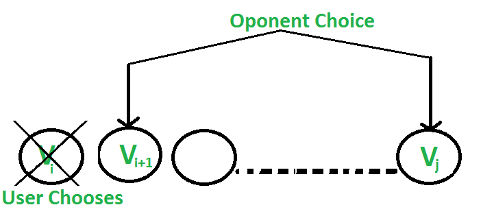
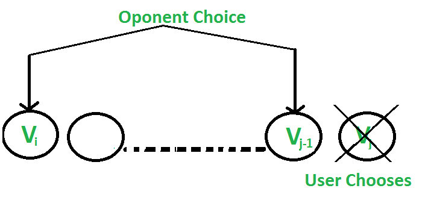

## Geeks For Geeks : Optimal Strategy for a Game | Set 2

Problem statement: Consider a row of n coins of values v1 . . . vn, where n is even. We play a game against an opponent by alternating turns. In each turn, a player selects either the first or last coin from the row, removes it from the row permanently, and receives the value of the coin. Determine the maximum possible amount of money we can definitely win if we move first.
Note: The opponent is as clever as the user.

Let us understand the problem with few examples:
**1.** 5, 3, 7, 10 : The user collects maximum value as 15(10 + 5)

**2.** 8, 15, 3, 7 : The user collects maximum value as 22(7 + 15)

Does choosing the best at each move give an optimal solution?
No. In the second example, this is how the game can finish:

1. …….User chooses 8. 

   …….Opponent chooses 15. 

   …….User chooses 7. 

   …….Opponent chooses 3. 

   Total value collected by user is 15(8 + 7) 

1. …….User chooses 7. 

   …….Opponent chooses 8. 

   …….User chooses 15. 

   …….Opponent chooses 3. 

   Total value collected by user is 22(7 + 15) 

   So if the user follows the second game state, maximum value can be collected although the first move is not the best.

We have discussed an approach that makes [4 recursive calls](Solution_Explanation.md). 
In this post, a new approach is discussed that makes two recursive calls.

There are two choices: 

**1.** The user chooses the ith coin with value Vi: The opponent either chooses (i+1)th coin or jth coin. The opponent intends to choose the coin which leaves the user with minimum value. 
i.e. The user can collect the value Vi + (Sum – Vi) – F(i+1, j, Sum – Vi) where Sum is sum of coins from index i to j. The expression can be simplified to Sum – F(i+1, j, Sum – Vi) 

**1.** The user chooses the jth coin with value Vj: The opponent either chooses ith coin or (j-1)th coin. The opponent intends to choose the coin which leaves the user with minimum value. 
i.e. The user can collect the value Vj + (Sum – Vj) – F(i, j-1, Sum – Vj) where Sum is sum of coins from index i to j. The expression can be simplified to Sum – F(i, j-1, Sum – Vj)


Following is recursive solution that is based on above two choices. We take the maximum of two choices. 
 
```
F(i, j)  represents the maximum value the user can collect from 
         i'th coin to j'th coin.
arr[]   represents the list of coins

    F(i, j)  = Max(Sum - F(i+1, j, Sum-arr[i]), 
                   Sum - F(i, j-1, Sum-arr[j])) 
Base Case
    F(i, j)  = max(arr[i], arr[j])  If j == i+1
```

**Simple Recursive Solution**

```python
# python program to find out maximum value from a
# given sequence of coins
 
def oSRec (arr, i, j, Sum):
 
    if (j == i + 1):
        return max(arr[i], arr[j])
 
    # For both of your choices, the opponent
    # gives you total Sum minus maximum of
    # his value
    return max((Sum - oSRec(arr, i + 1, j, Sum - arr[i])),
                (Sum - oSRec(arr, i, j - 1, Sum - arr[j])))
 
# Returns optimal value possible that a player can
# collect from an array of coins of size n. Note
# than n must be even
def optimalStrategyOfGame(arr, n):
 
    Sum = 0
    Sum = sum(arr)
    return oSRec(arr, 0, n - 1, Sum)
 
# Driver code
 
arr1= [ 8, 15, 3, 7]
n = len(arr1)
print(optimalStrategyOfGame(arr1, n))
 
arr2= [ 2, 2, 2, 2 ]
n = len(arr2)
print(optimalStrategyOfGame(arr2, n))
 
arr3= [ 20, 30, 2, 2, 2, 10 ]
n = len(arr3)
print(optimalStrategyOfGame(arr3, n))
```

**Output:**
```
22
4
42
```

**Memoization Based Solution**

```python
def optimalStrategyOfGame(arr, n):
    '''
    :param arr: given array
    :param n: given size of array
    :return: Integer 
    '''
    table=[[0]*n for x in range(n)]
    for gap in range(0,n):
        for j in range(gap,n):
            i=j-gap
            
            x=0
            if (i+2)<=j:
                x=table[i+2][j]
            y=0
            if (i+1)<=(j-1):
                y=table[i+1][j-1]
            z=0
            if i<=(j-2):
                z=table[i][j-2]
            table[i][j]=max(arr[i]+min(x,y),arr[j]+min(y,z))
    
    return table[0][n-1]
```

**Output:**
```
22
4
42
```
