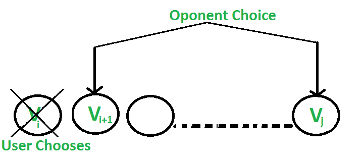
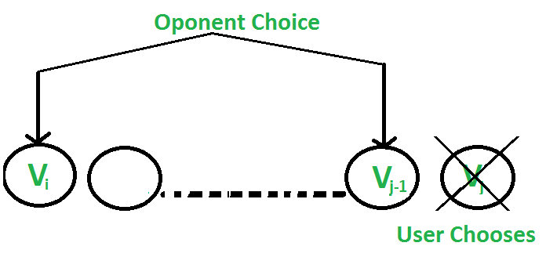

## Geeks For Geeks : Optimal Strategy for a Game | DP-31

Consider a row of n coins of values v1 . . . vn, where n is even. We play a game against an opponent by alternating turns. In each turn, a player selects either the first or last coin from the row, removes it from the row permanently, and receives the value of the coin. Determine the maximum possible amount of money we can definitely win if we move first.

Note: The opponent is as clever as the user.

Let us understand the problem with few examples:

1. 5, 3, 7, 10 : The user collects maximum value as 15(10 + 5)
1. 8, 15, 3, 7 : The user collects maximum value as 22(7 + 15)

Does choosing the best at each move gives an optimal solution? No.
In the second example, this is how the game can be finished:

1. …….User chooses 8.

   …….Opponent chooses 15.

   …….User chooses 7.

   …….Opponent chooses 3.

   Total value collected by user is 15(8 + 7)
1. …….User chooses 7.

   …….Opponent chooses 8.

   …….User chooses 15.

   …….Opponent chooses 3.

   Total value collected by user is 22(7 + 15)

So if the user follows the second game state, the maximum value can be collected 
although the first move is not the best.

**Approach:** As both the players are equally strong, both will try to reduce 
the possibility of winning of each other. Now let’s see how the opponent can 
achieve this.

There are two choices:

**1.** The user chooses the ‘ith’ coin with value ‘Vi’: The opponent either chooses (i+1)th coin or jth coin. 
The opponent intends to choose the coin which leaves the user with **minimum value**.
i.e. The user can collect the value **Vi + min(F(i+2, j), F(i+1, j-1) )**.

**1.** The user chooses the ‘jth’ coin with value ‘Vj’: The opponent either chooses ‘ith’ coin 
or ‘(j-1)th’ coin. The opponent intends to choose the coin which leaves the user 
with minimum value, i.e. the user can collect the value **Vj + min(F(i+1, j-1), F(i, j-2) )**.


Following is the recursive solution that is based on the above two choices. We take a maximum of two choices.

```
F(i, j) represents the maximum value the user
can collect from i'th coin to j'th coin.

F(i, j) = Max(Vi + min(F(i+2, j), F(i+1, j-1) ), 
              Vj + min(F(i+1, j-1), F(i, j-2) ))
As user wants to maximise the number of coins. 

Base Cases
    F(i, j) = Vi           If j == i
    F(i, j) = max(Vi, Vj)  If j == i + 1
```
    
```python
# Python3 program to find out maximum  
# value from a given sequence of coins 
  
# Returns optimal value possible that 
# a player can collect from an array  
# of coins of size n. Note than n  
# must be even  
def optimalStrategyOfGame(arr, n): 
      
    # Create a table to store  
    # solutions of subproblems  
    table = [[0 for i in range(n)] 
                for i in range(n)] 
  
    # Fill table using above recursive  
    # formula. Note that the table is  
    # filled in diagonal fashion  
    # (similar to http://goo.gl / PQqoS), 
    # from diagonal elements to 
    # table[0][n-1] which is the result.  
    for gap in range(n): 
        for j in range(gap, n): 
            i = j - gap 
              
            # Here x is value of F(i + 2, j),  
            # y is F(i + 1, j-1) and z is  
            # F(i, j-2) in above recursive  
            # formula  
            x = 0
            if((i + 2) <= j): 
                x = table[i + 2][j] 
            y = 0
            if((i + 1) <= (j - 1)): 
                y = table[i + 1][j - 1] 
            z = 0
            if(i <= (j - 2)): 
                z = table[i][j - 2] 
            table[i][j] = max(arr[i] + min(x, y), 
                              arr[j] + min(y, z)) 
    return table[0][n - 1] 
  
# Driver Code 
arr1 = [ 8, 15, 3, 7 ] 
n = len(arr1) 
print(optimalStrategyOfGame(arr1, n)) 
  
arr2 = [ 2, 2, 2, 2 ] 
n = len(arr2) 
print(optimalStrategyOfGame(arr2, n)) 
  
arr3 = [ 20, 30, 2, 2, 2, 10] 
n = len(arr3) 
print(optimalStrategyOfGame(arr3, n))
```

**Output:**
```
22
4
42
```

**Complexity Analysis:**

* **Time Complexity:** O(n2).

  Use of a nested for loop brings the time complexity to n2.
* **Auxiliary Space:** O(n2).

  As a 2-D table is used for storing states.

Note: The above solution can be optimized by using less number of 
comparisons for every choice. Please refer to: [Optimal Strategy for a Game | Set 2](Optimized_Solution_Explanation.md).