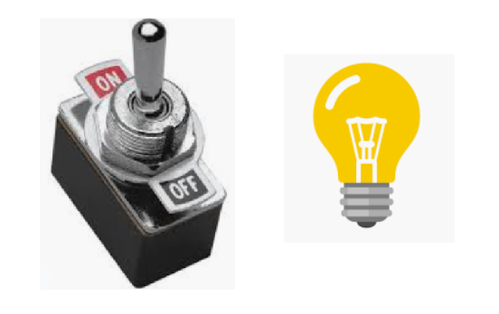
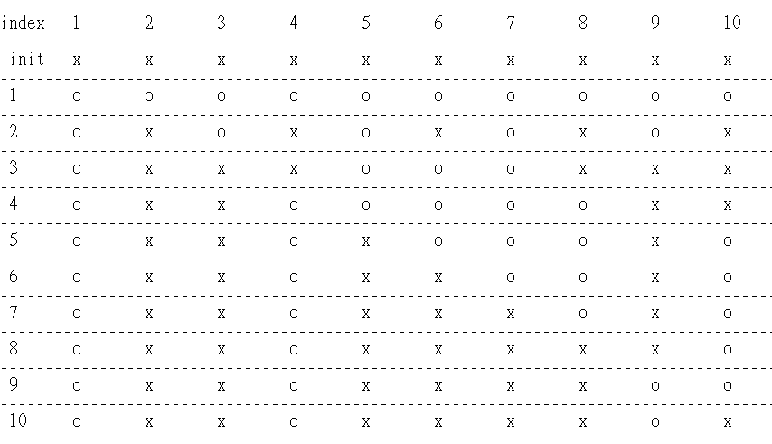

Initial state is "OFF" for all bulbs

We have n bulbs, number them from bulb_#1 to buld_#n.

Bulb_#k will be "ON" where k has odd times of switch toggle, if and only if, k has odd factors.

For all positive integers, only **perfect square numbers** have **odd factors**.

Bulb_#1 : 1 (OFF->**ON**).

total 1 factor
_____

Bulb_#4 : 1 (OFF->ON), 2 (ON->OFF), 4 (OFF->**ON**).

total 3 factors
_____

Bulb_#9 : 1 (OFF->ON), 3 (ON->OFF), 9 (OFF->**ON**).

total 3 factors
_____

Bulb_#16 : 1 (OFF->ON), 2 (ON->OFF), 4 (OFF->ON). , 8 (ON->OFF), 16 (OFF->**ON**).

total 5 factors
_____

Bulb_#25 : 1 (OFF->ON), 5 (ON->OFF), 25 (OFF->**ON**)

total 3 factors

... and so on
_____


**Implementation:**

```python
class Solution:
    def bulbSwitch(self, n: int) -> int:
        
        # Only those bulds with perferct square number index will keep "ON" at last.
        
        return int(n**0.5)
```

**Appendix:**

Demo for n = 10

