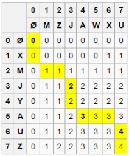
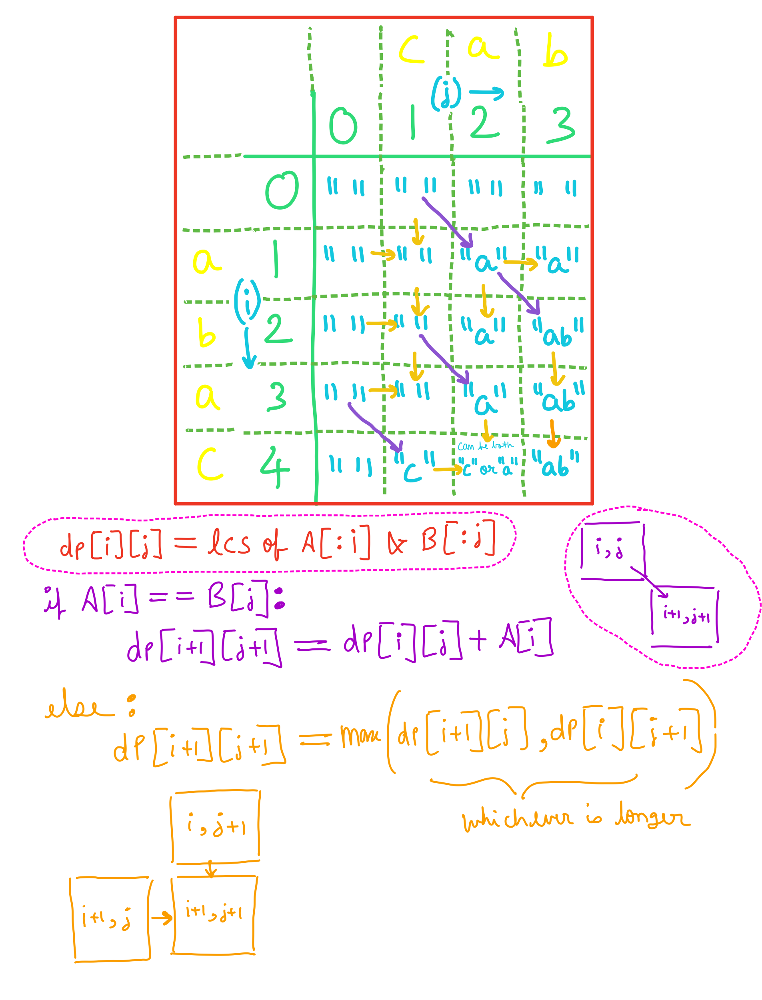

1) Find LCS:
Let X be “XMJYAUZ” and Y be “MZJAWXU”. The longest common subsequence between X and Y is “MJAU”. The following table shows the lengths of the longest common subsequences between prefixes of X and Y. The ith row and jth column shows the length of the LCS between X_{1..i} and Y_{1..j}.



you can refer to [here](https://en.m.wikipedia.org/wiki/Longest_common_subsequence_problem) for more details.

2) Reversely append the chars to StringBuilder, if the char is among the LCS, choose either one between the two strings.

    a) start from i = m - 1 and j = n - 1, check if the corresponding chars are equal, that is, s1.charAt(i) == s2.charAt(j); if yes, append either of them; if no, append the char with larger dp value.
    
    b) If we reach left end of s1 or s2 first, continue to append remaining chars in the other string.

```python
def shortestCommonSupersequence(self, s1: str, s2: str) -> str:
        m, n = len(s1), len(s2)
        dp = [[0] * (n + 1) for _ in range(m + 1)]
        for i, c in enumerate(s1):
            for j, d in enumerate(s2):
                dp[i + 1][j + 1] = 1 + dp[i][j] if c == d else max(dp[i + 1][j], dp[i][j + 1])
        i, j, stk = m - 1, n - 1, []
        while i >= 0 and j >= 0:
            if s1[i] == s2[j]:
                stk.append(s1[i])
                i -= 1
                j -= 1
            elif dp[i + 1][j] < dp[i][j + 1]:
                stk.append(s1[i])
                i -= 1
            else:
                stk.append(s2[j])
                j -= 1    
        return s1[: i + 1] + s2[: j + 1] + ''.join(reversed(stk))
```

**Analysis:**

Time & space:: O(m * n), where m = s1.length(), n = s2.length().

**Visual Representation of the Test Case:**

Here is a diagram of the given test case for finding the lcs.

