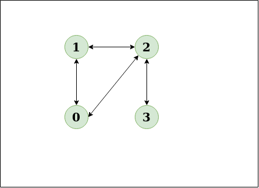
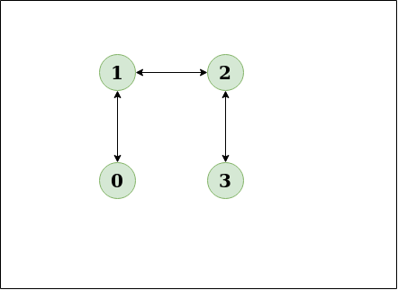
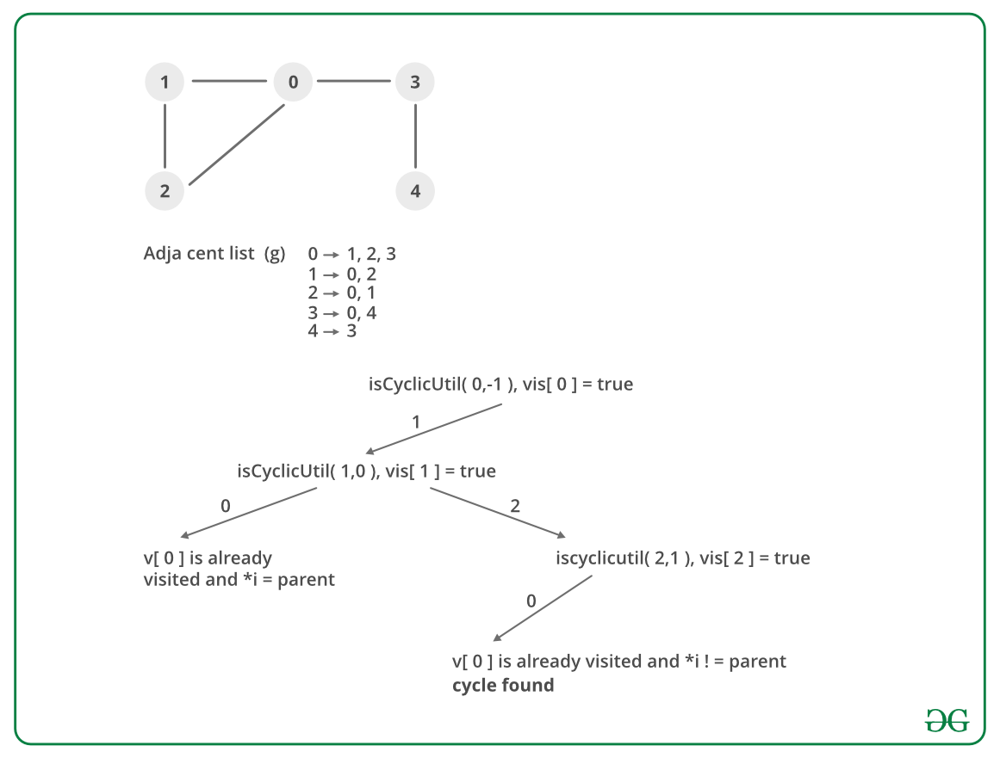

## GeeksForGeeks - Detect cycle in an undirected graph

Given an undirected graph, how to check if there is a cycle in the graph? 

Examples:

> Input: n = 4, e = 4
>
> Output: Yes
>
> Explanation:
>
> 0 1, 1 2, 2 3, 0 2
>
> Diagram:
>
> 
> _____
> ___The diagram clearly shows a cycle 0 to 2 to 1 to 0___

> Input:n = 4, e = 3
>
> 0 1, 1 2, 2 3
>
> Output:No
>
> Explanation:
>
> Diagram:
>
> 
> _____
> ___The diagram clearly shows no cycle___

#### <ins>Approach</ins>
 
**Approach:** Run a DFS from every unvisited node. [Depth First Traversal](https://www.geeksforgeeks.org/depth-first-search-or-dfs-for-a-graph/) can be used to detect a cycle in a Graph. DFS for a connected graph produces a tree. There is a cycle in a graph only if there is a back edge present in the graph. A back edge is an edge that is joining a node to itself (self-loop) or one of its ancestor in the tree produced by DFS.
To find the back edge to any of its ancestor keep a visited array and if there is a back edge to any visited node then there is a loop and return true.

#### <ins>Algorithm</ins>
1. Create the graph using the given number of edges and vertices.
1. Create a recursive function that that current index or vertex, visited and recursion stack.
1. Mark the current node as visited and also mark the index in recursion stack.
1. Find all the vertices which are not visited and are adjacent to the current node. Recursively call the function for those vertices, If the recursive function returns true return true.
1. If the adjacent vertices are already marked in the recursion stack then return true.
1. Create a wrapper class, that calls the recursive function for all the vertices and if any function returns true, return true.
1. Else if for all vertices the function returns false return false.

#### Dry Run:

______

#### Implementation

Below is the implementation of the above approach:

```python
from collections import defaultdict

# This class represents a undirected graph using adjacency list representation
class Graph:

    def __init__(self, vertices):
        self.V = vertices  # No. of vertices
        self.graph = defaultdict(list)  # default dictionary to store graph

    # function to add an edge to graph
    def addEdge(self, v, w):
        self.graph[v].append(w)  # Add w to v_s list
        self.graph[w].append(v)  # Add v to w_s list

    # A recursive function that uses visited[] and parent to detect
    # cycle in subgraph reachable from vertex v.
    def isCyclicUtil(self, v, visited, parent):

        # Mark the current node as visited
        visited[v] = True

        # Recur for all the vertices adjacent to this vertex
        for i in self.graph[v]:
            # If the node is not visited then recurse on it
            if not visited[i]:
                if (self.isCyclicUtil(i, visited, v)):
                    return True
            # If an adjacent vertex is visited and not parent of current vertex,
            # then there is a cycle
            elif parent != i:
                return True

        return False

    # Returns true if the graph contains a cycle, else false.
    def isCyclic(self):
        # Mark all the vertices as not visited
        visited = [False] * (self.V)
        # Call the recursive helper function to detect cycle in different
        # DFS trees
        for i in range(self.V):
            if not visited[i]:  # Don't recur for u if it is already visited
                if (self.isCyclicUtil(i, visited, -1)):
                    return True

        return False
```
____

#### Output:

```
Graph contains cycle
Graph doesn't contain cycle
```
____

#### Complexity Analysis:

- **Time Complexity:** O(V+E).
    
    The program does a simple DFS Traversal of the graph which is represented using adjacency list. So the time complexity is O(V+E).
    
- **Space Complexity:** O(V).

    To store the visited array O(V) space is required.