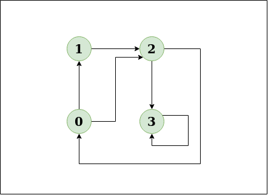
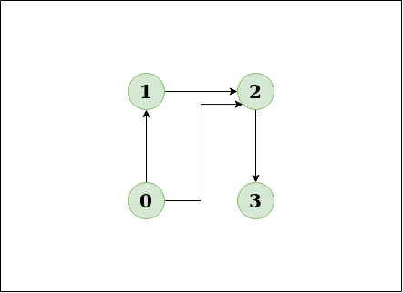
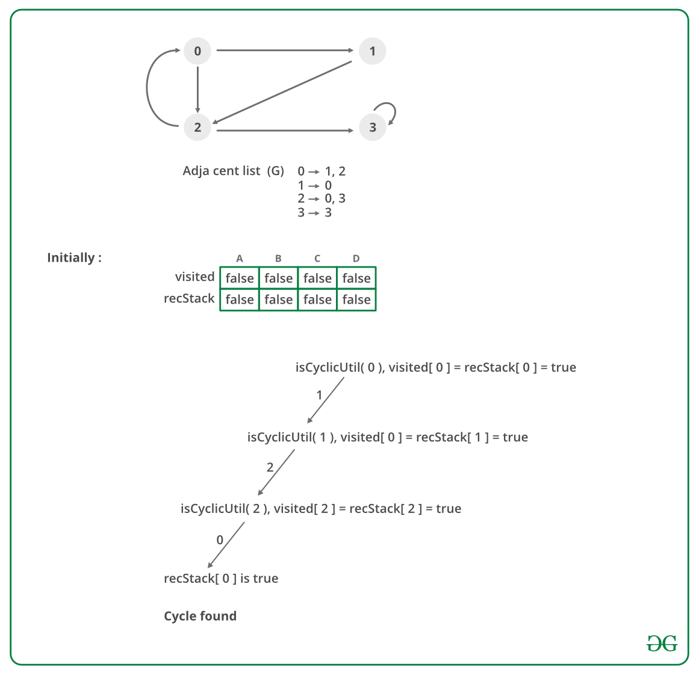

## GeeksForGeeks - Detect Cycle in a Directed Graph

Given a directed graph, check whether the graph contains a cycle or not. Your function should return true if the given graph contains at least one cycle, else return false. 

Examples:

> Input: n = 4, e = 4
> 0 -> 1, 0 -> 2, 1 -> 2, 2 -> 0, 2 -> 3, 3 -> 3
>
> Output: Yes
>
> Explanation:
>
> 0 1, 1 2, 2 3, 0 2
>
> Diagram:
>
> 
> _____
> ___The diagram clearly shows a cycle 0 -> 2 -> 0___

> Input:n = 4, e = 3
>
> 0 -> 1, 0 -> 2, 1 -> 2, 2 -> 3
>
> Output: No
>
> Explanation:
>
> Diagram:
>
> 
> _____
> ___The diagram clearly shows no cycle___

#### <ins>Approach</ins> - [ <ins>**Solution using Depth First Search or DFS**</ins> ]
 
**Approach:** Depth First Traversal can be used to detect a cycle in a Graph. 
DFS for a connected graph produces a tree. There is a cycle in a graph only if there is a [back edge](http://en.wikipedia.org/wiki/Depth-first_search#Output_of_a_depth-first_search) present in the graph. A back edge is an edge that is from a node to itself (self-loop) or one of its ancestors in the tree produced by DFS. In the following graph, there are 3 back edges, marked with a cross sign. We can observe that these 3 back edges indicate 3 cycles present in the graph.


For a disconnected graph, Get the DFS forest as output. To detect cycle, check for a cycle in individual trees by checking back edges.

To detect a back edge, keep track of vertices currently in the recursion stack of function for DFS traversal. If a vertex is reached that is already in the recursion stack, then there is a cycle in the tree. The edge that connects the current vertex to the vertex in the recursion stack is a back edge. Use **recStack[]** array to keep track of vertices in the recursion stack.

**Dry run of the above approach:**



____

#### <ins>Algorithm</ins>
1. Create the graph using the given number of edges and vertices.
1. Create a recursive function that initializes the current index or vertex, visited, and recursion stack.
1. Mark the current node as visited and also mark the index in recursion stack.
1. Find all the vertices which are not visited and are adjacent to the current node. Recursively call the function for those vertices, If the recursive function returns true, return true.
1. If the adjacent vertices are already marked in the recursion stack then return true.
1. Create a wrapper class, that calls the recursive function for all the vertices and if any function returns true return true. Else if for all vertices the function returns false return false.

______

#### Implementation

Below is the implementation of the above approach:

```python
from collections import defaultdict

class Graph():
    def __init__(self, vertices):
        self.graph = defaultdict(list)
        self.V = vertices

    def addEdge(self, u, v):
        self.graph[u].append(v)

    def isCyclicUtil(self, v, visited, recStack):

        # Mark current node as visited and
        # adds to recursion stack
        visited[v] = True
        recStack[v] = True

        # Recur for all neighbours
        # if any neighbour is visited and in
        # recStack then graph is cyclic
        for neighbour in self.graph[v]:
            if not visited[neighbour]:
                if self.isCyclicUtil(neighbour, visited, recStack):
                    return True
            elif recStack[neighbour]:
                return True

        # The node needs to be poped from
        # recursion stack before function ends
        recStack[v] = False
        return False

    # Returns true if graph is cyclic else false
    def isCyclic(self):
        visited = [False] * self.V
        recStack = [False] * self.V
        for node in range(self.V):
            if not visited[node]:
                if self.isCyclicUtil(node, visited, recStack):
                    return True
        return False
```
____

#### Output:

```
Graph contains cycle
```
____

#### Complexity Analysis:

- **Time Complexity:** O(V+E).
    
    Time Complexity of this method is same as time complexity of [DFS traversal](https://www.geeksforgeeks.org/archives/18212) which is O(V+E).
    
- **Space Complexity:** O(V).

    To store the visited and recursion stack O(V) space is needed.