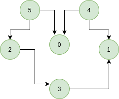
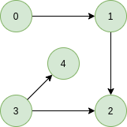

## GeeksForGeeks - Topological Sort of a Directed Graph - <ins>___[ Kahn’s algorithm for Topological Sorting ]___</ins>

Given a Directed Graph. Find any Topological Sorting of that Graph.

Topological sorting for <ins>**D**</ins>irected <ins>**A**</ins>cyclic <ins>**G**</ins>raph (DAG) is a linear ordering of vertices such that for every directed edge uv, vertex u comes before v in the ordering. Topological Sorting for a graph is not possible if the graph is not a **DAG**.

For example, a topological sorting of the following graph is “5 4 2 3 1 0?. There can be more than one topological sorting for a graph. For example, another topological sorting of the following graph is “4 5 2 0 3 1″. The first vertex in topological sorting is always a vertex with in-degree as 0 (a vertex with no in-coming edges).


____

Let’s look at few examples with proper explanation,

#### Examples:

> ___**Input**___
>
> 
>
> ___**Output:**___ 5 4 2 3 1 0
>
> ___**Explanation:**___ The topological sorting of a DAG is done in a order such that for every directed edge uv, vertex u comes before v in the ordering. 5 has no incoming edge. 4 has no incoming edge, 2 and 0 have incoming edge from 4 and 5 and 1 is placed at last.
> _____

> ___**Input**___
>
> 
>
> ___**Output:**___ 0 3 4 1 2
>
> ___**Explanation:**___ 0 and 3 have no incoming edge, 4 and 1 has incoming edge from 0 and 3. 2 is placed at last.

#### <ins>Approach</ins> - [ <ins>**Kahn's Algorithm**</ins> ]
 
**Approach:** Solution: In this article we will see another way to find the linear ordering of vertices in a directed acyclic graph (DAG). The approach is based on the below fact:
 
A **DAG** `G` has at least one vertex with in-degree 0 and one vertex with out-degree 0.
Proof: There’s a simple proof to the above fact is that a DAG does not contain a cycle which means that all paths will be of finite length. Now let S be the longest path from `u`(source) to `v`(destination). Since `S` is the longest path there can be no incoming edge to `u` and no outgoing edge from `v`, if this situation had occurred then `S` would not have been the longest path

```
=> indegree(u) = 0 and outdegree(v) = 0
```
#### <ins>Algorithm</ins>
Steps involved in finding the topological ordering of a **DAG**:

- Step-1: Compute in-degree (number of incoming edges) for each of the vertex present in the **DAG** and initialize the count of visited nodes as 0.

- Step-2: Pick all the vertices with in-degree as 0 and add them into a queue (Enqueue operation)

- Step-3: Remove a vertex from the queue (Dequeue operation) and then.
    1. Increment count of visited nodes by 1.
    1. Decrease in-degree by 1 for all its neighboring nodes.
    1. If in-degree of a neighboring nodes is reduced to zero, then add it to the queue.

- Step 4: Repeat Step 3 until the queue is empty.

- Step 5: If count of visited nodes is not equal to the number of nodes in the graph then the topological sort is not possible for the given graph.

**How to find in-degree of each node?**
There are 2 ways to calculate in-degree of every vertex:

(1) Take an in-degree array which we will keep track of.
    Traverse the array of edges and simply increase the counter of the destination node by
```
for each node in Nodes
    indegree[node] = 0;
for each edge(src, dest) in Edges
    indegree[dest]++
```
Time Complexity: O(V+E)

(2) Traverse the list for every node and then increment the in-degree of all the nodes connected to it by 1.
```
for each node in Nodes
    If (list[node].size()!=0) then
    for each dest in list
        indegree[dest]++;
```
Time Complexity: The outer for loop will be executed V number of times and the inner for loop will be executed E number of times, Thus overall time complexity is O(V+E).

The overall time complexity of the algorithm is O(V+E)
______

#### Implementation

Below is the implementation of the above approach in python:

```python
# A Python program to print topological sorting of a graph
# using indegrees
from typing import List
from collections import defaultdict

class Graph:
    def __init__(self, vertices: int) -> None:
        self.graph = defaultdict(list)  # dictionary containing adjacency List
        self.V = vertices  # No. of vertices

    # function to add an edge to graph
    def addEdge(self, u: int, v: int) -> None:
        self.graph[u].append(v)

    # The function to do Topological Sort.
    def topologicalSort(self) -> List[int]:

        # Create a vector to store indegrees of all
        # vertices. Initialize all indegrees as 0.
        in_degree = [0] * (self.V)

        # Traverse adjacency lists to fill indegrees of
        # vertices.  This step takes O(V + E) time
        for i in self.graph:
            for j in self.graph[i]:
                in_degree[j] += 1

        # Create an queue and enqueue all vertices with
        # indegree 0
        queue = []
        for i in range(self.V):
            if in_degree[i] == 0:
                queue.append(i)

        # Initialize count of visited vertices
        cnt = 0

        # Create a vector to store result (A topological
        # ordering of the vertices)
        top_order = []

        # One by one dequeue vertices from queue and enqueue
        # adjacents if indegree of adjacent becomes 0
        while queue:

            # Extract front of queue (or perform dequeue)
            # and add it to topological order
            u = queue.pop(0)
            top_order.append(u)

            # Iterate through all neighbouring nodes
            # of dequeued node u and decrease their in-degree
            # by 1
            for i in self.graph[u]:
                in_degree[i] -= 1
                # If in-degree becomes zero, add it to queue
                if in_degree[i] == 0:
                    queue.append(i)

            cnt += 1

        # Check if there was a cycle
        if cnt != self.V:
            print("There exists a cycle in the graph")
        else:
            # Print topological order
            print(top_order)
        return top_order
```
____

#### Output:

```
Following is a Topological Sort
4 5 2 0 3 1
```
____

#### Complexity Analysis:

- **Time Complexity:** O(V+E).
    
    The outer for loop will be executed V number of times and the inner for loop will be executed E number of times.
    
- **Space Complexity:** O(V).

    The queue needs to store all the vertices of the graph. So the space required is O(V).