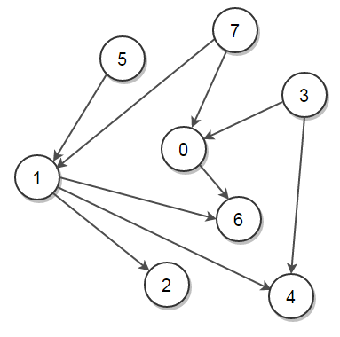
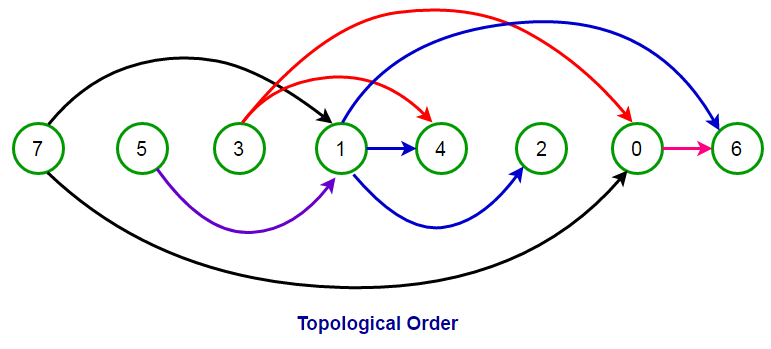

## GeeksForGeeks - Topological Sort of a Directed Graph - <ins>___[ Kahn’s algorithm for Topological Sorting - Detailed Explanation of Kahn's Algorithm]___</ins>

Given a <ins>**D**</ins>irected <ins>**A**</ins>cyclic <ins>**G**</ins>raph (DAG), print it in **Topological order** using Kahn’s Topological Sort algorithm. If the DAG has more than one topological ordering, print any of them.

A Topological Sort or Topological Ordering of a directed graph is a linear ordering of its vertices such that for every directed edge uv from vertex u to vertex v, u comes before v in the ordering. A topological ordering is possible if and only if the graph has no directed cycles, i.e. if the graph is DAG.

For example, consider below graph:


____

Above graph has many valid topological ordering of vertices like,

```
7, 5, 3, 1, 4, 2, 0, 6
7, 5, 1, 2, 3, 4, 0, 6
5, 7, 3, 1, 0, 2, 6, 4
3, 5, 7, 0, 1, 2, 6, 4
5, 7, 3, 0, 1, 4, 6, 2
7, 5, 1, 3, 4, 0, 6, 2
5, 7, 1, 2, 3, 0, 6, 4
3, 7, 0, 5, 1, 4, 2, 6

.. and many more
```

Note that for every directed edge `u -> v`, `u` comes before `v` in the ordering. For example, the pictorial representation of the topological order `[7, 5, 3, 1, 4, 2, 0, 6]` is:

____

In this post, **Kahn’s Topological Sort algorithm** is introduced which provides an efficient way to print topological order of a graph.</p>

**Kahn’s Topological Sort Algorithm** works by finding vertices which have no incoming edges and removing all outgoing edges from these vertices. 

Below is psedocode for **Kahn’s Topological Sort Algorithm** taken from [Wikipedia](https://en.wikipedia.org/wiki/Topological_sorting#Kahn.27s_algorithm) –

**Kahn's - Algorithm (graph)**
```
L ← Empty list that will contain the sorted elements
S ← Set of all nodes with no incoming edge

while S is not empty do
    remove a node n from S
    add n to L
    for each node m with an edge e from n to m do
        remove edge e from the graph
        if m has no other incoming edges then
            insert m into S

if graph has edges then
    return error   (graph has at least one cycle)
else 
    return L   (a topologically sorted order)
```

Note that a DAG has at least one such vertex which has no incoming edges.

> How can we remove an edge from the graph or check if a vertex has no other incoming edge in **constant** time?

The idea is to maintain in-degree information of all graph vertices in a map or an array (say `indegree[]`) for constant time operations. Here, `indegree[m]` will store number of incoming edges to vertex `m`.
- If vertex `m` has no incoming edge and is ready to get processed, its indegree will be 0, i.e., `indegree[m] = 0`.
- To remove an edge from n to m from the graph, we decrement `indegree[m]` by 1.

#### Implementation

Below is the implementation of the above approach in python:

```python
from typing import List
from collections import deque

# class to represent a graph object:
class Graph:

    # stores indegree of a vertex
    indegree = None

    # Constructor
    def __init__(self, edges: List[int], N: int) -> None:
        # Set the list of graph edges
        self.edges = edges
        # Set number of vertices in the graph
        self.N = N
		# A List of Lists to represent an adjacency list
        self.adjList = [[] for _ in range(self.N)]

        # initialize indegree of each vertex by 0
        self.indegree = [0] * self.N

        # add edges to the undirected graph
        for (src, dest) in self.edges:
            # add an edge from source to destination
            self.adjList[src].append(dest)

            # increment in-degree of destination vertex by 1
            self.indegree[dest] = self.indegree[dest] + 1

    # performs Topological Sort on a given DAG
    def doTopologicalSort(self) -> List[int]:
        # list to store the sorted elements
        L = []

        # get in-degree information of the graph
        indegree = self.indegree

        # Set of all nodes with no incoming edges
        S = deque([i for i in range(self.N) if indegree[i] == 0])

        while S:

            # remove a node n from S
            n = S.pop()

            # add n to tail of L
            L.append(n)

            for m in self.adjList[n]:

                # remove edge from n to m from the graph
                indegree[m] = indegree[m] - 1

                # if m has no other incoming edges then
                # insert m into S
                if indegree[m] == 0:
                    S.append(m)

        # if graph has edges then graph has at least one cycle
        for i in range(self.N):
            if indegree[i]:
                return None

        return L
```
____

#### Output:

```
[7, 5, 1, 2, 3, 4, 0, 6]
```
____

#### Complexity Analysis:

Time complexity of Kahn’s Topological Sort Algorithm is **O(n + m)** where n is number of vertices and m is number of edges in the graph.

- **Time Complexity:** O(V+E).
    
    The outer for loop will be executed V number of times and the inner for loop will be executed E number of times.
    
- **Space Complexity:** O(V).

    The queue needs to store all the vertices of the graph. So the space required is O(V).