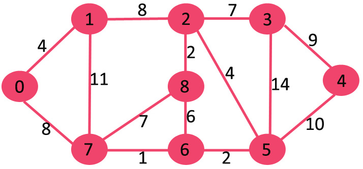
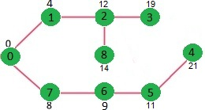

## GeeksForGeeks - Implementing Dijkstra | Set 1 (Adjacency Matrix)

Given a graph and a source vertex in the graph, find shortest paths from source to all vertices in the given graph.
Dijkstra’s algorithm is very similar to Prim’s algorithm for minimum spanning tree. Like Prim’s MST, we generate a SPT (shortest path tree) with given source as root. We maintain two sets, one set contains vertices included in shortest path tree, other set includes vertices not yet included in shortest path tree. At every step of the algorithm, we find a vertex which is in the other set (set of not yet included) and has a minimum distance from the source.

Below are the detailed steps used in Dijkstra’s algorithm to find the shortest path from a single source vertex to all other vertices in the given graph.

#### Algorithm
**1)** Create a set sptSet (shortest path tree set) that keeps track of vertices included in shortest path tree, i.e., whose minimum distance from source is calculated and finalized. Initially, this set is empty.

**2)** Assign a distance value to all vertices in the input graph. Initialize all distance values as INFINITE. Assign distance value as 0 for the source vertex so that it is picked first.

**3)** While sptSet doesn’t include all vertices

**….a)** Pick a vertex u which is not there in sptSet and has minimum distance value.

**….b)** Include u to sptSet.

**….c)** Update distance value of all adjacent vertices of u. To update the distance values, iterate through all adjacent vertices. For every adjacent vertex v, if sum of distance value of u (from source) and weight of edge u-v, is less than the distance value of v, then update the distance value of v.

Let us understand with the following example:
____

____
The set sptSet is initially empty and distances assigned to vertices are {0, INF, INF, INF, INF, INF, INF, INF} where INF indicates infinite. Now pick the vertex with minimum distance value. The vertex 0 is picked, include it in sptSet. So sptSet becomes {0}. After including 0 to sptSet, update distance values of its adjacent vertices. Adjacent vertices of 0 are 1 and 7. The distance values of 1 and 7 are updated as 4 and 8. Following subgraph shows vertices and their distance values, only the vertices with finite distance values are shown. The vertices included in SPT are shown in green colour.
____

____
Pick the vertex with minimum distance value and not already included in SPT (not in sptSET). The vertex 1 is picked and added to sptSet. So sptSet now becomes {0, 1}. Update the distance values of adjacent vertices of 1. The distance value of vertex 2 becomes 12.
____

____
Pick the vertex with minimum distance value and not already included in SPT (not in sptSET). Vertex 7 is picked. So sptSet now becomes {0, 1, 7}. Update the distance values of adjacent vertices of 7. The distance value of vertex 6 and 8 becomes finite (15 and 9 respectively).
____

____
Pick the vertex with minimum distance value and not already included in SPT (not in sptSET). Vertex 6 is picked. So sptSet now becomes {0, 1, 7, 6}. Update the distance values of adjacent vertices of 6. The distance value of vertex 5 and 8 are updated.
____

____
We repeat the above steps until sptSet does include all vertices of given graph. Finally, we get the following Shortest Path Tree (SPT).
____

____

#### Implementation

We use a boolean array sptSet[] to represent the set of vertices included in SPT. If a value sptSet[v] is true, then vertex v is included in SPT, otherwise not. Array dist[] is used to store shortest distance values of all vertices.

```python
# Python program for Dijkstra's single
# source shortest path algorithm. The program is
# for adjacency matrix representation of the graph
from typing import List
import sys

INT_MAX = sys.maxsize

class Graph():

    def __init__(self, vertices: int) -> None:
        self.V = vertices
        self.graph = [[0 for column in range(vertices)]
                      for row in range(vertices)]

    def printSolution(self, dist: List[int]) -> None:
        print("Vertex \tDistance from Source")
        for node in range(self.V):
            print(f"{node}\t{dist[node]}")

    # A utility function to find the vertex with
    # minimum distance value, from the set of vertices
    # not yet included in shortest path tree
    def minDistance(self, dist: List[int], sptSet: List[bool]) -> int:
        # Initilaize minimum distance for next node
        min = INT_MAX

        # Search not nearest vertex not in the
        # shortest path tree
        for v in range(self.V):
            if dist[v] < min and not sptSet[v]:
                min = dist[v]
                min_index = v

        return min_index

        # Funtion that implements Dijkstra's single source

    # shortest path algorithm for a graph represented
    # using adjacency matrix representation
    def dijkstra(self, src: int) -> List[int]:

        dist = [INT_MAX] * self.V
        dist[src] = 0
        sptSet = [False] * self.V

        for cout in range(self.V):

            # Pick the minimum distance vertex from
            # the set of vertices not yet processed.
            # u is always equal to src in first iteration
            u = self.minDistance(dist, sptSet)

            # Put the minimum distance vertex in the
            # shotest path tree
            sptSet[u] = True

            # Update dist value of the adjacent vertices
            # of the picked vertex only if the current
            # distance is greater than new distance and
            # the vertex in not in the shotest path tree
            for v in range(self.V):
                if self.graph[u][v] > 0 and not sptSet[v] and \
                        dist[v] > dist[u] + self.graph[u][v]:
                    dist[v] = dist[u] + self.graph[u][v]

        #self.printSolution(dist)
        return dist
```
____

#### Output:

```
Vertex   Distance from Source
0                0
1                4
2                12
3                19
4                21
5                11
6                9
7                8
8                14
```
____

#### Algorithm Notes

**Notes:**

1) The code calculates shortest distance, but doesn’t calculate the path information. We can create a parent array, update the parent array when distance is updated (like prim’s implementation) and use it show the shortest path from source to different vertices.

2) The code is for undirected graph, same dijkstra function can be used for directed graphs also.

3) The code finds shortest distances from source to all vertices. If we are interested only in shortest distance from the source to a single target, we can break the for the loop when the picked minimum distance vertex is equal to target (Step 3.a of the algorithm).

4) Time Complexity of the implementation is O(V^2). If the input graph is represented using adjacency list, it can be reduced to O(E log V) with the help of binary heap. Please see
Dijkstra’s Algorithm for Adjacency List Representation for more details.

5) Dijkstra’s algorithm doesn’t work for graphs with negative weight cycles, it may give correct results for a graph with negative edges. For graphs with negative weight edges and cycles, Bellman–Ford algorithm can be used, we will soon be discussing it as a separate post.


#### Complexity Analysis:

- **Time Complexity:** O(V^2).
    
    Time Complexity of this method is O(V^2). If the input graph is represented using adjacency list, it can be reduced to O(E log V) with the help of binary heap.
    
- **Space Complexity:** O(V).

    To store the visited and recursion stack O(V) space is needed.