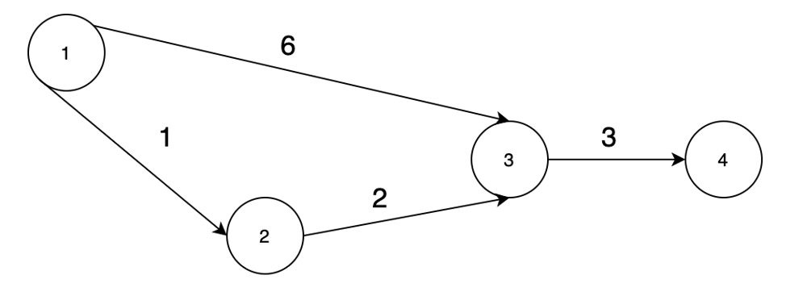

Basic Idea :
Calculate all adjacent cities that are within a threshold for each each city separately.
In this case a simple BFS will not do the trick for the following issue.

Given threshold of 6 and following **Weighted Bi-Directional Graph**:

A simple **BFS** might not allow us to reach City 4. However, this is clearly not correct and might artificially skew the result of our computation.

Hence, we should explore cities in a **Minimum Cost Shortest Path** fashion. Which is the very definition of **Dijkstra algorithm**.