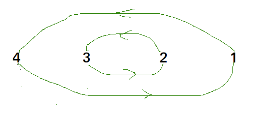
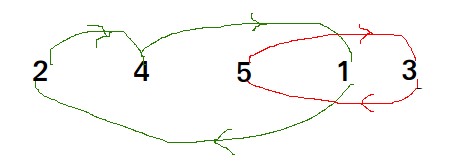

## GeeksForGeeks - Minimum number of swaps required to sort an array

Given an array of n distinct elements, find the minimum number of swaps required to sort the array.

**Examples:**

```
Input : {4, 3, 2, 1}
Output : 2
Explanation : Swap index 0 with 3 and 1 with 2 to 
              form the sorted array {1, 2, 3, 4}.

Input : {1, 5, 4, 3, 2}
Output : 2
```
_____

#### Approach

This can be easily done by visualizing the problem as a graph. We will have n nodes and an edge directed from node i to node j if the element at i’th index must be present at j’th index in the sorted array.

> 
>
> ```Graph for {4, 3, 2, 1}```
>

The graph will now contain many non-intersecting cycles. Now a cycle with 2 nodes will only require 1 swap to reach the correct ordering, similarly a cycle with 3 nodes will only require 2 swap to do so.

> 
>
> ```Graph for {4, 5, 2, 1, 5}```
>

Hence,
 - ans = Σ<sub>i</sub> = 1<sup>k</sup>(cycle_size – 1)

where k is the number of cycles

#### Implementation

Below is the implementation of the idea.

```python
# Python3 program to find  minimum number
# of swaps required to sort an array
#
# Function returns the minimum
# number of swaps required to sort the array
#
# Time Complexity: O(n Log n)
# Auxiliary Space: O(n)
# https://www.geeksforgeeks.org/minimum-number-swaps-required-sort-array/
from typing import List

class Solution:

    def minSwaps(self, A: List[int]) -> int:
        n = len(A)

        # Create two arrays and use
        # as pairs where first array
        # is element and second array
        # is position of first element
        arrpos = [*enumerate(A)]

        # Sort the array by array element
        # values to get right position of
        # every element as the elements
        # of second array.
        arrpos.sort(key=lambda it: it[1])

        # To keep track of visited elements.
        # Initialize all elements as not
        # visited or false.
        vis = {k: False for k in range(n)}

        # Initialize result
        ans = 0
        for i in range(n):

            # alreadt swapped or
            # alreadt present at
            # correct position
            if vis[i] or arrpos[i][0] == i:
                continue

            # find number of nodes
            # in this cycle and
            # add it to ans
            cycle_size = 0
            j = i
            while not vis[j]:
                # mark node as visited
                vis[j] = True

                # move to next node
                j = arrpos[j][0]
                cycle_size += 1

            # update answer by adding
            # current cycle
            if cycle_size > 0:
                ans += (cycle_size - 1)
                # return answer
        return ans

# main
if __name__ == "__main__":
    sol = Solution()
    # Driver Code      
    arr = [1, 5, 4, 3, 2] 
    print(sol.minSwaps(arr))
```
____

#### Output:

```
2
```
____

#### Complexity Analysis:

- Time Complexity: O(n Log n)
- Auxiliary Space: O(n)

____

#### Related Problems:

[GeeksForGeeks - Number of swaps to sort when only adjacent swapping allowed](https://www.geeksforgeeks.org/number-swaps-sort-adjacent-swapping-allowed/)

____

#### References:

[Stackoverflow - Compute the Minimal Number of Swaps to Order a Sequence](http://stackoverflow.com/questions/15152322/compute-the-minimal-number-of-swaps-to-order-a-sequence/15152602#15152602)
