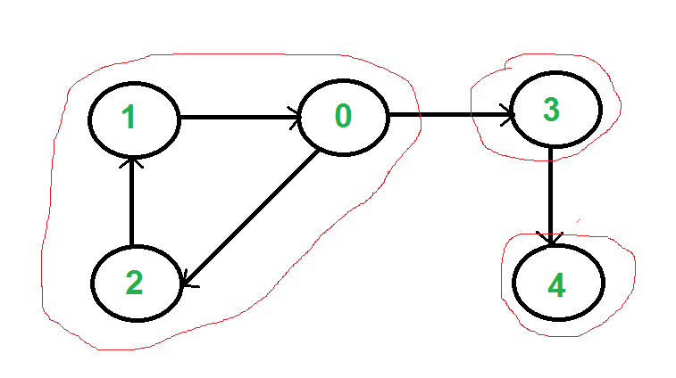
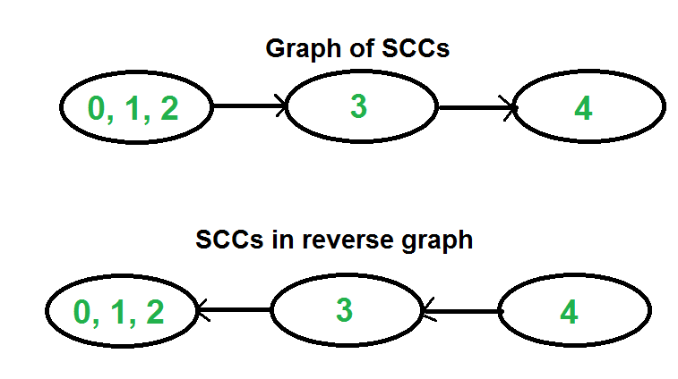

## GeeksForGeeks - Strongly Connected Components (Kosaraju's Algo)

A directed graph is strongly connected if there is a path between all pairs of vertices. A strongly connected component (**SCC**) of a directed graph is a maximal strongly connected subgraph. For example, there are 3 SCCs in the following graph.
___

___

We can find all strongly connected components in O(V+E) time using [Kosaraju’s algorithm](http://en.wikipedia.org/wiki/Kosaraju%27s_algorithm). Following is detailed Kosaraju’s algorithm.

**1)** Create an empty stack ‘S’ and do DFS traversal of a graph. In DFS traversal, after calling recursive DFS for adjacent vertices of a vertex, push the vertex to stack. In the above graph, if we start DFS from vertex 0, we get vertices in stack as 1, 2, 4, 3, 0.

**2)** Reverse directions of all arcs to obtain the transpose graph.

**3)** One by one pop a vertex from S while S is not empty. Let the popped vertex be ‘v’. Take v as source and do DFS (call `DFSUtil(v)`). The DFS starting from v prints strongly connected component of v. In the above example, we process vertices in order 0, 3, 4, 2, 1 (One by one popped from stack).

**How does this work?**

The above algorithm is DFS based. It does DFS two times. DFS of a graph produces a single tree if all vertices are reachable from the DFS starting point. Otherwise DFS produces a forest. So DFS of a graph with only one SCC always produces a tree. The important point to note is DFS may produce a tree or a forest when there are more than one SCCs depending upon the chosen starting point. For example, in the above diagram, if we start DFS from vertices 0 or 1 or 2, we get a tree as output. And if we start from 3 or 4, we get a forest. To find and print all SCCs, we would want to start DFS from vertex 4 (which is a sink vertex), then move to 3 which is sink in the remaining set (set excluding 4) and finally any of the remaining vertices (0, 1, 2). So how do we find this sequence of picking vertices as starting points of DFS? Unfortunately, there is no direct way for getting this sequence. However, if we do a DFS of graph and store vertices according to their finish times, we make sure that the finish time of a vertex that connects to other SCCs (other that its own SCC), will always be greater than finish time of vertices in the other SCC (See this for proof). For example, in DFS of above example graph, finish time of 0 is always greater than 3 and 4 (irrespective of the sequence of vertices considered for DFS). And finish time of 3 is always greater than 4. DFS doesn’t guarantee about other vertices, for example finish times of 1 and 2 may be smaller or greater than 3 and 4 depending upon the sequence of vertices considered for DFS. So to use this property, we do DFS traversal of complete graph and push every finished vertex to a stack. In stack, 3 always appears after 4, and 0 appear after both 3 and 4.
In the next step, we reverse the graph. Consider the graph of SCCs. In the reversed graph, the edges that connect two components are reversed. So the SCC {0, 1, 2} becomes sink and the SCC {4} becomes source. As discussed above, in stack, we always have 0 before 3 and 4. So if we do a DFS of the reversed graph using sequence of vertices in stack, we process vertices from sink to source (in reversed graph). That is what we wanted to achieve and that is all needed to print SCCs one by one.
___

___

#### Implementation

Below is the implementation of the idea in Python.

```python
# Python implementation of Kosaraju's algorithm to print all SCCs 
from collections import defaultdict

# This class represents a directed graph using adjacency list representation
class Graph:
    def __init__(self, vertices):
        self.V = vertices  # No. of vertices
        self.graph = defaultdict(list)  # default dictionary to store graph

    # function to add an edge to graph
    def addEdge(self, u, v):
        self.graph[u].append(v)

        # A function used by DFS

    def DFSUtil(self, v, visited):
        # Mark the current node as visited and print it
        visited[v] = True
        print(f"{v}", end=" ")
        # Recur for all the vertices adjacent to this vertex
        for i in self.graph[v]:
            if not visited[i]:
                self.DFSUtil(i, visited)

    def fillOrder(self, v, visited, stack):
        # Mark the current node as visited
        visited[v] = True
        # Recur for all the vertices adjacent to this vertex
        for i in self.graph[v]:
            if not visited[i]:
                self.fillOrder(i, visited, stack)
        stack = stack.append(v)

        # Function that returns reverse (or transpose) of this graph

    def getTranspose(self):
        g = Graph(self.V)

        # Recur for all the vertices adjacent to this vertex
        for i in self.graph:
            for j in self.graph[i]:
                g.addEdge(j, i)
        return g

        # The main function that finds and prints all strongly

    # connected components
    def countSCCs(self):

        stack = []
        # Mark all the vertices as not visited (For first DFS)

        visited = [False] * (self.V)
        # Fill vertices in stack according to their finishing
        # times
        for i in range(self.V):
            if not visited[i]:
                self.fillOrder(i, visited, stack)

        # Create a reversed graph
        gr = self.getTranspose()

        # Mark all the vertices as not visited (For second DFS)
        visited = [False] * (self.V)

        # Now process all vertices in order defined by Stack
        ans = 0
        while stack:
            i = stack.pop()
            if not visited[i]:
                gr.DFSUtil(i, visited)
                ans += 1

        return ans

# main
if __name__ == "__main__":
    # Create a graph given in the above diagram
    g = Graph(5)
    g.addEdge(1, 0)
    g.addEdge(0, 2)
    g.addEdge(2, 1)
    g.addEdge(0, 3)
    g.addEdge(3, 4)

    print("Following are strongly connected components " +
          "in given graph")
    g.countSCCs()
```
____

#### Output:

```
Following are strongly connected components in given graph
0 1 2
3
4
```
____

#### Complexity Analysis:

- **Time Complexity:** 

    Time Complexity: The above algorithm calls DFS, finds reverse of the graph and again calls DFS. DFS takes O(V+E) for a graph represented using adjacency list. Reversing a graph also takes O(V+E) time. For reversing the graph, we simple traverse all adjacency lists.

    The above algorithm is asymptotically best algorithm, but there are other algorithms like Tarjan’s algorithm and path-based which have same time complexity but find SCCs using single DFS.
    
#### Applications:

SCC algorithms can be used as a first step in many graph algorithms that work only on strongly connected graph.
In social networks, a group of people are generally strongly connected (For example, students of a class or any other common place). Many people in these groups generally like some common pages or play common games. The SCC algorithms can be used to find such groups and suggest the commonly liked pages or games to the people in the group who have not yet liked commonly liked a page or played a game.

#### References:
- [http://en.wikipedia.org/wiki/Kosaraju%27s_algorithm](http://en.wikipedia.org/wiki/Kosaraju%27s_algorithm)
- [https://www.youtube.com/watch?v=PZQ0Pdk15RA](https://www.youtube.com/watch?v=PZQ0Pdk15RA)
