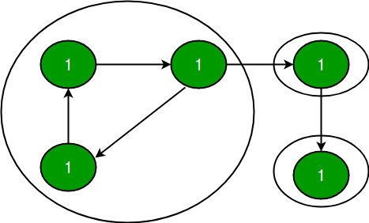
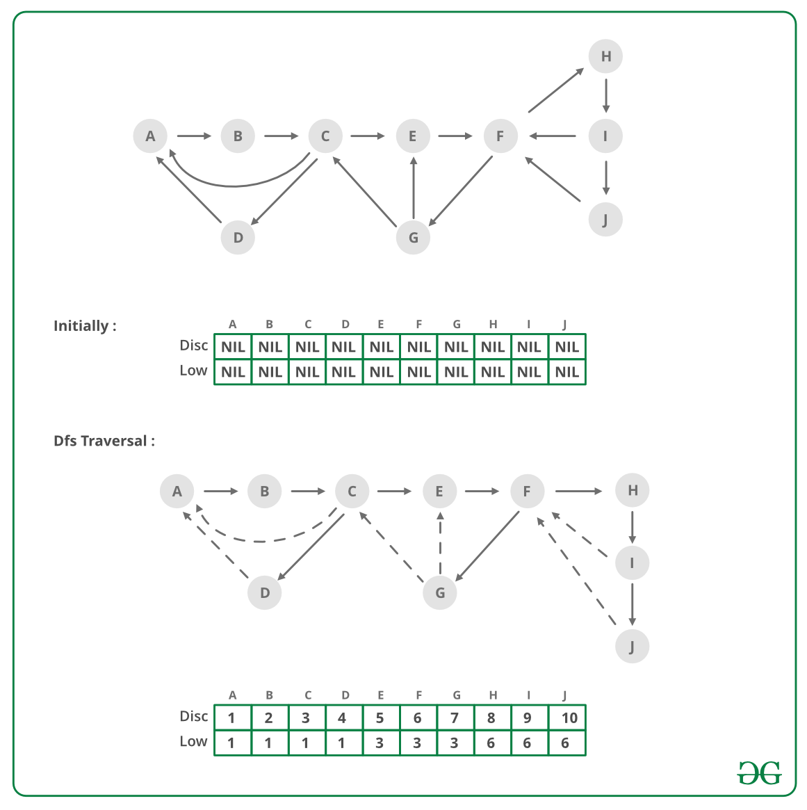

## GeeksForGeeks - Strongly Connected Components (Tarjan's Algo)

A directed graph is strongly connected if there is a path between all pairs of vertices. A strongly connected component (**SCC**) of a directed graph is a maximal strongly connected subgraph. For example, there are 3 SCCs in the following graph.
___

___

We have discussed [Kosaraju’s algorithm for strongly connected components](https://www.geeksforgeeks.org/strongly-connected-components/). The previously discussed algorithm requires two DFS traversals of a Graph. In this post, [Tarjan’s algorithm](http://en.wikipedia.org/wiki/Tarjan%27s_strongly_connected_components_algorithm) is discussed that requires only one DFS traversal.

Tarjan Algorithm is based on following facts:
1. DFS search produces a DFS tree/forest
2. Strongly Connected Components form subtrees of the DFS tree.
3. If we can find the head of such subtrees, we can print/store all the nodes in that subtree (including head) and that will be one SCC.
4. There is no back edge from one SCC to another (There can be cross edges, but cross edges will not be used while processing the graph).

To find head of a SCC, we calculate disc and low array (as done for [articulation point](https://www.geeksforgeeks.org/articulation-points-or-cut-vertices-in-a-graph/), [bridge](https://www.geeksforgeeks.org/bridge-in-a-graph/), [biconnected component](https://www.geeksforgeeks.org/biconnectivity-in-a-graph/)). As discussed in the previous posts, low[u] indicates earliest visited vertex (the vertex with minimum discovery time) that can be reached from subtree rooted with u. A node u is head if disc[u] = low[u].

Below image is an illustration of the approach:
___

___
___Strongly Connected Component relates to directed graph only, but Disc and Low values relate to both directed and undirected graph, so in above pic we have taken an undirected graph.___

In above Figure, we have shown a graph and its one of DFS tree (There could be different DFS trees on same graph depending on order in which edges are traversed).
In DFS tree, continuous arrows are tree edges and dashed arrows are back edges ([DFS Tree Edges](http://en.wikipedia.org/wiki/Depth-first_search#Output_of_a_depth-first_search))
Disc and Low values are shown in in Figure for every node as (Disc/Low).

**Disc:** This is the time when a node is visited 1st time while DFS traversal. For nodes A, B, C, .., J in DFS tree, Disc values are 1, 2, 3, .., 10.

**Low:** In DFS tree, Tree edges take us forward, from ancestor node to one of its descendants. For example, from node C, tree edges can take us to node node G, node I etc. Back edges take us backward, from a descendant node to one of its ancestors. For example, from node G, Back edges take us to E or C. If we look at both Tree and Back edge together, then we can see that if we start traversal from one node, we may go down the tree via Tree edges and then go up via back edges. For example, from node E, we can go down to G and then go up to C. Similarly from E, we can go down to I or J and then go up to F. “Low” value of a node tells the topmost reachable ancestor (with minimum possible Disc value) via the subtree of that node. So for any node, Low value equal to its Disc value anyway (A node is ancestor of itself). Then we look into its subtree and see if there is any node which can take us to any of its ancestor. If there are multiple back edges in subtree which take us to different ancestors, then we take the one with minimum Disc value (i.e. the topmost one). If we look at node F, it has two subtrees. Subtree with node G, takes us to E and C. The other subtree takes us back to F only. Here topmost ancestor is C where F can reach and so Low value of F is 3 (The Disc value of C).

Based on above discussion, it should be clear that Low values of B, C, and D are 1 (As A is the topmost node where B, C and D can reach). In same way, Low values of E, F, G are 3 and Low values of H, I, J are 6.

For any node u, when DFS starts, Low will be set to its Disc 1st.

Then later on DFS will be performed on each of its children v one by one, Low value of u can change it two case:

**Case1 (Tree Edge):** If node v is not visited already, then after DFS of v is complete, then minimum of low[u] and low[v] will be updated to low[u].

`low[u] = min(low[u], low[v])`

**Case 2 (Back Edge):** When child v is already visited, then minimum of low[u] and Disc[v] will be updated to low[u].

`low[u] = min(low[u], disc[v])`

In case two, ___can we take low[v] instead of disc[v] ??___. Answer is **NO**. If you can think why answer is **NO**, you probably understood the Low and Disc concept.
___

___

Same Low and Disc values help to solve other graph problems like [articulation point](https://www.geeksforgeeks.org/articulation-points-or-cut-vertices-in-a-graph/), [bridge](https://www.geeksforgeeks.org/bridge-in-a-graph/) and [biconnected component](https://www.geeksforgeeks.org/biconnectivity-in-a-graph/).

To track the subtree rooted at head, we can use a stack (keep pushing node while visiting). When a head node found, pop all nodes from stack till you get head out of stack.

To make sure, we don’t consider cross edges, when we reach a node which is already visited, we should process the visited node only if it is present in stack, else ignore the node.

#### Implementation

Following is implementation of Tarjan’s algorithm to print all SCCs.

```python
from collections import defaultdict

# This class represents an directed graph using adjacency list representation
class Graph:
    def __init__(self, vertices):
        # No. of vertices
        self.V = vertices

        # default dictionary to store graph
        self.graph = defaultdict(list)

        self.Time = 0

    # function to add an edge to graph
    def addEdge(self, u, v):
        self.graph[u].append(v)

    '''A recursive function that find finds and prints strongly connected 
    components using DFS traversal 
    u --> The vertex to be visited next 
    disc[] --> Stores discovery times of visited vertices 
    low[] -- >> earliest visited vertex (the vertex with minimum 
                discovery time) that can be reached from subtree 
                rooted with current vertex 
     st -- >> To store all the connected ancestors (could be part 
           of SCC) 
     stackMember[] --> bit/index array for faster check whether 
                  a node is in stack 
    '''
    def SCCUtil(self, u, low, disc, stackMember, st):

        # Initialize discovery time and low value
        disc[u] = self.Time
        low[u] = self.Time
        self.Time += 1
        stackMember[u] = True
        st.append(u)

        # Go through all vertices adjacent to this
        for v in self.graph[u]:

            # If v is not visited yet, then recur for it
            if disc[v] == -1:

                self.SCCUtil(v, low, disc, stackMember, st)

                # Check if the subtree rooted with v has a connection to
                # one of the ancestors of u
                # Case 1 (per above discussion on Disc and Low value)
                low[u] = min(low[u], low[v])

            elif stackMember[v] == True:

                '''Update low value of 'u' only if 'v' is still in stack 
                (i.e. it's a back edge, not cross edge). 
                Case 2 (per above discussion on Disc and Low value) '''
                low[u] = min(low[u], disc[v])

        # head node found, pop the stack and print an SCC
        w = -1  # To store stack extracted vertices
        if low[u] == disc[u]:
            while w != u:
                w = st.pop()
                print(f"{w}", end=" ")
                stackMember[w] = False
            print("")

            # The function to do DFS traversal.

    # It uses recursive SCCUtil()
    def SCC(self):

        # Mark all the vertices as not visited
        # and Initialize parent and visited,
        # and ap(articulation point) arrays
        disc = [-1] * (self.V)
        low = [-1] * (self.V)
        stackMember = [False] * (self.V)
        st = []

        # Call the recursive helper function
        # to find articulation points
        # in DFS tree rooted with vertex 'i'
        for i in range(self.V):
            if disc[i] == -1:
                self.SCCUtil(i, low, disc, stackMember, st)

# main
if __name__ == "__main__":
    # Create a graph given in the above diagram
    g1 = Graph(5)
    g1.addEdge(1, 0)
    g1.addEdge(0, 2)
    g1.addEdge(2, 1)
    g1.addEdge(0, 3)
    g1.addEdge(3, 4)
    print("SSC in first graph ")
    g1.SCC()

    g2 = Graph(4)
    g2.addEdge(0, 1)
    g2.addEdge(1, 2)
    g2.addEdge(2, 3)
    print("SSC in second graph ")
    g2.SCC()

    g3 = Graph(7)
    g3.addEdge(0, 1)
    g3.addEdge(1, 2)
    g3.addEdge(2, 0)
    g3.addEdge(1, 3)
    g3.addEdge(1, 4)
    g3.addEdge(1, 6)
    g3.addEdge(3, 5)
    g3.addEdge(4, 5)
    print("SSC in third graph ")
    g3.SCC()

    g4 = Graph(11)
    g4.addEdge(0, 1)
    g4.addEdge(0, 3)
    g4.addEdge(1, 2)
    g4.addEdge(1, 4)
    g4.addEdge(2, 0)
    g4.addEdge(2, 6)
    g4.addEdge(3, 2)
    g4.addEdge(4, 5)
    g4.addEdge(4, 6)
    g4.addEdge(5, 6)
    g4.addEdge(5, 7)
    g4.addEdge(5, 8)
    g4.addEdge(5, 9)
    g4.addEdge(6, 4)
    g4.addEdge(7, 9)
    g4.addEdge(8, 9)
    g4.addEdge(9, 8)
    print("SSC in fourth graph ")
    g4.SCC()

    g5 = Graph(5)
    g5.addEdge(0, 1)
    g5.addEdge(1, 2)
    g5.addEdge(2, 3)
    g5.addEdge(2, 4)
    g5.addEdge(3, 0)
    g5.addEdge(4, 2)
    print("SSC in fifth graph ")
    g5.SCC()
```
____

#### Output:

```
SCCs in first graph
4
3
1 2 0

SCCs in second graph
3
2
1
0

SCCs in third graph
5
3
4
6
2 1 0

SCCs in fourth graph
8 9
7
5 4 6
3 2 1 0
10

SCCs in fifth graph
4 3 2 1 0
```
____

#### Complexity Analysis:

- **Time Complexity:** 

    The above algorithm mainly calls DFS, DFS takes O(V+E) for a graph represented using adjacency list.


#### References:
- [http://en.wikipedia.org/wiki/Tarjan%27s_strongly_connected_components_algorithm](http://en.wikipedia.org/wiki/Tarjan%27s_strongly_connected_components_algorithm)
- [http://www.ics.uci.edu/~eppstein/161/960220.html#sca](http://www.ics.uci.edu/~eppstein/161/960220.html#sca)
