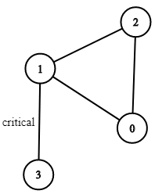

## LeetCode - Problem 1192 - Critical Connections in a Network

There are `n` servers numbered from `0` to `n-1` connected by undirected server-to-server `connections` forming a network where `connections[i] = [a, b]` represents a connection between servers a and b. Any server can reach any other server directly or indirectly through the network.

A ___critical connection___ is a connection that, if removed, will make some server unable to reach some other server.

Return all critical connections in the network in any order.

### Examples:

#### Example 1:


```
Input: n = 4, connections = [[0,1],[1,2],[2,0],[1,3]]
Output: [[1,3]]
Explanation: [[3,1]] is also accepted.
```
____

### Algorithm ( Tarjan's Algorithm ):

In **Tarjan's algorithm**, we keep two arrays `DFN` and `LOW` in DFS procedure. 
- `DFN` array records the order of DFS for each node while `LOW` array records the lowest order of each node's neighbor except its direct parent. 
- Initially, `LOW[i]` equals to `DFN[i]`.
- After DFS, we find `edge(u,v)` where `DFN(u)<LOW(v)` and get the final answers.

> `low[node]`:
>
>   this gets the `min(level)` of neighbors, which actually means "how close to the supposed root can we can get if we keep traversing forward from that node".
>
> As for `"edge(u,v) where DFN(u)<LOW(v)"`:
>
>   This means that:
>
>    traversing down the tree from a node at level 2 will ONLY reach level 3+.
>
>    - this implies that this node is the ONLY link from level 2 to level 3.
>
>    - implies u to v is a critical connection
>
>   A more intuitive explanation of the above:
>
>    That statement means: "can we traverse along any of a nodes neighbors to get back to the same level as node?
>  
>    because if we can, there is a cycle and we can safely remove this node.
>
>    If not, then the inverse is true, and u -> v is a critical connection"

### Implementation:

```python
from typing import List
import collections


class Solution:
    def criticalConnections(self, n: int, connections: List[List[int]]) -> List[List[int]]:
        """
        :type n: int
        :type connections: List[List[int]]
        :rtype: List[List[int]]
        """
        graph = collections.defaultdict(list)
        for u, v in connections:
            graph[u].append(v)
            graph[v].append(u)

        N = len(connections)
        lev = [None] * N
        low = [None] * N

        def dfs(node, par, level):
            # already visited
            if lev[node] is not None:
                return

            lev[node] = low[node] = level
            for nei in graph[node]:
                if not lev[nei]:
                    dfs(nei, node, level + 1)

            # minimal level in the neignbors, exclude the parent
            cur = min([level] + [low[nei] for nei in graph[node] if nei != par])
            low[node] = cur
            # print(low, lev)

        dfs(0, None, 0)

        ans = []
        for u, v in connections:
            if low[u] > lev[v] or low[v] > lev[u]:
                ans.append([u, v])
        return ans

```
