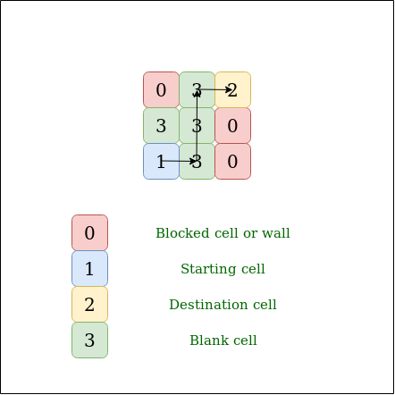
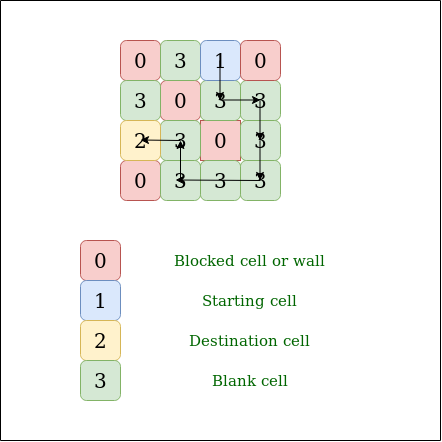

## GeeksForGeeks - Find whether there is path between two cells in matrix

Given N X N matrix filled with 1, 0, 2, 3. Find whether there is a path possible from source to destination, traversing through blank cells only. You can traverse up, down, right and left.

- A value of cell 1 means Source.
- A value of cell 2 means Destination.
- A value of cell 3 means Blank cell.
- A value of cell 0 means Blank Wall.

Note: there are an only a single source and single destination(sink).

#### Examples

```
Input:
M[3][3] = {{ 0, 3, 2 },
{ 3, 3, 0 },
{ 1, 3, 0 }};
Output : Yes
Explanation:
```
___

___
```
Input:
M[4][4] = {{ 0, 3, 1, 0 },
{ 3, 0, 3, 3 },
{ 2, 3, 0, 3 },
{ 0, 3, 3, 3 }};
Output: Yes
Explanation:
```
___

___

#### Efficient solution: Graph.

**Approach:** The idea is to use Breadth-First Search. Consider each cell as a node and each boundary between any two adjacent cells be an edge. so total number of Node is N * N.
So the idea is to do a breadth-first search from the starting cell till the ending cell is found.

#### Algorithm:

1. Create an empty Graph having N*N node(Vertex), push all nodes into a graph and notedown source and sink vertex.
1. Now apply BFS on the graph, create a queue and insert the source node in the queue
1. Run a loop till the size of queue is greater than 0
1. Remove the front node of the queue and check if the node is destination, if destination return true. mark the node
1. Check all adjacent cells if unvisited and blank insert them in the queue.
1. If destination is not reached return true.

#### Implementation

Below is the implementation of the idea –

```python
# Python3 program to find path between two
# cell in matrix
from collections import defaultdict

class Graph:
    def __init__(self):
        self.graph = defaultdict(list)

        # add edge to graph

    def addEdge(self, u, v):
        self.graph[u].append(v)

        # BFS function to find path from source to sink

    def BFS(self, s, d):

        # Base case
        if s == d:
            return True

        # Mark all the vertices as not visited
        visited = [False] * (len(self.graph) + 1)

        # Create a queue for BFS
        queue = []
        queue.append(s)

        # Mark the current node as visited and
        # enqueue it
        visited[s] = True
        while (queue):

            # Dequeue a vertex from queue
            s = queue.pop(0)

            # Get all adjacent vertices of the
            # dequeued vertex s. If a adjacent has
            # not been visited, then mark it visited
            # and enqueue it
            for i in self.graph[s]:

                # If this adjacent node is the destination
                # node, then return true
                if i == d:
                    return True

                # Else, continue to do BFS
                if visited[i] == False:
                    queue.append(i)
                    visited[i] = True

        # If BFS is complete without visiting d
        return False

class Solution:
    def isSafe(self, i, j, matrix):
        if i >= 0 and i <= len(matrix) and j >= 0 and j <= len(matrix[0]):
            return True
        else:
            return False

    # Returns true if there is a path from a source (a
    # cell with value 1) to a destination (a cell with
    # value 2)
    def findPath(self, M):
        s, d = None, None  # source and destination
        N = len(M)
        g = Graph()

        # create graph with n * n node
        # each cell consider as node
        k = 1  # Number of current vertex
        for i in range(N):
            for j in range(N):
                if (M[i][j] != 0):

                    # connect all 4 adjacent cell to
                    # current cell
                    if (self.isSafe(i, j + 1, M)):
                        g.addEdge(k, k + 1)
                    if (self.isSafe(i, j - 1, M)):
                        g.addEdge(k, k - 1)
                    if (self.isSafe(i + 1, j, M)):
                        g.addEdge(k, k + N)
                    if (self.isSafe(i - 1, j, M)):
                        g.addEdge(k, k - N)

                if (M[i][j] == 1):
                    s = k

                    # destination index
                if (M[i][j] == 2):
                    d = k
                k += 1

        # find path Using BFS
        return g.BFS(s, d)


# main
if __name__ == "__main__":
    # Driver code
    sol = Solution()
    M = [[0, 3, 0, 1], [3, 0, 3, 3], [2, 3, 3, 3], [0, 3, 3, 3]]
    if sol.findPath(M):
        print("Yes")
    else:
        print("No")
```
____

#### Output:

```
Yes
```

#### Complexity Analysis:

- **Time Complexity:** O(n*m).

    Every cell of the matrix is visited only once so the time complexity is O(n*m).

- **Space Complexity:** O(n*m).

    The space is required to store the visited array and to create the queue.