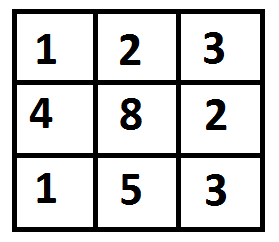
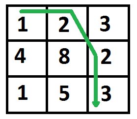

## GeeksForGeeks - Minimum Cost Path

Given a cost matrix cost[][] and a position (m, n) in cost[][], write a function that returns cost of minimum cost path to reach (m, n) from (0, 0). Each cell of the matrix represents a cost to traverse through that cell. Total cost of a path to reach (m, n) is sum of all the costs on that path (including both source and destination). You can only traverse down, right and diagonally lower cells from a given cell, i.e., from a given cell (i, j), cells (i+1, j), (i, j+1) and (i+1, j+1) can be traversed. You may assume that all costs are positive integers.

For example, in the following figure, what is the minimum cost path to (2, 2)?



The path with minimum cost is highlighted in the following figure. The path is (0, 0) –> (0, 1) –> (1, 2) –> (2, 2). The cost of the path is 8 (1 + 2 + 2 + 3).



(1) Optimal Substructure
The path to reach (m, n) must be through one of the 3 cells: (m-1, n-1) or (m-1, n) or (m, n-1). So minimum cost to reach (m, n) can be written as “minimum of the 3 cells plus cost[m][n]”.

```
minCost(m, n) = min (minCost(m-1, n-1), minCost(m-1, n), minCost(m, n-1)) + cost[m][n]
```

(2) Overlapping subproblems
So the MCP problem has both properties (see this and this) of a dynamic programming problem. Like other typical Dynamic Programming(DP) problems, recomputations of same subproblems can be avoided by constructing a temporary array tc[][] in bottom up manner.


#### Implementation

Below is the implementation of the idea –

```python
from typing import List

# Dynamic Programming Python implementation of Min Cost Path
# problem
R = 3
C = 3

class Solution:

    def minCost(self, cost: List[int], m: int, n: int) -> int:

        # Instead of following line, we can use int tc[m+1][n+1] or
        # dynamically allocate memoery to save space. The following
        # line is used to keep te program simple and make it working
        # on all compilers.
        tc = [[0 for x in range(C)] for x in range(R)]

        tc[0][0] = cost[0][0]

        # Initialize first column of total cost(tc) array
        for i in range(1, m + 1):
            tc[i][0] = tc[i - 1][0] + cost[i][0]

            # Initialize first row of tc array
        for j in range(1, n + 1):
            tc[0][j] = tc[0][j - 1] + cost[0][j]

            # Construct rest of the tc array
        for i in range(1, m + 1):
            for j in range(1, n + 1):
                tc[i][j] = min(tc[i - 1][j - 1], tc[i - 1][j], tc[i][j - 1]) + cost[i][j]

        return tc[m][n]


# main
if __name__ == "__main__":
    # Driver program to test above functions
    sol = Solution()
    cost = [[1, 2, 3],
            [4, 8, 2],
            [1, 5, 3]]
    print(sol.minCost(cost, 2, 2))
```
____

#### Output:

```
8
```

#### Complexity Analysis:

**Time Complexity** of the DP implementation is O(mn) which is much better than Naive Recursive implementation.

**Space Optimization:** The idea is to use same given array to store the solutions of subproblems, so O(1).