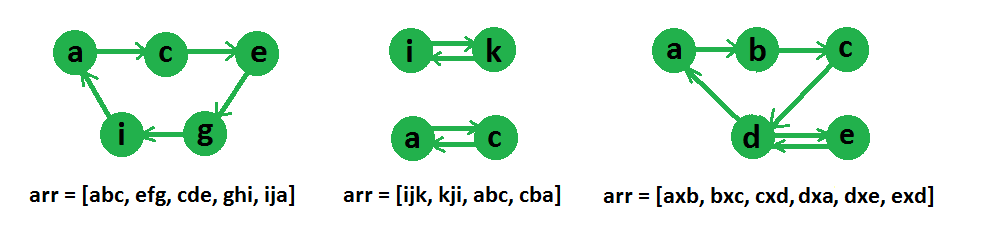

## GeeksForGeeks - Find if an array of strings can be chained to form a circle | Set 1

Given an array of strings, find if the given strings can be chained to form a circle. A string X can be put before another string Y in circle if the last character of X is same as first character of Y.

Examples:

```
Input: arr[] = {"geek", "king"}
Output: Yes, the given strings can be chained.
Note that the last character of first string is same
as first character of second string and vice versa is
also true.

Input: arr[] = {"for", "geek", "rig", "kaf"}
Output: Yes, the given strings can be chained.
The strings can be chained as "for", "rig", "geek" 
and "kaf"

Input: arr[] = {"aab", "bac", "aaa", "cda"}
Output: Yes, the given strings can be chained.
The strings can be chained as "aaa", "aab", "bac" 
and "cda"

Input: arr[] = {"aaa", "bbb", "baa", "aab"};
Output: Yes, the given strings can be chained.
The strings can be chained as "aaa", "aab", "bbb" 
and "baa"

Input: arr[] = {"aaa"};
Output: Yes

Input: arr[] = {"aaa", "bbb"};
Output: No

Input  : arr[] = ["abc", "efg", "cde", "ghi", "ija"]
Output : Yes
These strings can be reordered as, “abc”, “cde”, “efg”,
“ghi”, “ija”

Input : arr[] = [“ijk”, “kji”, “abc”, “cba”]
Output : No
```

The idea is to create a directed graph of all characters and then find if their is an [eulerian circuit](https://www.geeksforgeeks.org/euler-circuit-directed-graph/) in the graph or not.

Graph representation of some string arrays are given in below diagram,



Following are detailed steps of the algorithm.

(1) Create a directed graph g with number of vertices equal to the size of alphabet. We have created a graph with 26 vertices in the below program.

(2) Do following for every string in the given array of strings.
…..a) Add an edge from first character to last character of the given graph.

(3) If the created graph has eulerian circuit, then return true, else return false.

#### Implementation

Below is the implementation of the idea –

```python
from typing import List

# Python program to check if a given directed graph is Eulerian or not 
CHARS = 26


# A class that represents an undirected graph 
class Graph(object):
    def __init__(self, V):
        self.V = V  # No. of vertices 
        self.adj = [[] for x in range(V)]  # a dynamic array 
        self.inp = [0] * V

        # function to add an edge to graph 

    def addEdge(self, v, w):
        self.adj[v].append(w)
        self.inp[w] += 1

    # Method to check if this graph is Eulerian or not 
    def isSC(self):
        # Mark all the vertices as not visited (For first DFS) 
        visited = [False] * self.V

        # Find the first vertex with non-zero degree 
        n = 0
        for n in range(self.V):
            if len(self.adj[n]) > 0:
                break

        # Do DFS traversal starting from first non zero degree vertex. 
        self.DFSUtil(n, visited)

        # If DFS traversal doesn't visit all vertices, then return false. 
        for i in range(self.V):
            if len(self.adj[i]) > 0 and visited[i] == False:
                return False

        # Create a reversed graph 
        gr = self.getTranspose()

        # Mark all the vertices as not visited (For second DFS) 
        for i in range(self.V):
            visited[i] = False

        # Do DFS for reversed graph starting from first vertex. 
        # Staring Vertex must be same starting point of first DFS 
        gr.DFSUtil(n, visited)

        # If all vertices are not visited in second DFS, then 
        # return false 
        for i in range(self.V):
            if len(self.adj[i]) > 0 and visited[i] == False:
                return False

        return True

    # This function returns true if the directed graph has an eulerian 
    # cycle, otherwise returns false 
    def isEulerianCycle(self):

        # Check if all non-zero degree vertices are connected 
        if self.isSC() == False:
            return False

        # Check if in degree and out degree of every vertex is same 
        for i in range(self.V):
            if len(self.adj[i]) != self.inp[i]:
                return False

        return True

    # A recursive function to do DFS starting from v 
    def DFSUtil(self, v, visited):

        # Mark the current node as visited and print it 
        visited[v] = True

        # Recur for all the vertices adjacent to this vertex 
        for i in range(len(self.adj[v])):
            if not visited[self.adj[v][i]]:
                self.DFSUtil(self.adj[v][i], visited)

                # Function that returns reverse (or transpose) of this graph 

    # This function is needed in isSC() 
    def getTranspose(self):
        g = Graph(self.V)
        for v in range(self.V):
            # Recur for all the vertices adjacent to this vertex 
            for i in range(len(self.adj[v])):
                g.adj[self.adj[v][i]].append(v)
                g.inp[v] += 1
        return g

    # This function takes an of strings and returns true 

class Solution:
    # if the given array of strings can be chained to 
    # form cycle 
    def canBeChained(self, arr: List[str], n: int) -> bool:
        # Create a graph with 'aplha' edges 
        g = Graph(CHARS)
    
        # Create an edge from first character to last character 
        # of every string
        for i in range(n):
            s = arr[i]
            g.addEdge(ord(s[0]) - ord('a'), ord(s[len(s) - 1]) - ord('a'))
    
        # The given array of strings can be chained if there
        # is an eulerian cycle in the created graph 
        return g.isEulerianCycle()


# main
if __name__ == "__main__":
    # Driver program
    sol = Solution()
    arr1 = ["for", "geek", "rig", "kaf"]
    n1 = len(arr1)
    if sol.canBeChained(arr1, n1):
        print("Can be chained")
    else:
        print("Cant be chained")

    arr2 = ["aab", "abb"]
    n2 = len(arr2)
    if sol.canBeChained(arr2, n2):
        print("Can be chained")
    else:
        print("Can't be chained")
```
____

#### Output:

```
Can be chained
Can't be chained 
```
