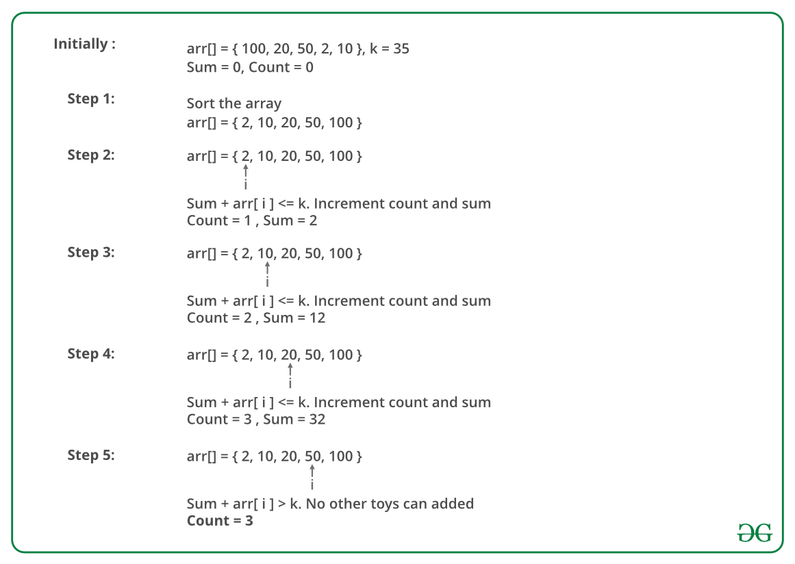

## GeeksForGeeks - Maximise the number of toys that can be purchased with amount K

Given an array consisting of cost of toys. Given an integer K depicting the amount of money available to purchase toys. Write a program to find the maximum number of toys one can buy with the amount K.

**Note:** One can buy only 1 quantity of a particular toy.

##### Examples:

```
Input:  N = 10, K =  50
        cost = { 1, 12, 5, 111, 200, 1000, 10, 9, 12, 15 }
Output: 6
Explanation: Toys with amount 1, 5, 9, 10, 12, and 12 
can be purchased resulting in a total amount of 49. Hence,
maximum number of toys is 6.

Input:  N = 7, K = 50
        cost = { 1, 12, 5, 111, 200, 1000, 10 }
Output: 4
```

The idea to solve this problem is to first sort the cost array in ascending order. This will arrange the toys in increasing order of the cost. Now iterate over the cost array and keep calculating the sum of costs until the sum is less than or equal to K. Finally return the number of toys used to calculate the sum which is just less than or equals to K.

Below image is an illustration of the above approach:



#### Implementation

Below is the implementation of the above approach:

```python
from typing import List

import unittest

# Python 3 Program to maximize the
# number of toys with K amount
class Solution:
    # This functions returns the required
    # number of toys
    def maximum_toys(self, cost: List[int], N: int, K: int) -> int:
        count = 0
        sum = 0

        # sort the cost array
        cost.sort(reverse=False)
        for i in range(0, N, 1):

            # Check if we can buy ith toy or not
            if (sum + cost[i] <= K):
                sum = sum + cost[i]
                # Increment the count variable
                count += 1

        return count

class Test(unittest.TestCase):
    def setUp(self) -> None:
        pass

    def tearDown(self) -> None:
        pass

    def test_maximum_toys(self) -> None:
        sol = Solution()
        for a, k, solution in (
            [[1, 12, 5, 111, 200, 1000, 10], 50, 4],
            [[20, 30, 50], 100, 3]
        ):
            self.assertEqual(solution, sol.maximum_toys(a, len(a), k))


# main
if __name__ == "__main__":
    # # Driver code
    # sol = Solution()
    # K = 50
    # cost = [1, 12, 5, 111, 200,
    #         1000, 10, 9, 12, 15]
    # N = len(cost)
    # print(sol.maximum_toys(cost, N, K))
    unittest.main()
```
____

#### Output:

```
6
```

#### Complexity Analysis:

**Time Complexity :** O(N * logN), where N is the size of cost array.