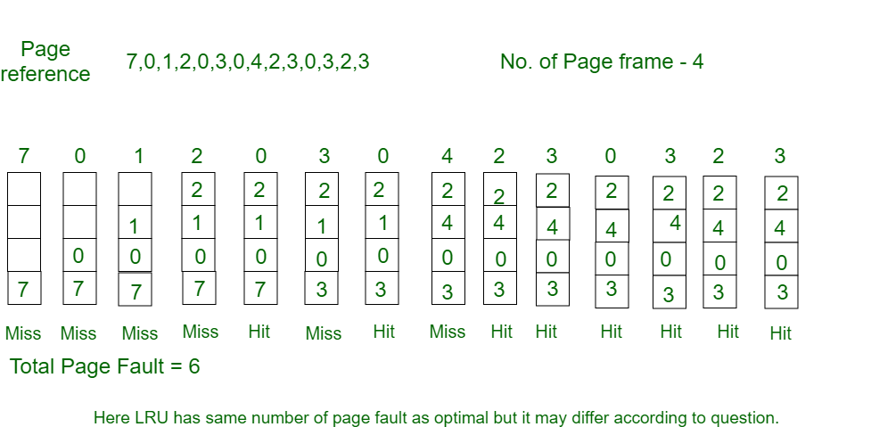

## Page Replacement Algorithms in Operating Systems

In an operating system that uses paging for memory management, a page replacement algorithm is needed to decide which page needs to be replaced when new page comes in.

**Page Fault –** A page fault happens when a running program accesses a memory page that is mapped into the virtual address space, but not loaded in physical memory.

Since actual physical memory is much smaller than virtual memory, page faults happen. In case of page fault, Operating System might have to replace one of the existing pages with the newly needed page. Different page replacement algorithms suggest different ways to decide which page to replace. The target for all algorithms is to reduce the number of page faults.

**Page Replacement Algorithms :**

- **First in First Out (FIFO) -**
  
  This is the simplest page replacement algorithm. In this algorithm, the operating system keeps track of all pages in the memory in a queue, the oldest page is in the front of the queue. When a page needs to be replaced page in the front of the queue is selected for removal.

  **Example-1** Consider page reference string 1, 3, 0, 3, 5, 6 with 3 page frames.Find number of page faults.
  
  
  - Initially all slots are empty, so when 1, 3, 0 came they are allocated to the empty slots —> **3 Page Fault(s)**.
  - when 3 comes, it is already in  memory so —> **0 Page Fault(s)**.
  - Then 5 comes, it is not available in  memory so it replaces the oldest page slot i.e 1. —> **1 Page Fault(s)**.
  - 6 comes, it is also not available in memory so it replaces the oldest page slot i.e 3 —> **1 Page Fault(s)**.
  - Finally when 3 come it is not available so it replaces 0 -> **1 Page Fault(s)**.

  [Belady’s anomaly](https://www.geeksforgeeks.org/operating-system-beladys-anomaly/) – Belady’s anomaly proves that it is possible to have more page faults when increasing the number of page frames while using the First in First Out (FIFO) page replacement algorithm.  For example, if we consider reference string 3, 2, 1, 0, 3, 2, 4, 3, 2, 1, 0, 4 and 3 slots, we get 9 total page faults, but if we increase slots to 4, we get 10 page faults.

- **Optimal Page replacement -**
  In this algorithm, pages are replaced which would not be used for the longest duration of time in the future.
  
  **Example-2:** Consider the page references 7, 0, 1, 2, 0, 3, 0, 4, 2, 3, 0, 3, 2, with 4 page frame. Find number of page faults.
  
  
  - Initially all slots are empty, so when 7 0 1 2 are allocated to the empty slots —> **4 Page fault(s)**
  - 0 is already there so —> **0 Page fault(s)**.
  - when 3 came it will take the place of 7 because it is not used for the longest duration of time in the future —> **1 Page fault(s)**.
  - 0 is already there so —> **0 Page fault(s)**.
  - 4 will takes place of 1 —> **1 Page Fault(s)**.

  Now for the further page reference string —> **0 Page fault(s)** because they are already available in the memory.

  Optimal page replacement is perfect, but not possible in practice as the operating system cannot know future requests. The use of Optimal Page replacement is to set up a benchmark so that other replacement algorithms can be analyzed against it.

- **Least Recently Used -**
  In this algorithm page will be replaced which is least recently used.

  **Example-3** Consider the page reference string 7, 0, 1, 2, 0, 3, 0, 4, 2, 3, 0, 3, 2 with 4 page frames.Find number of page faults.
  
  
  - Initially all slots are empty, so when 7 0 1 2 are allocated to the empty slots —> **4 Page fault(s)**.
  - 0 is already their so —> **0 Page fault(s)**.
  - when 3 came it will take the place of 7 because it is least recently used —> **1 Page fault(s)**.
  - 0 is already in memory so —> **0 Page fault(s)**.
  - 4 will takes place of 1 —> **1 Page Fault(s)**.

  Now for the further page reference string —> 0 Page fault because they are already available in the memory.
  