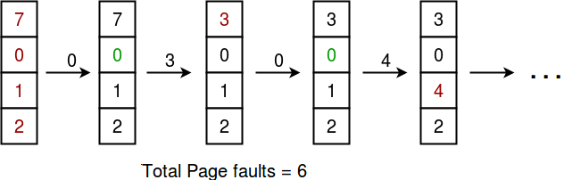

## GeeksForGeeks - Page Faults in LRU 
## Program for Least Recently Used (LRU) Page Replacement algorithm

Prerequisite: [Page Replacement Algorithms](https://www.geeksforgeeks.org/operating-system-page-replacement-algorithm/).

Reading Material: [Page Replacement Algorithms in Operating Systems](Page_Replacement_Algorithms_in_Operating_Systems.md)

In operating systems that use paging for memory management, page replacement algorithm are needed to decide which page needed to be replaced when new page comes in. Whenever a new page is referred and not present in memory, page fault occurs and Operating System replaces one of the existing pages with newly needed page. Different page replacement algorithms suggest different ways to decide which page to replace. The target for all algorithms is to reduce number of page faults.

**L**east **R**ecently **Us**ed (LRU) algorithm is a Greedy algorithm where the page to be replaced is least recently used. The idea is based on locality of reference, the least recently used page is not likely

- Let's say the page reference string 7 0 1 2 0 3 0 4 2 3 0 3 2 . Initially we have 4 page slots empty.
- Initially all slots are empty, so when 7 0 1 2 are allocated to the empty slots —> **4 Page fault(s)**
0 is already their so —> **0 Page fault(s)**.
- when 3 comes in, it will take the place of 7 because it is least recently used —> **1 Page fault(s)**
0 is already in memory so —> **0 Page fault(s)**.
- 4 will take the place of 1 —> **1 Page Fault**.
- Now for the further page reference string —> **0 Page fault(s)** because they are already available in the memory.
____

____

##### Algorithm:

```
Let capacity be the number of pages that
memory can hold.  Let set be the current
set of pages in memory.

1- Start traversing the pages.
 i) If set holds less pages than capacity.
   a) Insert page into the set one by one until 
      the size  of set reaches capacity or all
      page requests are processed.
   b) Simultaneously maintain the recent occurred
      index of each page in a map called indexes.
   c) Increment page fault
 ii) Else 
   If current page is present in set, do nothing.
   Else 
     a) Find the page in the set that was least 
     recently used. We find it using index array.
     We basically need to replace the page with
     minimum index.
     b) Replace the found page with current page.
     c) Increment page faults.
     d) Update index of current page.

2. Return page faults.
```

#### Implementation

Below is the implementation of the above approach:

```python
from typing import List

import unittest

# Python 3 Program to maximize the
# number of toys with K amount
class Solution:
    # This functions returns the required
    # number of toys
    def findPageFaultsInLRU(self, processList: List[int], N: int, capacity: int) -> int:
        # List of current pages in Main Memory
        s = []

        pageFaults = 0
        # pageHits = 0

        for i in processList:

            # If i is not present in currentPages list
            if i not in s:

                # Check if the list can hold equal pages
                if (len(s) == capacity):
                    s.remove(s[0])
                    s.append(i)

                else:
                    s.append(i)

                # Increment Page faults
                pageFaults += 1

            # If page is already there in
            # currentPages i.e in Main
            else:

                # Remove previous index of current page
                s.remove(i)

                # Now append it, at last index
                s.append(i)

        print(f"{pageFaults}")
        return pageFaults

class Test(unittest.TestCase):
    def setUp(self) -> None:
        pass

    def tearDown(self) -> None:
        pass

    def test_findPageFaultsInLRU(self) -> None:
        sol = Solution()
        for processList, capacity, solution in (
            [[5,0,1,3,2,4,1,0,5], 4, 8],
            [[7,0,1,2,0,3,0,4,2,3,0,3,2], 4, 6],
            [[3,1,0,2,5,4,1,2], 4, 7]
        ):
            self.assertEqual(solution, sol.findPageFaultsInLRU(processList, len(processList), capacity))


# main
if __name__ == "__main__":
    # # Driver code
    # sol = Solution()
    # capacity = 4
    # processList = [7, 0, 1, 2, 0, 3, 0,
    #                4, 2, 3, 0, 3, 2]
    # print(sol.findPageFaultsInLRU(processList, len(processList), capacity))
    unittest.main()
```
____

#### Output:

```
6
```
