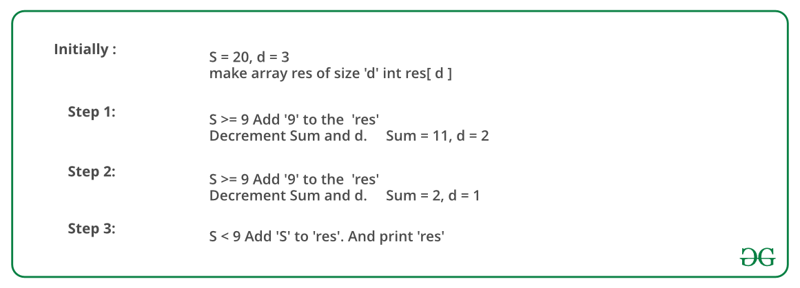

## GeeksForGeeks - Find the Largest number with given number of digits and sum of digits

How to find the largest number with given digit sum **s** and number of digits **d**?

##### Examples:

```
Input  : s = 9, d = 2
Output : 90

Input  : s = 20, d = 3
Output : 992
```

A **Simple Solution** is to consider all m digit numbers and keep track of maximum number with digit sum as s. A close upper bound on time complexity of this solution is O(10m).

There is a **Greedy approach** to solve the problem. The idea is to one by one fill all digits from leftmost to rightmost (or from most significant digit to least significant).
We compare the remaining sum with 9 if the remaining sum is more than 9, we put 9 at the current position, else we put the remaining sum. Since we fill digits from left to right, we put the highest digits on the left side, hence get the largest number.

Below image is an illustration of the above approach:



#### Implementation

Below is the implementation of the above approach:

```python
import unittest

# Python 3 program to find
# the largest number that
# can be formed from given
# sum of digits and number
# of digits.
class Solution:
    # Prints the smalles
    # possible number with digit
    # sum 's' and 'm' number of
    # digits.
    def findLargest(self, N: int, S: int) -> int:

        # If sum of digits is 0,
        # then a number is possible
        # only if number of digits
        # is 1.
        if (S == 0):
            if (N == 1):
                print("Largest number is ", "0", end="")
            else:
                print("Not possible", end="")
            return None

        # Sum greater than the
        # maximum possible sum.
        if (S > 9 * N):
            print("Not possible", end="")
            return None

        # Create an array to
        # store digits of
        # result
        res = [0] * N

        # Fill from most significant
        # digit to least significant
        # digit.
        for i in range(0, N):

            # Fill 9 first to make
            # the number largest
            if (S >= 9):
                res[i] = 9
                S = S - 9

            # If remaining sum
            # becomes less than
            # 9, then fill the
            # remaining sum
            else:
                res[i] = S
                S = 0

        print("Largest number is ", end="")

        largest_number = 0
        for i in range(0, N):
            largest_number = res[i]
            print(res[i], end="")
        return largest_number
    
class Test(unittest.TestCase):
    def setUp(self) -> None:
        pass

    def tearDown(self) -> None:
        pass

    def test_findLargest(self) -> None:
        sol = Solution()
        for N, S, solution in (
            [2, 9, 90],
            [3, 20, 992]
        ):
            self.assertEqual(solution, sol.findLargest(N, S))


# main
if __name__ == "__main__":
    # # Driver code
    # sol = Solution()
    # N = 2
    # S = 9
    # sol.findLargest(N, S)
    unittest.main()
```
____

#### Output:

```
Largest number is 90
```

#### Complexity Analysis:

**Time Complexity :** Time Complexity of this solution is O(m).