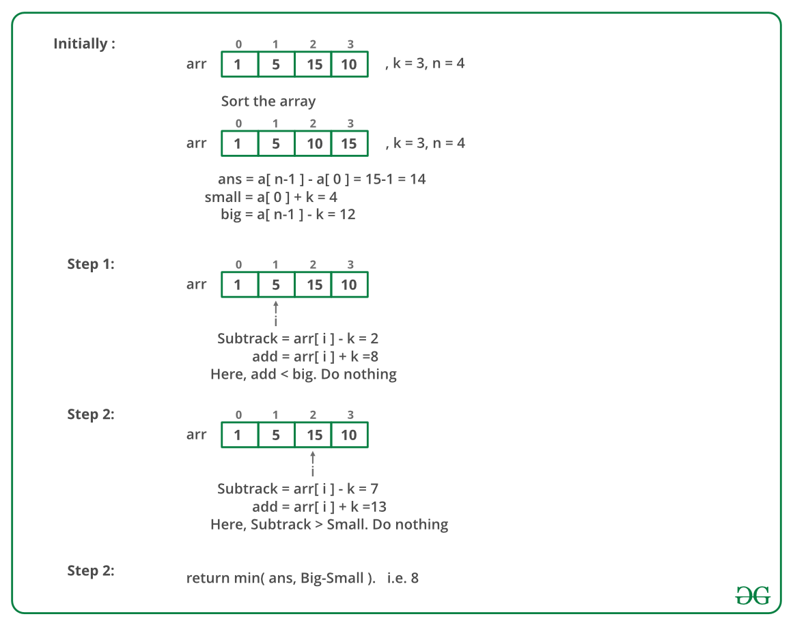

## GeeksForGeeks - Minimize the maximum difference between the heights

Given heights of n towers and a value k. We need to either increase or decrease height of every tower by k (only once) where k > 0. The task is to minimize the difference between the heights of the longest and the shortest tower after modifications, and output this difference.

##### Examples:

```
Input  : arr[] = {1, 15, 10}, k = 6
Output :  Maximum difference is 5.
Explanation : We change 1 to 6, 15 to 
9 and 10 to 4. Maximum difference is 5
(between 4 and 9). We can't get a lower
difference.

Input : arr[] = {1, 5, 15, 10} 
        k = 3   
Output : Maximum difference is 8
arr[] = {4, 8, 12, 7}

Input : arr[] = {4, 6} 
        k = 10
Output : Maximum difference is 2
arr[] = {14, 16} OR {-6, -4}

Input : arr[] = {6, 10} 
        k = 3
Output : Maximum difference is 2
arr[] = {9, 7} 

Input : arr[] = {1, 10, 14, 14, 14, 15}
        k = 6 
Output: Maximum difference is 5
arr[] = {7, 4, 8, 8, 8, 9} 

Input : arr[] = {1, 2, 3}
        k = 2 
Output: Maximum difference is 2
arr[] = {3, 4, 5} 
```

The idea is to sort all elements increasing order. And for all elements check if subtract(element-k) and add(element+k) makes any changes or not.



#### Implementation

Below is the implementation of the above approach:

```python
from typing import List

import unittest

# Python 3 program to find the minimum
# possible difference between maximum
# and minimum elements when we have to
# add / subtract every number by k
class Solution:
    # Modifies the array by subtracting /
    # adding k to every element such that
    # the difference between maximum and
    # minimum is minimized
    def getMinDiff(self, arr: List[int], n: int, k: int) -> int:

        if (n == 1):
            return 0

        # Sort all elements
        arr.sort()

        # Initialize result
        ans = arr[n - 1] - arr[0]

        # Handle corner elements
        small = arr[0] + k
        big = arr[n - 1] - k

        if (small > big):
            small, big = big, small

        # Traverse middle elements
        for i in range(1, n - 1):

            subtract = arr[i] - k
            add = arr[i] + k

            # If both subtraction and addition
            # do not change diff
            if (subtract >= small or add <= big):
                continue

            # Either subtraction causes a smaller
            # number or addition causes a greater
            # number. Update small or big using
            # greedy approach (If big - subtract
            # causes smaller diff, update small
            # Else update big)
            if (big - subtract <= add - small):
                small = subtract
            else:
                big = add

        return min(ans, big - small)

class Test(unittest.TestCase):
    def setUp(self) -> None:
        pass

    def tearDown(self) -> None:
        pass

    def test_getMinDiff(self) -> None:
        sol = Solution()
        for a, k, solution in (
            [[1, 5, 8, 10], 2, 5],
            [[3, 9, 12, 16, 20], 3, 11]
        ):
            self.assertEqual(solution, sol.getMinDiff(a, len(a), k))


# main
if __name__ == "__main__":
    # # Driver function
    # sol = Solution()
    # arr = [4, 6]
    # k = 10
    # print("Maximum difference is {}".format(sol.getMinDiff(arr, len(arr), k)))
    unittest.main()
```
____

#### Output:

```
Maximum difference is 2
```

#### Complexity Analysis:

**Time Complexity :** O(N * logN)