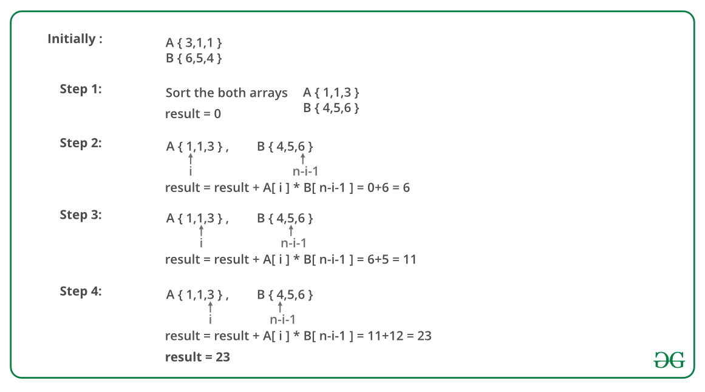

## GeeksForGeeks - Minimize the sum of product of two arrays with permutations allowed

Given two arrays, A and B, of equal size n, the task is to find the minimum value of A[0] * B[0] + A[1] * B[1] +…+ A[n-1] * B[n-1]. Shuffling of elements of arrays A and B is allowed.

##### Examples:

```
Input : A[] = {3, 1, 1} and B[] = {6, 5, 4}.
Output : 23
Minimum value of S = 1*6 + 1*5 + 3*4 = 23.

Input : A[] = { 6, 1, 9, 5, 4 } and B[] = { 3, 4, 8, 2, 4 }
Output : 80.
Minimum value of S = 1*8 + 4*4 + 5*4 + 6*3 + 9*2 = 80.
```

The idea is to multiply minimum element of one array to maximum element of another array. Algorithm to solve this problem:

Sort both the arrays A and B.
Traverse the array and for each element, multiply A[i] and B[n – i – 1] and add to the total.
Below image is an illustration of the above approach:



#### Implementation

Below is the implementation of the above approach:

```python
from typing import List

import unittest

# Python program to calculate minimum sum of product
# of two arrays.
class Solution:
    # Returns minimum sum of product of two arrays
    # with permutations allowed
    def getMinValue(self, A: List[int], B: List[int], n: int) -> int:
        # Sort A and B so that minimum and maximum
        # value can easily be fetched.
        A.sort()
        B.sort()

        # Multiplying minimum value of A and maximum
        # value of B
        result = 0
        for i in range(n):
            result += (A[i] * B[n - i - 1])

        return result

class Test(unittest.TestCase):
    def setUp(self) -> None:
        pass

    def tearDown(self) -> None:
        pass

    def test_getMinValue(self) -> None:
        sol = Solution()
        for A, B, solution in (
            [[3,1,1], [6,5,4], 23],
            [[6,1,9,5,4], [3,4,8,2,4], 80]
        ):
            self.assertEqual(solution, sol.getMinValue(A, B, len(A)))


# main
if __name__ == "__main__":
    # # Driver function
    # sol = Solution()
    # A = [3,1,1]
    # B = [6,5,4]
    # print(minValue(A, B, len(A)))
    unittest.main()
```
____

#### Output:

```
23
```

#### Complexity Analysis:

**Time Complexity :** O(N * logN)