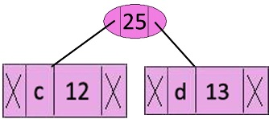
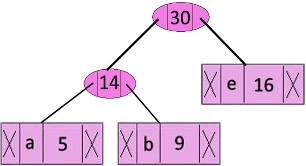
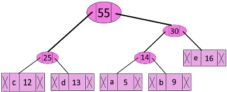
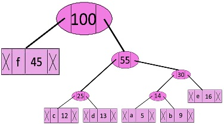
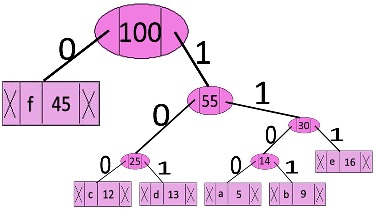

## GeeksForGeeks - Huffman Coding | Greedy Algo-3

Prefix Codes, means the codes (bit sequences) are assigned in such a way that the code assigned to one character is not the prefix of code assigned to any other character. This is how Huffman Coding makes sure that there is no ambiguity when decoding the generated bitstream.
Let us understand prefix codes with a counter example. Let there be four characters a, b, c and d, and their corresponding variable length codes be 00, 01, 0 and 1. This coding leads to ambiguity because code assigned to c is the prefix of codes assigned to a and b. If the compressed bit stream is 0001, the de-compressed output may be “cccd” or “ccb” or “acd” or “ab”.
See [this](http://en.wikipedia.org/wiki/Huffman_coding#Applications) for applications of Huffman Coding.

There are mainly two major parts in Huffman Coding
1) Build a Huffman Tree from input characters.
2) Traverse the Huffman Tree and assign codes to characters.

##### Steps to build a Huffman Tree:

Input is an array of unique characters along with their frequency of occurrences and output is Huffman Tree.

**1.** Create a leaf node for each unique character and build a min heap of all leaf nodes (Min Heap is used as a priority queue. The value of frequency field is used to compare two nodes in min heap. Initially, the least frequent character is at root)

**2.** Extract two nodes with the minimum frequency from the min heap.

**3.** Create a new internal node with a frequency equal to the sum of the two nodes frequencies. Make the first extracted node as its left child and the other extracted node as its right child. Add this node to the min heap.

**4.** Repeat steps#2 and #3 until the heap contains only one node. The remaining node is the root node and the tree is complete.

Let us understand the algorithm with an example:

```
character   Frequency
    a            5
    b           9
    c           12
    d           13
    e           16
    f           45
```

**Step 1.** Build a min heap that contains 6 nodes where each node represents root of a tree with single node.

**Step 2.** Extract two minimum frequency nodes from min heap. Add a new internal node with frequency 5 + 9 = 14.



Now min heap contains 5 nodes where 4 nodes are roots of trees with single element each, and one heap node is root of tree with 3 elements

```
character           Frequency
       c               12
       d               13
 Internal Node         14
       e               16
       f                45
```

**Step 3.** Extract two minimum frequency nodes from heap. Add a new internal node with frequency 12 + 13 = 25


Now min heap contains 4 nodes where 2 nodes are roots of trees with single element each, and two heap nodes are root of tree with more than one nodes.
```
character           Frequency
Internal Node          14
       e               16
Internal Node          25
       f               45
```

**Step 4.** Extract two minimum frequency nodes. Add a new internal node with frequency 14 + 16 = 30



Now min heap contains 3 nodes.

```
character          Frequency
Internal Node         25
Internal Node         30
      f               45 
```

**Step 5:** Extract two minimum frequency nodes. Add a new internal node with frequency 25 + 30 = 55



Now min heap contains 2 nodes.

```
character     Frequency
       f         45
Internal Node    55
```

**Step 6:** Extract two minimum frequency nodes. Add a new internal node with frequency 45 + 55 = 100



Now min heap contains only one node.

```
character      Frequency
Internal Node    100
```

Since the heap contains only one node, the algorithm stops here.

___**Steps to print codes from Huffman Tree:**___

Traverse the tree formed starting from the root. Maintain an auxiliary array. While moving to the left child, write 0 to the array. While moving to the right child, write 1 to the array. Print the array when a leaf node is encountered.



The codes are as follows:

```
character   code-word
    f          0
    c          100
    d          101
    a          1100
    b          1101
    e          111
```

#### Complexity Analysis:

**Time Complexity :** O(nlogn) where n is the number of unique characters. If there are n nodes, extractMin() is called 2*(n – 1) times. extractMin() takes O(logn) time as it calles minHeapify(). So, overall complexity is O(nlogn).