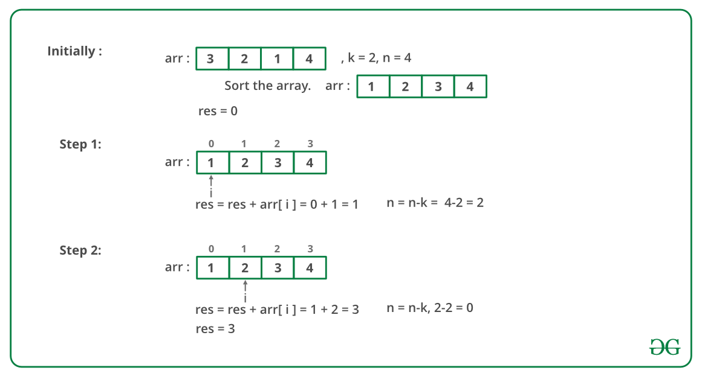
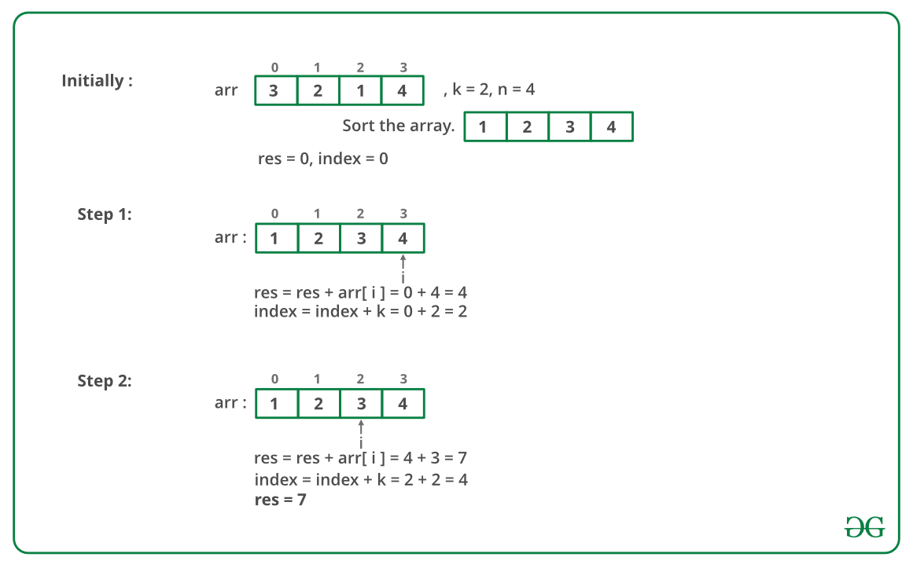

## GeeksForGeeks - Find the minimum and maximum amount to buy all N candies

In a candy store there are N different types of candies available and the prices of all the N different types of candies are provided. There is also an attractive offer by candy store. We can buy a single candy from the store and get at-most K other candies (all are different types) for free.

1. Find minimum amount of money we have to spend to buy all the N different candies.
2. Find maximum amount of money we have to spend to buy all the N different candies.

In both the cases we must utilize the offer and get maximum possible candies back. If k or more candies are available, we must take k candies for every candy purchase. If less than k candies are available, we must take all candies for a candy purchase.

Examples:

```
Input :  price[] = {3, 2, 1, 4}
               k = 2
Output :  Min = 3, Max = 7
Since k is 2, if we buy one candy we can take 
atmost two more for free.
So in the first case we buy the candy which 
costs 1 and take candies worth 3 and 4 for 
free, also you buy candy worth 2 as well.
So min cost = 1 + 2 = 3.
In the second case we buy the candy which 
costs 4 and take candies worth 1 and 2 for 
free, also We buy candy worth 3 as well.
So max cost = 3 + 4 = 7.
```

One important thing to note is, we must use the offer and get maximum candies back for every candy purchase. So if we want to minimize the money, we must buy candies of minimum cost and get candies of maximum costs for free. To maximize the money, we must do reverse. Below is algorithm based on this.

```
First Sort the price array.

For finding minimum amount :
  Start purchasing candies from starting 
  and reduce k free candies from last with
  every single purchase.

For finding maximum amount : 
   Start purchasing candies from the end 
   and reduce k free candies from starting 
   in every single purchase.
```

Below image is an illustration of the above approach:

Minimum amount :



Maximum amount :



#### Implementation

Below is the implementation of the above approach:

```python
from typing import List

import unittest

# Python implementation
# to find the minimum
# and maximum amount
class Solution:
    # Function to find
    # the minimum amount
    # to buy all candies
    def findMinimum(self, arr: List[int], n: int, k: int) -> int:
        res = 0
        i = 0
        while (n):
            # Buy current candy
            res += arr[i]

            # And take k
            # candies for free
            # from the last
            n = n - k
            i += 1
        return res

        return result

    # Function to find
    # the maximum amount
    # to buy all candies
    def findMaximum(self, arr: List[int], n: int, k: int) -> int:
        res = 0
        index = 0
        i = n - 1
        while (i >= index):
            # Buy candy with
            # maximum amount
            res += arr[i]

            # And get k candies
            # for free from
            # the starting
            index += k
            i -= 1

        return res

class Test(unittest.TestCase):
    def setUp(self) -> None:
        pass

    def tearDown(self) -> None:
        pass

    def test_findMinimumAndMaximum(self) -> None:
        sol = Solution()
        arr = [3,2,1,4]
        k = 2
        arr.sort()
        self.assertEqual(3, sol.findMinimum(arr, len(arr), k))
        self.assertEqual(7, sol.findMaximum(arr, len(arr), k))


# main
if __name__ == "__main__":
    # # Driver code
    # sol = Solution()
    # arr = [3, 2, 1, 4]
    # k = 2
    # arr.sort()
    # print("{} {}".format(sol.findMinimum(arr, len(arr), k),
    #                      sol.findMaximum(arr, len(arr), k)))
    unittest.main()
```
____

#### Output:

```
3 7
```

#### Complexity Analysis:

**Time Complexity :** O(n log n)