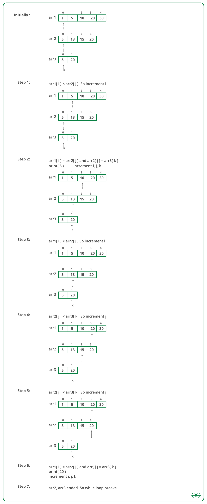

## GeeksForGeeks - Find common elements in three sorted arrays

Given three arrays sorted in non-decreasing order, print all common elements in these arrays.
Examples:

```
Input:
ar1[] = {1, 5, 10, 20, 40, 80}
ar2[] = {6, 7, 20, 80, 100}
ar3[] = {3, 4, 15, 20, 30, 70, 80, 120}
Output: 20, 80

Input:
ar1[] = {1, 5, 5}
ar2[] = {3, 4, 5, 5, 10}
ar3[] = {5, 5, 10, 20}
Output: 5, 5
```

### Python O( n1+n2+n3 ) solution

#### <ins>Approach 1> Intersection of three arrays</ins>
 
A simple solution is to first find intersection of two arrays and store the intersection in a temporary array, then find the intersection of third array and temporary array.

Time complexity of this solution is **O(n1 + n2 + n3)** where n1, n2 and n3 are sizes of ar1[], ar2[] and ar3[] respectively.

The above solution requires extra space and two loops, we can find the common elements using a single loop and without extra space. 
The idea is similar to [intersection of two arrays](https://www.geeksforgeeks.org/union-and-intersection-of-two-sorted-arrays-2/). Like two arrays loop, we run a loop and traverse three arrays.

Let the current element traversed in ar1[] be x, in ar2[] be y and in ar3[] be z. We can have following cases inside the loop.

- If x, y and z are same, we can simply print any of them as common element and move ahead in all three arrays.
- Else If x < y, we can move ahead in ar1[] as x cannot be a common element.
- Else If x > z and y > z), we can simply move ahead in ar3[] as z cannot be a common element.

Below image is a dry run of the above approach:

______

#### Implementation

Below is the implementation of the above approach:

```python
from typing import List

class Solution:
    # Python function to print common elements in three sorted arrays
    def commonElements(self, A: List[int], B: List[int], C: List[int]) -> List[int]:
        n1, n2, n3 = len(A), len(B), len(C)
        # Initialize starting indexes for ar1[], ar2[] and ar3[]
        i, j, k = 0, 0, 0
        ans = []
        # Iterate through three arrays while all arrays have elements
        while (i < n1 and j < n2 and k < n3):

            # If x = y and y = z, print any of them and move ahead
            # in all arrays
            if (A[i] == B[j] and B[j] == C[k]):
                ans.append(A[i])
                i += 1
                j += 1
                k += 1

            # x < y
            elif A[i] < B[j]:
                i += 1

            # y < z
            elif B[j] < C[k]:
                j += 1

            # We reach here when x > y and z < y, i.e., z is smallest
            else:
                k += 1

        return ans
```

#### <ins>Approach 2> Using Sets</ins>
Intersection method simply provides the intersection of both the arrays upon which you want to perform the operation of intersection (or, it simply gives out the common elements in both the array). We will be taking three arrays and then we will take out the intersection.

#### Implementation

Below is the implementation of above approach :

```python
from typing import List

class Solution:
    def commonElementsUsingSet(self, A: List[int], B: List[int], C: List[int]) -> List[int]:
        # Converting the arrays into sets
        s1 = set(A)
        s2 = set(B)
        s3 = set(C)

        # Calculates intersection of
        # sets on s1 and s2
        set1 = s1.intersection(s2)

        # Calculates intersection of sets
        # on set1 and s3
        result_set = set1.intersection(s3)

        # Converts resulting set to list and return
        return(list(result_set))
```