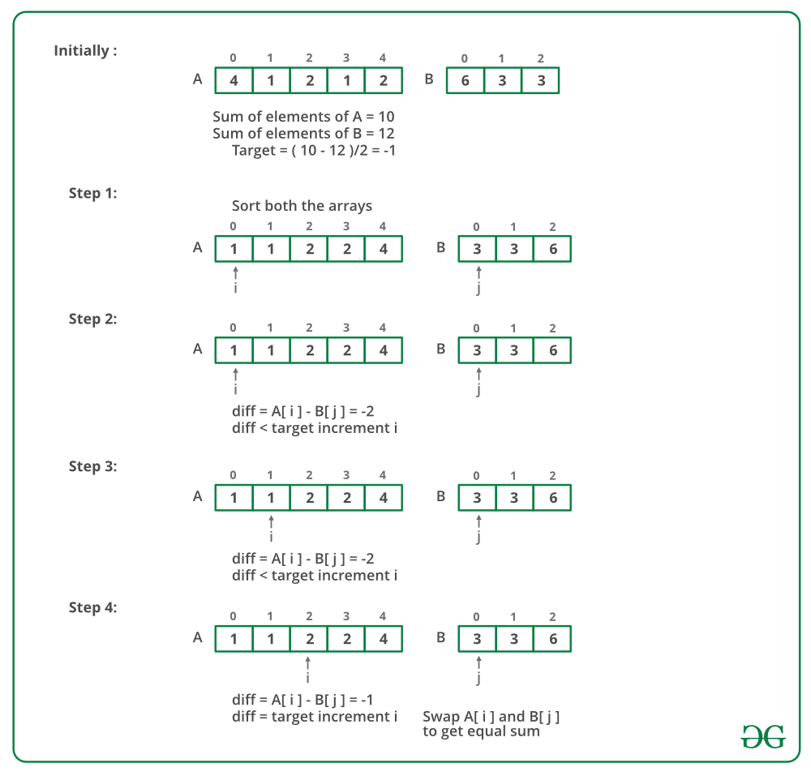

## GeeksForGeeks - Swapping pairs make sum equal

Given two arrays of integers A[] and B[] of size N and M, the task is to check if a pair of values (one value from each array) exists such that swapping the elements of the pair will make the sum of two arrays equal.

Examples:

```
Example 1:

Input: N = 6, M = 4
A[] = {4, 1, 2, 1, 1, 2}
B[] = (3, 6, 3, 3)
Output: 1
Explanation: Sum of elements in A[] = 11
Sum of elements in B[] = 15, To get same 
sum from both arrays, we can swap following 
values: 1 from A[] and 3 from B[]
```
_____

```
Example 2:

Input: N = 4, M = 4
A[] = {5, 7, 4, 6}
B[] = {1, 2, 3, 8}
Output: 1
Explanation: We can swap 6 from array 
A[] and 2 from array B[]
```

> Python solution 
> ______________________
>
> Time Complexity   : O(n+m) [ if arrays are sorted ]
>
> Time Complexity   : O(nlog(n) + mlog(m)) [ if arrays are not sorted]

#### <ins>Approach 1> Intersection of three arrays</ins>
 
- Sort the arrays.
- Traverse both array simultaneously and do following for every pair.
    1. If the difference is too small then, make it bigger by moving ‘a’ to a bigger value.
    1. If it is too big then, make it smaller by moving b to a bigger value.
    1. If it’s just right, return this pair.

Below image is a dry run of the above approach:

______

#### Implementation

Below is the implementation of the above approach:
```python
class Solution:
    # Returns sum of elements in list
    def getSum(self, X):
        sum = 0
        for i in X:
            sum += i
        return sum

    # Finds value of
    # a - b = (sumA - sumB) / 2
    def getTarget(self, A, B):
        # Calculations of sumd from both lists
        sum1 = self.getSum(A)
        sum2 = self.getSum(B)

        # Because that target must be an integer
        if ((sum1 - sum2) % 2 != 0):
            return 0
        return (sum1 - sum2) / 2

    def findSwapValues(self, A, B):
        # Call for sorting the lists
        A.sort()
        B.sort()

        # Note that target can be negative
        target = self.getTarget(A, B)

        # target 0 means, answer is not possible
        if (target == 0):
            return False
        i, j = 0, 0
        while (i < len(A) and j < len(B)):
            diff = A[i] - B[j]
            if diff == target:
                return True
            # Look for a greater value in list A
            elif diff < target:
                i += 1
            # Look for a greater value in list B
            else:
                j += 1
```

#### Time Complexity :-
- If arrays are sorted : O(n + m)
- If arrays are not sorted : O(nlog(n) + mlog(m))