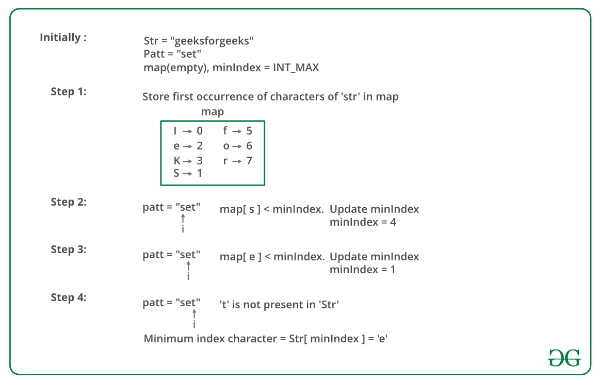

## GeeksForGeeks - Minimum Indexed Character

Given a string str and another string patt. Find the character in patt that is present at the minimum index in str. If no character of patt is present in str then print ‘No character present’.
Examples:

```
Example 1:

Input:
str = "geeksforgeeks"
patt = "set"
Output: 1
Explanation: e is the character which is present in given patt "geeksforgeeks" and is first found in str "set".
```
_____

> Python solution 
> ______________________
>
> Time Complexity   : O(m+n) [ where **m** and **n** are the lengths of the two strings. ]
>
> Time Complexity   : O(d) [ where **d** is the size of hash table, which is the count of distinct characters in **str**. ]

#### Solution Approach using Hashing

- Create a hash table with (key, value) tuple represented as (character, index) tuple.
- Store the first index of each character of str in the hash table.
- Now, for each character of patt check if it is present in the hash table or not. 
    - If present then get its index from the hash table and update minIndex(minimum index encountered so far).
    - For no matching character print “No character present”.

Hash table is implemented using unordered_set in C++.
The below image is a dry run of the above approach: 

______

#### Implementation

Below is the implementation of the above approach:
```python
import sys

class Solution:
    # Function to find the
    # minimum index character
    def printMinIndexChar(self, str1: str, patt: str) -> str:

        # unordered_map 'um'
        # implemented as hash table
        um = {}

        # to store the index of
        # character having minimum index
        minIndex = sys.maxsize

        # Lengths of the two strings
        m = len(str1)
        n = len(patt)

        # Store the first index of
        # each character of 'str'
        for i in range(m):
            if (str1[i] not in um):
                um[str1[i]] = i

        # traverse the string 'patt'
        for i in range(n):

            # If patt[i] is found in 'um',
            # check if  it has the minimum
            # index or not accordingly
            # update 'minIndex'
            if (patt[i] in um and
                    um[patt[i]] < minIndex):
                minIndex = um[patt[i]]

        # Print the minimum index character
        if (minIndex != sys.maxsize):
            return str1[minIndex]

        # If no character of 'patt'
        # is present in 'str'
        else:
            return ""
```

#### Time Complexity :-
**Time Complexity**: O(m + n), where **m** and **n** are the lengths of the two strings. 
**Auxiliary Space**: O(d), where **d** is the size of hash table, which is the count of distinct characters in **str**.