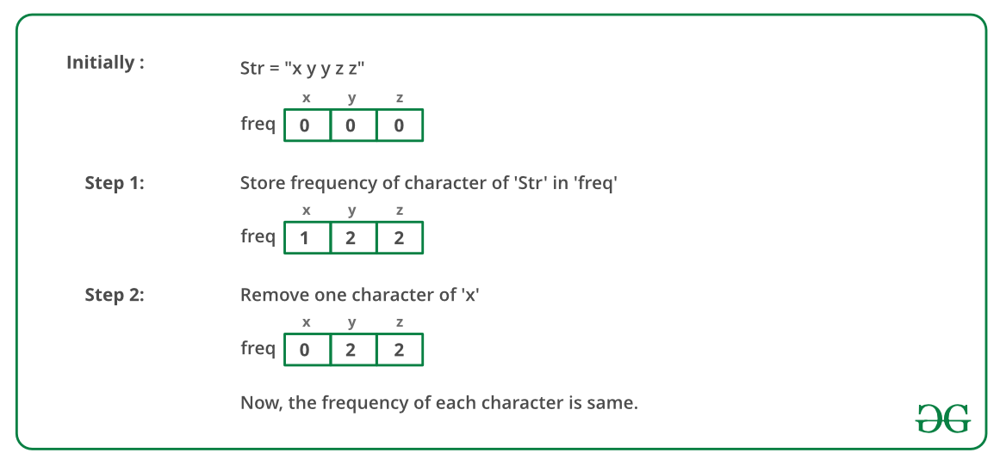

## GeeksForGeeks - Check if frequencies can be equal

Given a string s which contains only lower alphabetic characters, check if it is possible to remove at most one character from this string in such a way that frequency of each distinct character becomes same in the string.

Examples:

```
Example 1:

Input:
s = xyyz
Output: 1
Explanation: Removing one 'y' will make frequency of each letter 1.
```
_____

> Python solution 
> ______________________
>
> Time Complexity   : O(n) assuming alphabet size is constant.
>

#### Solution Approach using Hashing

Approach: The problem can be solved using the concept of hashing. The main thing to observe in this problem is that the position of characters does not matter here so we will count the frequency of characters, if all of them are the same then we are done and there is no need to remove any character to make frequency of characters same Otherwise we can iterate over all characters one by one and decrease their frequency by one, if all frequencies become same then we will flag that it is possible to make character frequency same by at most one removal and if frequencies don’t match then we will increase that frequency again and loop for other characters.

Below is a dry run of the above approach:

______

#### Implementation

Below is the implementation of the above approach:
```python
from typing import List

M = 26

class Solution:
    # Utility method to get index of character ch
    # in lower alphabet characters
    def getIdx(self, ch: str) -> int:
        return (ord(ch) - ord('a'))

        # Returns true if all non-zero elements

    # values are same
    def allSame(self, freq: List[int], N: int) -> bool:
        # get first non-zero element
        for i in range(0, N):
            if (freq[i] > 0):
                same = freq[i]
                break

        # check equality of each element
        # with variable same
        for j in range(i + 1, N):
            if (freq[j] > 0 and freq[j] != same):
                return False

        return True

    # Returns true if we can make all
    # character frequencies same
    def possibleSameCharFreqByOneRemoval(self, str1: str) -> bool:
        l = len(str1)

        # fill frequency array
        freq = [0] * M
        for i in range(0, l):
            freq[self.getIdx(str1[i])] += 1

        # if all frequencies are same,
        # then return true
        if (self.allSame(freq, M)):
            return True

        # Try decreasing frequency of all character
        # by one and then check all equality of all
        # non-zero frequencies
        for i in range(0, 26):

            # Check character only if it
            # occurs in str
            if (freq[i] > 0):
                freq[i] -= 1

                if (self.allSame(freq, M)):
                    return True
                freq[i] += 1

        return False
```

#### Time Complexity :-
**Time Complexity**: O(n) assuming alphabet size is constant. 
