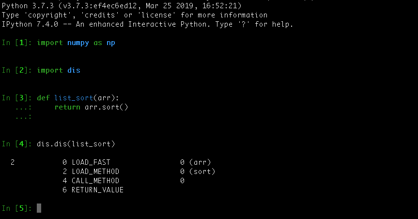
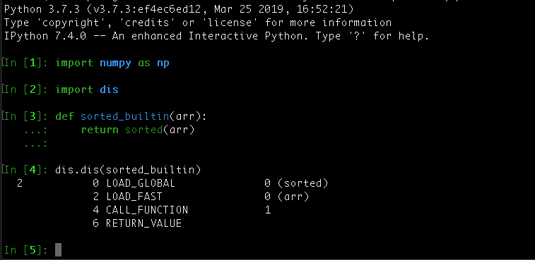

# list.sort() vs. sorted(list)

## A closer look at Python’s built-in List Sorting Methods concerning Memory Consumption and Time Efficiency

#### Introduction
Recently, I came across the question, which method to sort a list is more efficient: 
Using Python’s built-in `sorted` function or relying on the `list.sort` method. 
To answer this question I started a little investigation described in this article. 
You can find the repository I’m referring to on [GitHub](https://github.com/DahlitzFlorian/list-sort-vs-sorted-list).

The starting point is a Python list containing 1,000,000 random numbers 
(integers) built using the random module:

```python
import random
arr = [random.randint(0, 50) for r in range(1_000_000)]
```

The generated numbers are in the range from 0 (inclusive) to 50 
(inclusive).

#### Memory Consumption
Let’s have a look at the memory consumption of both functions. 
Therefore, we are using the builtin `resource` module to track the maximum memory 
usage. As the resource module enables us to track the memory usage of a 
single thread, we are running the sorting of our list in a separate thread. 
You can use the `FunctionSniffingClass` included in the [repository](https://github.com/DahlitzFlorian/list-sort-vs-sorted-list) to do so.

Let’s have a closer look at our Python script:

We create two wrapper functions for the built-in ones to be able to pass 
them as arguments to the `FunctionSniffingClass`. We could pass the built-
in sorted function directly to the `FunctionSniffingClass`, but we want the 
same chances for both built-ins. Furthermore, some simple command-line 
argument parsing is implemented to be able to use it as simple as possible 
from the command-line.

Curious how both built-ins perform? Let’s see!

```
$ python memory_measurement/main.py sort
Calling the Target Function...
Function Call Complete

MAX Memory Usage: 23.371 MB$ python memory_measurement/main.py sorted
Calling the Target Function...
Function Call Complete

MAX Memory Usage: 30.879 MB
```

As you can see, the `sorted` function consumed around 32% more memory 
as the `list.sort` method. This was predictable as the latter on modifies the 
list in-place, whereas the first ones is always creating a separate list.

#### Speed
To be able to time the execution time of both wrapper functions, we make 
use of the third-party [boxx](https://github.com/DIYer22/boxx) module. 
The following gist shows you how we can make use of its `timeit` function 
to time the execution time of both functions.

Note: Be sure to run the `sorted_builtin` function first as the `list.sort` 
method sorts the list just in-place, so the `sorted` function wouldn’t have to 
sort anything!

Running the above snippet prints the following output:

```
$ python main.py
"sorted(list)" spend time: 0.1104379
"list.sort()" spend time: 0.0956471
```

As you can see, the `list.sort` method is slightly faster than the `sorted` 
function. Why is this the case? Let’s disassemble both functions and see, 
whether we can conclude the answer based on the bytecode:


> Disassembled list.sort()


> Disassembled sorted(list)

Both functions bytecode is pretty much the same. The only difference is, 
that the `list_sort` function first loads the list, loads the method (sort) 
followed by calling the method on the list without any arguments, whereas 
the the `sorted_builtin` function first loads the built-in `sorted` function, 
followed by loading the list and calling the loaded function with the list as 
argument.

Additionally, both use the same sorting algorithm: [Timsort](https://en.wikipedia.org/wiki/Timsort). 
So if both are using the same sorting algorithm and the bytecode of both is pretty much 
the same, why are the timing results different?

My guess is, that as `list.sort` can work with a known size, and swap 
elements within that size, whereas `sorted` has to work with an unknown 
size. Therefore, the new list created by `sorted` needs to be resized if not 
enough memory is left when appending a new element. And this takes 
time!

Having a look at the CPython source code, we find the following comment 
about resizing list objects:

> The growth pattern is: 0, 4, 8, 16, 25, 35, 46, 58, 72, 88, …
>
> -- CPython: Objects/listobject.c
>

If we bring back to mind, that we are dealing with a list of size 1,000,000, 
we can see: that’s a lot of resizing! Unfortunately, this is the best answer we 
get, when asking why `list.sort` is 13% faster than `sorted`.

Unfortunately my guess is wrong. As [Nick Coghlan](https://twitter.com/ncoghlan_dev), one of the CPython 
core developer, stated on Twitter, the size of the resulting list is known. 
Basically, the following is happening:

```python
new_array = arr.copy()
new_array.sort()
```

However, he also states, that it’s not really obvious if you don’t know that 
it’s there and look explicitly for in the [implementation](https://github.com/python/cpython/blob/2fb2bc81c3f40d73945c6102569495140e1182c7/Python/bltinmodule.c#L2238).

This implementation results in the execution time difference as creating a 
copy of the list takes some time.

#### Additional Remarks

Before wrapping up this article, let’s have a look at what the official Python 
documentation says about this topic.

> You can also use the `list.sort()` method. It modifies the list in-place (and 
> returns `None` to avoid confusion). Usually it’s less convenient than `sorted()` -
> but if you don’t need the original list, it’s slightly more efficient.
>
> -- [Sorting HOW TO](https://docs.python.org/3/howto/sorting.html#sorting-basics)
>

As you can see, the official documentation states, what we have already 
proven: `list.sort` is slightly more efficient. Furthermore, it tells us, that 
`sorted` is usually more convenient.

Another question that my arise is, whether both sorting techniques are 
stable. Fortunately, the docs have an answer to that:

> Sorts are guaranteed to be <ins>stable</ins>. That means that when multiple records 
> have the same key, their original order is preserved.
>
> -- [Sorting HOW TO](https://docs.python.org/3/howto/sorting.html#sort-stability-and-complex-sorts)
>

This is also true, when using the `reverse` parameter or applying the 
`reversed` function twice.

#### Conclusion
The previous investigations showed us, that `list.sort` is slightly faster 
than `sorted` and consumes around 24% less memory. However, keep in 
mind that `list.sort` is only implemented for lists, whereas `sorted` accepts 
any iterable. Furthermore, if you use `list.sort`, you will lose your original 
list.

I hope this article revealed you more insights into the Python programming 
language. Stay curious and keep coding!
