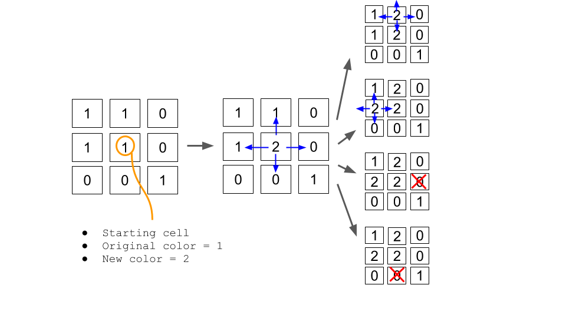

## LeetCode - Problem - 733: Flood Fill

### Python O( n ) sol. by DFS approach using Recursion

We are going to start from the cell at sr and sc and radiate the newColor with depth first search (DFS).
Visually speaking, it would look like this:



We are going to radiate with our DFS in four directions (up, down, left and right) until we hit the following scenarios:

The indices are beyond the image grid indcies (indicated by blue arrows protruding beyond the image grid)
The new cell is of different color (indicated by red crosses in the image)
The new cell is of same color (the arrow pointing downwards for the the topmost picture)_____

### Implementation:

```python
from typing import List

class Solution:
    def floodFill(self, image: List[List[int]], sr: int, sc: int, newColor: int) -> List[List[int]]:

        color = image[sr][sc]
        if color == newColor:return image
        row,col = len(image),len(image[0])
		
        def paint(x,y):
            if x in range(row) and y in range(col) and image[x][y]==color:
                image[x][y]=newColor
				# In Python3, the map function is lazy, and the function inside will not be calculated without adding list
                list(map(paint,(x+1,x-1,x,x),(y,y,y+1,y-1)))
                
        paint(sr,sc)
        return image
```


