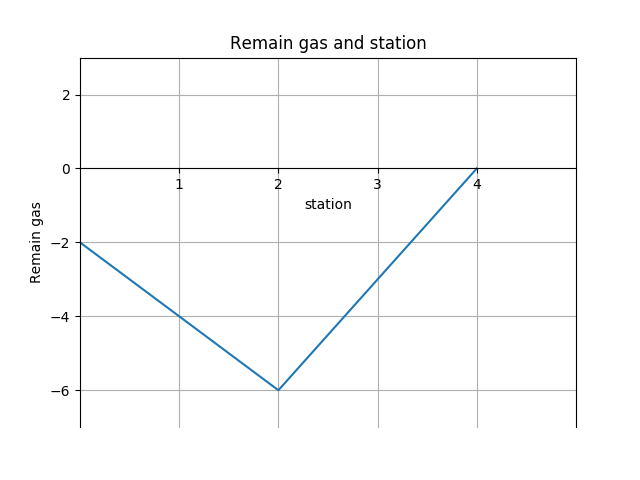
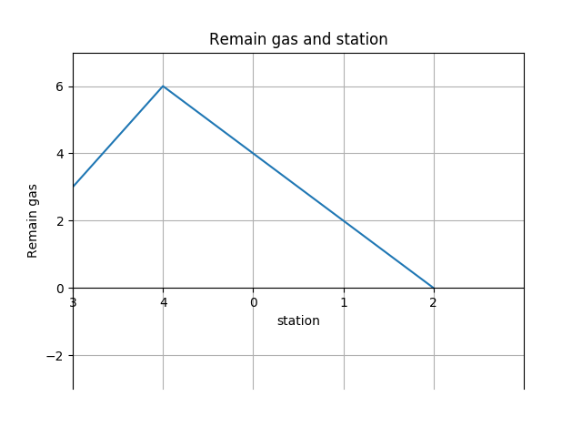

This solution base on the following idea:

*If the total number of gas is bigger than the total number of cost. There must be a solution.*

Pick **Example 1** to prove

```
gas  = [1,2,3,4,5]
cost = [3,4,5,1,2]
```

It's easy to prove that if we start from station 0, and keep track of the amount of gas, when we go to the end of station, our gas would be g (g >= 0)
Draw a picture of the ramain gas and station number



We find that at station 2 the gas is the least
Then we pick station 3 as start station, and we can reorganize the image(move down the x axis and splice the left image of station 3 to the right).



We finally proved that If the total number of gas is bigger than the total number of cost. 
There must be a solution, because we just need  to find the station that the remaining gas 
is least and pick the next station as the start station, and 
our gas will not less than zero on our journey travelling around the circuit.

```python
class Solution:
    def canCompleteCircuit(self, gas, cost):
        if sum(gas) < sum(cost):
            return -1
        start, total, Min = 0, 0, sys.maxsize
        for i in range(len(gas)):
            total += gas[i] - cost[i]
            if total < Min:
                start = (i + 1)%len(gas)
                Min = total
        return start
```