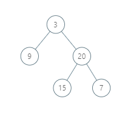

# Leetcode - Problem 987 - Vertical Order Traversal of a Binary Tree

## Problem Description:

### Example 1:



```
Input: [3,9,20,null,null,15,7]
Output: [[9],[3,15],[20],[7]]
Explanation: 
Without loss of generality, we can assume the root node is at position (0, 0):
Then, the node with value 9 occurs at position (-1, -1);
The nodes with values 3 and 15 occur at positions (0, 0) and (0, -2);
The node with value 20 occurs at position (1, -1);
The node with value 7 occurs at position (2, -2).
```

### Example 2:


```
Input: [1,2,3,4,5,6,7]
Output: [[4],[2],[1,5,6],[3],[7]]
Explanation: 
The node with value 5 and the node with value 6 have the same position according to the given scheme.
However, in the report "[1,5,6]", the node value of 5 comes first since 5 is smaller than 6.
```

#### Note:

    1. The tree will have between 1 and 1000 nodes.
    2. Each node's value will be between 0 and 1000.