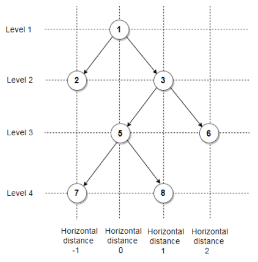

# Leetcode - Problem 987 - Vertical Order Traversal of a Binary Tree

## PYTHON SOLUTION EXPLANATION:



->Root node is considered as 0 horizontal distance.

->As we move left hd is decreased by 1 and is increased by 1 as we move right.

->vd is used to get the top to bottom series.

->comparison in each dic is done based on vd value

-> if vd comes out to be same then node value is compared.

NOTE: Instead of decreasing Y when going down, we can increase it to make the sorting part easier.
When doing this, we can just do a regular sort without worrying about the lambda functions.

```python
import collections

class Solution:
	def verticalTraversal(self,root):
		dic=collections.defaultdict(list)
		queue=[(root,0,0)]
		ans=[]
		while queue:
			for _ in range(len(queue)):
				node,hd,vd=queue.pop(0)
				dic[hd].append((vd,node.val))
				if node.left:
					queue.append((node.left,hd-1,vd-1))
				if node.right:
					queue.append((node.right,hd+1,vd-1))
		for i in sorted(dic.keys()):
			level=[x[1] for x in sorted(dic[i],key=lambda x:(-x[0],x[1]))]   
			ans.append(level)
		return ans
```