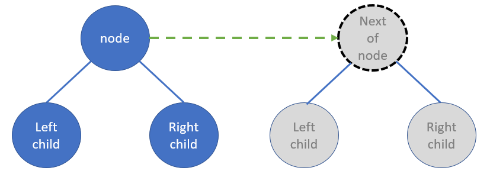

# LeetCode - Problem 116 - Populating Next Right Pointers in Each Node

## PYTHON SOLUTION EXPLANATION:

Python O(1) aux space by DFS

### Hint

Think of pre-order traversal in DFS.

#### Algorithm:

For each current node,

Step_#1:
Update left child's next as right child.

Step_#2:
Update right child'next as left child of current's next **if the current's next exists**

Step_#3:
DFS down to next level with pre-order.

##### Abstract Model:

**Before** connection of next pointer:



----

**After** connection of next pointer:


----

##### Implementation:

```python
class Solution:
    def connect(self, root: 'Node') -> 'Node':
        
        def helper( node: 'Node'):
            
            if node and node.left and node.right:
                
                # update next of left child        
                node.left.next = node.right
                
                # update next of right child
                if node.next:
                    node.right.next = node.next.left
            
                helper( node.left )
                helper( node.right )
            
            return node
        # ----------------------------
        
        return helper( root )
```

----

Related leetcode challenge:

( a general version of current challenge )

[Leetcode - Problem 117 - Populating Next Right Pointers in Each Node II](https://leetcode.com/problems/populating-next-right-pointers-in-each-node-ii/)

[Refer to Python Solution](../009_leetcode_P_117_PopulatingNextRightPointersInEachNodeTwo/Solution.py)